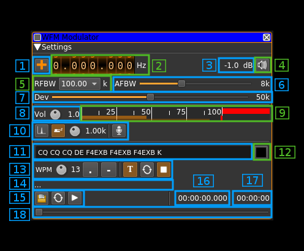

<h1>WFM modulator plugin</h1>

<h2>Introduction</h2>

This plugin can be used to generate a wideband frequency modulated signal. "Wideband" means that the bandwidth can vary from 12.5 to 250 kHz.

<h2>Interface</h2>

<h3>1: Frequency shift from center frequency of transmission</h3>

Use the wheels to adjust the frequency shift in Hz from the center frequency of transmission. Left click on a digit sets the cursor position at this digit. Right click on a digit sets all digits on the right to zero. This effectively floors value at the digit position. Wheels are moved with the mousewheel while pointing at the wheel or by selecting the wheel with the left mouse click and using the keyboard arrows. Pressing shift simultaneously moves digit by 5 and pressing control moves it by 2.

<h3>3: Channel power</h3>

Average total power in dB relative to a +/- 1.0 amplitude signal generated in the pass band.

<h3>4: Channel mute</h3>

Use this button to toggle mute for this channel.

<h3>5: RF bandwidth</h3>

This is the bandwidth in kHz of the channel signal filtered after modulation. It can be set in discrete values: 12.5, 25, 40, 60, 75, 80, 100, 125, 140, 160, 180, 200, 220 and 250  kHz

<h3>6: Audio frequency bandwidth</h3>

This is the bandwidth in khz of the modulating signal filtered before modulation. It can be set in kHz steps from 1 to 20 kHz 

<h3>7: Frequency deviation</h3>

Adjusts the frequency deviation in 1 kHz steps from 0 to 100 kHz

<h3>8: Volume</h3>

This is the volume of the audio signal from 0.0 (mute) to 2.0 (maximum). It can be varied continuously in 0.1 steps using the dial button.

<h3>9: Level meter in %</h3>

  - top bar (beige): average value
  - bottom bar (brown): instantaneous peak value
  - tip vertical bar (bright red): peak hold value

You should aim at keeping the peak value below 100% using the volume control

<h3>10: Input source control</h3>

<h4>10.1: Tone input select</h4>

Switches to the tone input. You must switch it off to make other inputs available.

<h4>10.2: Morse keyer input select</h4>

Switches to the Morse keyer input. You must switch it off to make other inputs available.

<h4>10.3: Tone frequency (kHz)</h4>

Adjusts the tone frequency from 0.1 to 2.5 kHz in 0.01 kHz steps

<h4>10.4: Audio input select and select audio input device</h4>

Left click to switch to the audio input. You must switch it off to make other inputs available.

Right click to select audio input device. See [audio management documentation](../../../sdrgui/audio.md) for details.

<h3>11: CW (Morse) text</h3>

Enter the text to be keyed when Morse input is active and in text mode

<h3>12: Clear CW text</h3>

Clears the CW (Morse) text

<h3>13: Morse keyer controls</h3>

<h4>13.1: CW keying speed</h4>

Sets the CW speed in Words Per Minute (WPM). This is based on the word "PARIS" sent 5 times. For 5 WPM the dot length is 240 ms. In other terms the dot length is calculated as 1.2 / WPM seconds. The dot length is used as the base to compute other timings:

  - Element (dot or dash) silence separator: 1 dot length
  - Dash: 3 dot lengths
  - Character silence separator: 3 dot lengths
  - Word silence separator: 7 dot lengths
  
<h4>13.2: Dots keying</h4>

Switch this button to send dots continuously

<h4>13.3: Dashes keying</h4>

Switch this button to send dashes continuously

<h4>13.4: Text keying</h4>

Switch this button to send the text typed into the text box (11)

<h4>13.5: Text auto repeat</h4>

Switch this button to auto repeat the text keying

<h4>13.6: Text play/stop</h4>

Use this button to stop sending text. When resuming keying restarts at the start of text

<h3>14: Audio file path</h3>

The path to the selected audio file to be played or dots if unselected

<h3>15: Audio file play controls</h3>

<h4>15.1: Audio file select</h4>

Opens a file dialog to select the audio file to be played. It must be mono 48 kHz 16LE raw format.

<h4>15.2: Audio file loop</h4>

Audio replay file at the end

<h4>15.3: Play/pause file play</h4>

Toggle play/pause file play. When paused the slider below (18) can be used to randomly set the position in the file when re-starting.

<h3>16: Play file current position</h3>

This is the current audio file play position in time units relative to the start

<h3>17: Play file length</h3>

This is the audio file play length in time units

<h3>18: Play file position slider</h3>

This slider can be used to randomly set the current position in the file when file play is in pause state (button 15.3)
