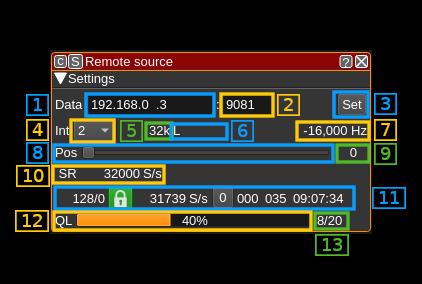
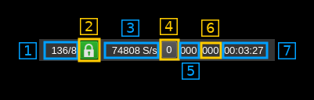

<h1>Remote source channel plugin</h1>

<h2>Introduction</h2>

This plugin receives I/Q samples from UDP and copies them to the baseband to be transmitted by the sink output device. It uses SDRangel remote format and possible FEC protection.

<h2>Build</h2>

The plugin will be built only if the [CM256cc library](https://github.com/f4exb/cm256cc) is installed in your system. For CM256cc library you will have to specify the include and library paths on the cmake command line. Say if you install cm256cc in `/opt/install/cm256cc` you will have to add `-DCM256CC_DIR=/opt/install/cm256cc` to the cmake commands.

<h2>Interface</h2>

The top and bottom bars of the channel window are described [here](../../../sdrgui/channel/readme.md)

<h3>1: Data local address</h2>

IP address of the local network interface from where the I/Q samples are fetched via UDP

<h3>2: Data local port</h2>

Local port from where the I/Q samples are fetched via UDP

<h3>3: Validation button</h3>

When the return key is hit within the address (1) or port (2) the changes are effective immediately. You can also use this button to set again these values.

<h3>4: Interpolation factor</h3>

The device baseband can be interpolated from the channel and its center can be selected with (5). The resulting sample rate of the I/Q stream pulled from the Remote Output device sink is the baseband sample rate divided by this value. The value is displayed in (5).

<h3>5: I/Q stream sample rate</h3>

This is the sample rate in kS/s of the I/Q stream pulled from the Remote Output device sink instance.

<h3>6: Half-band filters chain sequence</h3>

This string represents the sequence of half-band filters used in the interpolation. Each character represents a filter type:

  - **L**: lower half-band
  - **H**: higher half-band
  - **C**: centered

<h3>7: Center frequency shift</h3>

This is the shift of the channel center frequency from the device center frequency. Its value is driven by the device sample rate, the interpolation (1) and the filter chain sequence (5).

<h3>8: Half-band filter chain sequence</h3>

The slider moves the channel center frequency roughly from the lower to the higher frequency in the device baseband.

<h3>9: Half-band filter sequence</h3>

The number on the right represents the filter sequence as the decimal value of a base 3 number. Each base 3 digit represents the filter type and its sequence from MSB to LSB in the filter chain:

  - **0**: lower half-band
  - **1**: centered
  - **2**: higher half-band

<h3>10: Meta data stream sample rate</h3>

This is the sample rate set in the stream meta data

<h3>11: Stream status</h3>

<h4>11.1: Total number of frames and number of FEC blocks</h4>

This is the total number of frames and number of FEC blocks separated by a slash '/' as sent in the meta data block thus acknowledged by the distant server. When you set the number of FEC blocks in the remote the effect may not be immediate and this information can be used to monitor when it gets effectively set in the distant server.

A frame consists of 128 data blocks (1 meta data block followed by 127 I/Q data blocks) and a variable number of FEC blocks used to protect the UDP transmission with a Cauchy MDS block erasure correction.

Using the Cauchy MDS block erasure correction ensures that if at least the number of data blocks (128) is received per complete frame then all lost blocks in any position can be restored. For example if 8 FEC blocks are used then 136 blocks are transmitted per frame. If only 130 blocks (128 or greater) are received then data can be recovered. If only 127 blocks (or less) are received then none of the lost blocks can be recovered.

<h4>11.2: Stream status</h4>

The color of the icon indicates stream status:

  - Green: all original blocks have been received for all frames during the last polling timeframe (ex: 136)
  - No color: some original blocks were reconstructed from FEC blocks for some frames during the last polling timeframe (ex: between 128 and 135)
  - Red: some original blocks were definitely lost for some frames during the last polling timeframe (ex: less than 128)

<h4>11.3: Actual stream sample rate</h4>

This is the sample rate calculated using the counter of samples between two consecutive polls

<h4>11.4: Reset events counters</h4>

This push button can be used to reset the events counters (11.5 and 5.6) and reset the event counts timer (11.7)

<h4>11.5: Unrecoverable error events counter</h4>

This counter counts the unrecoverable error conditions found (i.e. lower than 128) since the last counters reset.

<h4>11.6: Recoverable error events counter</h4>

This counter counts the unrecoverable error conditions found (i.e. between 128 and 128 plus the number of FEC blocks) since the last counters reset.

<h4>11.7: events counters timer</h4>

This HH:mm:ss time display shows the time since the reset events counters button (11.4) was pushed.

<h3>12: Transmitter queue length gauge</h3>

This is ratio of the reported number of data frame blocks in the remote queue over the total number of blocks in the queue.

<h3>13: Transmitter queue length status</h3>

This is the detail of the ratio shown in the gauge. Each frame block is a block of 127 &#x2715; 126 samples (16 bit I or Q samples) or 127 &#x2715; 63 samples (24 bit I or Q samples).
