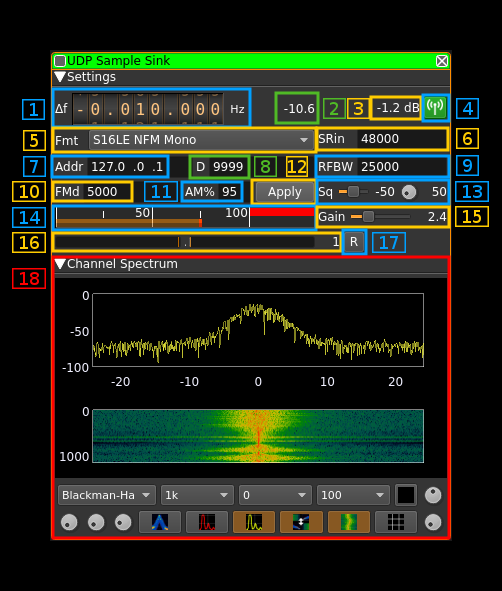

<h1>UDP sink plugin</h1>

<h2>Introduction</h2>

By "sink" one should undetstand a sink of samples for the outside of SDRangel application. An external application establishes an UDP connection to the plugin at the given address and port and samples are directed to it. In fact it can also come frome SDRangel itself using the UDP source plugin

The UDP block size or UDP payload size is optimized for 512 bytes but other sizes are acceptable.

This plugin is available for Linux and Mac O/S only.

<h2>Interface</h2>

<h3>1: Frequency shift from center frequency of reception</h3>

Use the wheels to adjust the frequency shift in Hz from the center frequency of reception. Left click on a digit sets the cursor position at this digit. Right click on a digit sets all digits on the right to zero. This effectively floors value at the digit position. Wheels are moved with the mousewheel while pointing at the wheel or by selecting the wheel with the left mouse click and using the keyboard arroews. Pressing shift simultanoeusly moves digit by 5 and pressing control moves it by 2.

<h3>2: Input channel power</h3>

Total power in dB relative to a +/- 1.0 amplitude signal received fron UDP.

<h3>3: Output channel power</h3>

Total power in dB relative to a +/- 1.0 amplitude signal sent in the channel.

<h3>4: Channel mute</h3>

Use this button to switch off the RF on the channel. The background of the button lits in green when a signal can be sent.

<h3>5: UDP address and port</h3>

These parameters are set with the basic channel settings dialog. See: [here](https://github.com/f4exb/sdrangel/blob/master/sdrgui/readme.md#6-channels)

The display is in the format `address:data port` 

<h3>6: Input sample rate</h3>

Sample rate in samples per second of the signal that is recveived on UDP. The actual byte rate depends on the type of sample which corresponds to a number of bytes per sample.

<h3>7: Type of samples</h3>

Combo box to specify the type of samples that are received and sent in the channel.

  - `S16LE I/Q`: Raw I/Q samples on signed 16 bits integers with Little Endian layout. Use it with software that sends I/Q data as output like GNUradio with the `UDP source` block. The output is interleaved I and Q samples. It can also match the UDP source plugin with the same `S16LE I/Q` format and can be used for linear transposition.
  - `S16LE NFM`: receives 16 bits signed integers on 1 (mono) or 2 (stereo) channels with Little Endian layout. It produces a mono signal with narrow bandwidth FM modulation. Stereo input channels are mixed before modulation. There is no DC block so it can be used with modulating signals where the DC component is important like digital signals.
  - `S16LE LSB`: Takes a 1 (mono) or 2 (stereo) channels AF signal and produces a LSB modulated signal. Stereo input channels are mixed before modulation.
  - `S16LE USB`: Takes a 1 (mono) or 2 (stereo) channels AF signal and produces a USB modulated signal. Stereo input channels are mixed before modulation.
  - `S16LE AM`: Takes a 1 (mono) or 2 (stereo) channels AF signal and produces a AM modulated signal. Stereo input channels are mixed before modulation.

<h3>8: Mono/Stereo input</h3>

This toggles switches between 1 channel (mono) and 2 channels (stereo) input samples format.
  
<h3>9: Output signal bandwidth</h3>

The signal is bandpass filtered to this bandwidth (zero frequency centered) before being sent out in the channel. In SSB modes only half of the filter is used (LSB: lower, USB: upper). Thus to send a signal with 3000 Hz bandwidth a bandwidth of 6000 Hz must be selected. In addition in SSB modes a 300 Hz highpass filter is applied.

<h3>10: FM deviation</h3>

This is the maximum FM deviation in Hz for a +/- 1.0 amplitude modulating signal. Therefore it is active only for `NFM` types of sample formats.

<h3>11: AM percentage modulation</h3>

this is the AM precentage modulation when a +/- 1.0 amplitude modulating signal is applied. herefore it is active only for `S16LE AM Mono` sample format.

<h3>12: Apply (validation) button</h3>

The changes in the following items only become effective when this button is pressed:

  - Samples format (5)
  - Output sample rate (6)
  - Address (7)
  - Data port (8)
  - RF bandwidth (9)
  - FM deviation (10)
  - AM percentage (11)

When any item of these items is changed the button is lit in green until it is pressed. 

<h3>13: Squelch</h3>

The slider sets the squelch power threshold based on channel input power (2). At the right of the slider the value in dB is displayed. 

The button sets the delay after which a signal constantly above the squelch threshold effectively opens the squelch. The same delay is used for squelch release. The delay in milliseconds is displayed at the right of the button. 

<h3>14: signal amplitude percentage of maximum</h3>

The gain (15) should be adjusted so that the peak amplitude (small red vertical bar) never exceeds 100%. Above 100% the signal is clipper which results in distorsion. 

<h3>15: Input and output Gains</h3>

Input ("Gi") and output ("Go") gains are placed next to each other.

The input gain is applied to samples received from UDP. The gain value appears at the right of the button.

The output gain is applied to the samples just before they are filtered and sent int the channel. The gain value appears at the right of the button.

<h3>16: Input buffer gauge</h3>

This gauge shows the percentage of deviation from a R/W pointer distance of half the buffer size. Ideally this should stay in the middle and no bar should appear. The percentage value appears at the right of the gauge and can vary from -50 to +50 (0 is the middle).

There is an automatic correction to try to maintain the half buffer distance between read and write pointers. This adjust the sample rate and therefore some wiggling around the nominal sample rate can occur. This should be hardly noticeable for most modulations but can be problematic with very narrowband modulations like WSPR.

The buffer consists in 512 bytes frames so that a normalized UDP block can be placed in one frame. Half the number of frames is calculated as the sample rate divided by 375. This results in a fixed average delay 0f 341 ms for sample rates of 48 kS/s and above. 

<h3>17: Reset input buffer R/W pointers</h3>

Resets the read and write pointers at their ideal position that is read at start and write at the middle of the buffer. This may cause occasional mess-up with the modulating signal until the read pointer reaches the middle of the buffer.

<h3>18: Automatic R/W balance toggle</h3>

This button enables or disables the automatic read / write pointers balance compensation so that they are always about half a buffer apart. The compensation adjust the sample rate around nominal input sample rate and can cause some tone wiggle on very narrowband modulations. Therefore you can switch it off at the expense of a small buffer section overlap or drop. With an input from the DSD demodulator it can be better to switch it off since the input samples flow is discontinuous and the automatic compensation may not have the time to adjust.

<h3>19: Spectrum display</h3>

This is the spectrum display of the channel signal before filtering. Please refer to the Spectrum display description for details. 

This spectrum is centered on the center frequency of the channel (center frequency of reception + channel shift) and is that of a complex signal i.e. there are positive and negative frequencies. The width of the spectrum is proportional of the sample rate. That is for a sample rate of S samples per seconds the spectrum spans from -S/2 to +S/2 Hz. 
