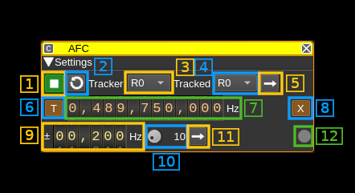

<h1>Automatic Frequency Control plugin</h1>

<h2>Introduction</h2>

This plugin makes the link between a [frequency tracker](../../channelrx/freqtracker/readme.md) and other channels in order to have them controlled by the frequency tracker. Thus it closes the loop to effectively make an automatic frequency control system.

<h2>Interface</h2>

<h3>1: Start/Stop plugin</h3>

This button starts or stops the plugin

<h3>2: Update device sets lists</h3>

It updates the tracker device set and tracked device set combo boxes (3) and (4) respectively with the available device sets.

<h3>3: Tracker device set selection</h3>

The first frequency tracker in this device set will be used to control frequency. Thus only Rx device sets can be selected.

<h3>4: Tracked device set selection</h3>

All channels but frequency tracker(s) in this device set will have their offset frequency controlled by the frequency tracker selected with (3).

<h3>5: (Re)apply device sets selection</h3>

Use this button to force evaluation of selected device sets i.e. the first frequency tracker used for tracking and the tracked channels.

<h3>6: Automatic target frequency readjustment</h3>

When the frequency tracker drifts following the signal it is tracking its effective frequency will move accordingly. To avoid it going too far from a nominal frequency set by (7) the device or transverter frequency can be used to re-adjust the frequency tracker center frequency periodically.

<h3>7: Tracker target frequency</h3>

This is the nominal frequency of the signal being tracked. For example (as in the picture) when tracking the QO-100 center beacon this is 10489.750 MHz thus with the transverter shift set at -250 kHz this is 489.750 MHz (The actual downconverted Rx frequency is 739.750 MHz).

<h3>8: Use transverter shift to adjust target frequency</h3>

When unset the device center frequency is used and when set the device center frequency setting is unchanged and the transverter shift is adjusted.

You would use the transverter adjustment for QO-100 tracking for example thus the resulting IF frequency is unchanged maintaining the center beacon around 489.750 MHz.

The transverter shift can be adjusted down to the Hz but depending on the device actual steps such granularity may not be effectively achievable.

<h3>9: Target frequency tolerance</h3>

Frequency readjustment will actually take place only if the frequency tracker frequency moves further away than &plusmn; this value from the nominal frequency (7).

You should not choose a value that is too tight else the frequency tracker frequency will keep moving around the target frequency without stabilizing. In practice you may set a low value and trigger a single shot adjustment with the (11) button and once stabilized choose a value significantly higher than the offset from nominal that is obtained.

Please note that if the device frequency adjustment is used the steps are in kHz so multiples of the kHz should be used.

<h3>10. Target frequency readjustment period (seconds)</h3>

The target frequency readjustment is periodically activated and frequency change is effectively activated if the tracker frequency offset from nominal is larger than the tolerance (9).

Depending on how fast the frequency drift occurs you should set a value in combination with the frequency tolerance (9) so that the frequency is not readjusted too frequently.

<h3>11. Activate target frequency readjustment immediately</h3>

This forces target readjustment process described above immediately.

<h3>12. Target readjustement indicator</h3>

This indicator will flash briefly when the readjustment process takes place. Its color is green if the frequency is not changed and is red if frequency changes. The tooltip shows the last frequency difference that was calculated.
