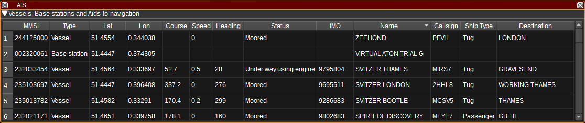
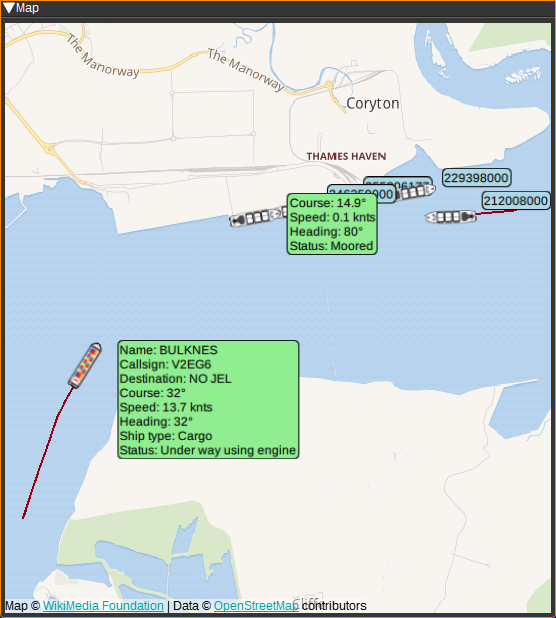
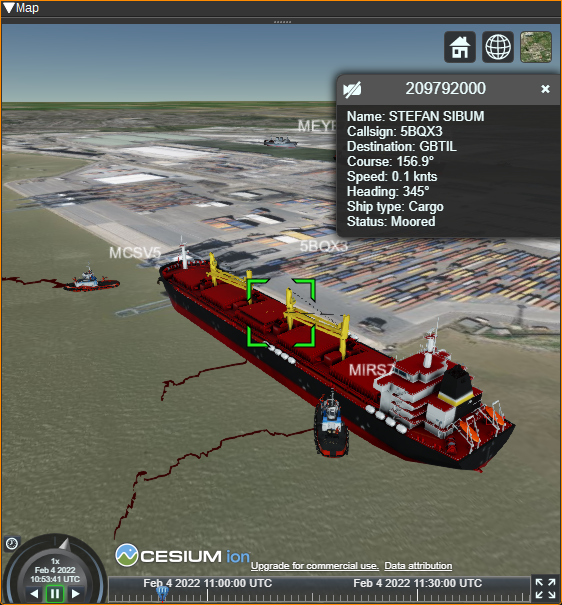

<h1>AIS Plugin</h1>

<h2>Introduction</h2>

The AIS feature displays a table containing the most recent information about vessels, base-stations and aids-to-navigation,
based on messages received via [AIS Demodulators](../../channelrx/demodais/readme.md).
Typically the AIS feature would be used with two AIS Demodulators: one at 161.975MHz and 162.025MHz.

The AIS feature can draw corresponding objects on the [Map](../../feature/map/readme.md) in 2D and 3D.

<h2>Interface</h2>

<h3>Vessels Table</h3>

The vessels table displays the current status for each vessel, base station or aid-to-navigation, based on the latest received messages, aggregated from all AIS Demodulators.

* MMSI - The Maritime Mobile Service Identity number of the vessel or base station. Double clicking on this column will search for the MMSI on VesselFinder.
* Type - Vessel, Base station or Aid-to-Navigation.
* Lat - Latitude in degrees. East positive. Double clicking on this column will center the map on this object.
* Lon - Longitude in degrees. West positive. Double clicking on this column will center the map on this object.
* Course - Course over ground in degrees.
* Speed - Speed over ground in knots.
* Heading - Heading in degrees (Heading is the direction the vessel is facing, whereas course is the direction it is moving in).
* Status - Status of the vessel (E.g. Underway using engine, At anchor).
* IMO -  International Maritime Organization (IMO) number which uniquely identifies a ship. Double clicking on this column will search for the IMO on https://www.vesselfinder.com/
* Name - Name of the vessel. Double clicking on this column will search for the name on https://www.vesselfinder.com/
* Callsign - Callsign of the vessel.
* Ship Type - Type of ship (E.g. Passenger ship, Cargo ship, Tanker) and activity (Fishing, Towing, Sailing).
* Length - The length of the vessel.
* Destination - Destination the vessel is travelling to. Double clicking on this column will search for this location on the map on this object.
* Position Updated - Gives the date and time the last position was received.
* Updated - Gives the date and time the last message was received.
* Messages - Displays the number of messages received.

Right clicking on the table header allows you to select which columns to show. The columns can be reordered by left clicking and dragging the column header.

Right clicking on a table cell allows you to copy the cell contents, view the vessel on a variety of websites or find the vessel on the map.

Vessels are removed from the table if a message is not received for 10 minutes.

<h3>Map</h3>

The AIS feature can plot ships, base stations and aids-to-navigation on the [Map](../../feature/map/readme.md). To use, simply open a Map feature and the AIS plugin will display objects based upon the messages it receives from that point.
Selecting an AIS item on the map will display a text bubble containing information from the above table. To centre the map on an item in the table, double click in the Lat or Lon columns.

<h2>Attribution</h2>

Map icons are by Maarten van der Werf, DE Alvida Biersack, ID and jokokerto, MY, from the Noun Project https://thenounproject.com/

Map icons are from http://all-free-download.com.
