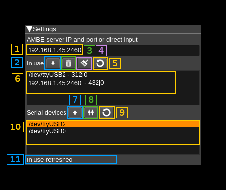

<h1>AMBE controller</h1>

<h2>Introduction</h2>

Control AMBE3000 serial a.k.a. DV serial devices or AMBE server addresses to use for AMBE digital voice processing.

DV serial devices are supported using the [SerialDV](https://github.com/f4exb/serialDV) library that is a mandatory requirement for this feature to be compiled. Therefore you have to compile and install SerialDV in your system. Please refer to this project Readme.md to compile and install SerialDV. f you install it in a custom location say `/opt/install/serialdv` you will need to add this define to the cmake command: `-DSERIALDV_DIR=/opt/install/serialdv`

To effectively use serial DV devices for AMBE decoding you will have to add at least one device to the list of AMBE devices (6) in use.

Although such serial devices work with a serial interface at 400 kb in practice maybe for other reasons they are capable of handling only one conversation at a time. The software will allocate the device dynamically to a conversation with an inactivity timeout of 1 second so that conversations do not get interrupted constantly making the audio output too choppy. In practice you will have to have as many devices listed in (6) as the number of conversations you would like to be handled in parallel.

---
&#9888; With kernel 4.4.52 and maybe other 4.4 versions the default for FTDI devices (that is in the ftdi_sio kernel module) is not to set it as low latency. This results in the ThumbDV dongle not working anymore because its response is too slow to sustain the normal AMBE packets flow. The solution is to force low latency by changing the variable for your device (ex: /dev/ttyUSB0) as follows:

`echo 1 | sudo tee /sys/bus/usb-serial/devices/ttyUSB0/latency_timer` or `sudo setserial /dev/ttyUSB0 low_latency`

Newer kernels do not seem to have this issue.

---

<h2>Interface</h2>

<h3>1: AMBE server address and port or direct input</h3>

Use this freeflow text input box to specify either the address and port of an AMBE server in the form: &lt;IPv4 address>:&lt;port> or any directly attached physical device address.

<h3>2: Import above address or device</h3>

Import the address or device specified in (1) into the list of used devices. The system will try to open the device or contact the server and will add it to the list only if successful.

<h3>3: Remove in use device or address</h3>

When a device or address is selected in the in use list (6) push this button to remove it from the list. The corresponding resources will be released.

<h3>4: Refresh in use list</h3>

Checks the list of devices or addresses currently in use and update the in use list (6).

<h3>5: Empty in use list</h3>

Removes all devices or addresses in use. The in use list (6) is cleared consequently. This removes all AMBE devices related resources attached to the current instance of the SDRangel program. Therefore consecutive AMBE frames decoding will be handled by the mbelib library if available or no audio will be output.

<h3>6: In use list</h3>

List of devices or addresses currently in use for AMBE frames decoding by this feature.

Format is the device path or URL followed by a dash then the number of frames successfully decoded then a vertical bar then the number of frames that failed decoding. i.e:

`<Device path> - <successful count>|<failed count>`

<h3>7: Import serial device</h3>

Imports a serial device scanned in the list of available AMBE 3000 serial devices (10) in the in use list. If this device is already in the in use list then nothing happens and this is reported in the status text (11)

<h3>8: Import all serial devices</h3>

Imports all serial devices scanned in the list of available AMBE 3000 serial devices (9) in the in use list. If any device is already in the in use list then it is not added twice.

<h3>9: Refresh list of AMBE serial devices</h3>

Scans available AMBE 3000 serial devices and updates the list.

<h3>10: List of AMBE 3000 serial devices</h3>

List of AMBE 3000 connected to the system. Use button (9) to update the list.

<h3>11: Status text</h3>

A brief text reports the result of the current action.
