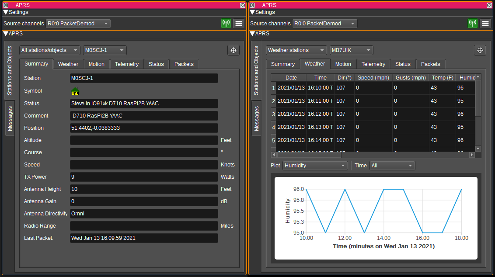
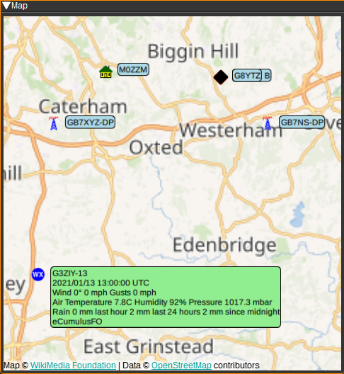

<h1>APRS Feature Plugin</h1>

<h2>Introduction</h2>

The APRS plugin displays APRS (Automatic Packet Reporting System) packets. APRS packets can be received over RF via one or more Packet Demodulator or ChirpChat Demodulator source channels or from the Internet via an APRS-IS IGate.

<h2>Interface</h2>

<h3>1: Source channels</h3>

This displays a list of the Packet Demodulator or ChirpChat Demodulator channels the APRS feature is receiving packets from.

<h3>2: Enable APRS-IS IGate</h3>

When checked, enables the APRS-IS IGate (Internet gateway). The IGate forwards packets received via the Packet Demodulators to APRS-IS internet servers.
These servers collate packets from all IGates and allow them to be viewed on web sites such as https://aprs.fi, https://www.aprsdirect.com/ and http://ariss.net/ (the latter being for packets repeated via satellites and the ISS).
It is also possible to receive packets via the IGate, which allows you to see packets that you cannot receive via RF.

<h3>3: Show APRS Settings</h3>

Pressing this button shows the APRS Settings Dialog. This dialog allows you to enter:

* The APRS-IS server the IGate should connect to. Please choose your local server. (noam = North America, euro = Europe, etc).
* The callsign the IGate should connect with.
* The passcode corresponding to the given callsign.
* A serverside filter, that specifies which packets should be forwarded from the internet to SDRangel. See http://www.aprs-is.net/javAPRSFilter.aspx
m/50 will send you packets within 50 km of the last known position of the station corresponding to the callsign used to log in with.
If you do not have a corresponding station, you can specify a location by passing a latitude and longitude. E.g: r/lat/lon/50
* The units in which altitudes are displayed (Feet or metres).
* The units in which object speeds are displayed (Knots, MPH or KPH).
* The units in which temperature is displayed (Fahrenheit or Celsius).
* The units in which rainfall is displayed (Hundredths of an inch or millimetres).

<h2>Map</h2>

The APRS feature can plot APRS symbols and data on the Map. To use, simply open a Map feature and the APRS plugin will display packets it receives from that point on it.
Selecting an APRS item on the map will display a text bubble containing APRS status, position and weather data.

<h2>Attribution</h2>

APRS icons are from: https://github.com/hessu/aprs-symbols

<h2>API</h2>

Full details of the API can be found in the Swagger documentation. Here is a quick example of how to enable the APRS-IS IGate:

    curl -X PATCH "http://127.0.0.1:8091/sdrangel/featureset/0/feature/0/settings" -d '{"featureType": "APRS",  "APRSSettings": { "igateCallsign": "MYCALLSIGN", "igatePasscode": "12345", "igateFilter": "r/50.2/10.2/25", "igateEnabled": 1  }}'
