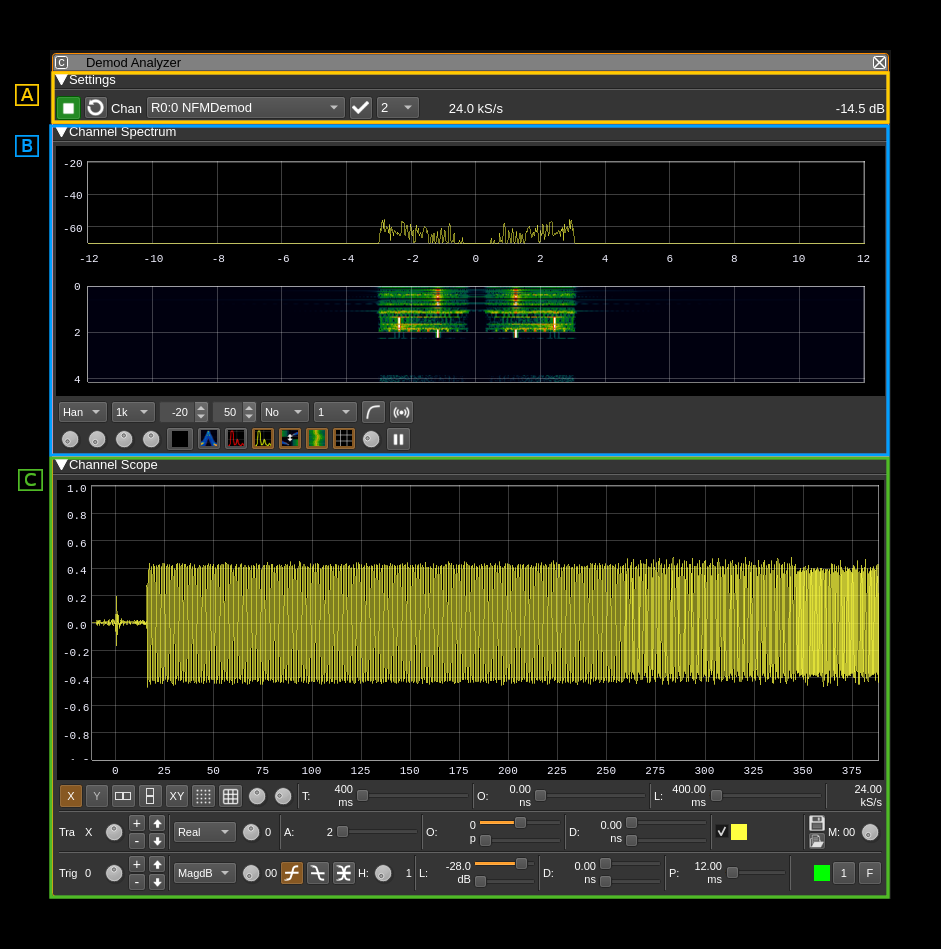
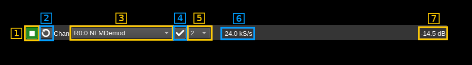

<h1>(De)modulator Analyzer plugin</h1>

<h2>Introduction</h2>

This plugin can be used to analyze the real demodulated signal from some Rx channel plugins. It can also be used to view the modulating signal of some Tx channel plugins.

Rx plugins are:

  - AIS demodulator
  - AM demodulator
  - DAB demodulator
  - DSD (FM digital voice) demodulator
  - NFM demodulator
  - Packet demodulator
  - SSB demodulator
  - WFM demodulator

Tx plugins are:

  - AIS modulator
  - AM modulator
  - NFM modulator
  - Packet modulator
  - SSB modulator
  - WFM modulator

<h2>General interface</h2>

The interface is essentially divided in the following sections

  - A. Channel controls
  - B. Spectrum view
  - C. Scope view

<h2>A. Channel controls</h2>

Typical sequence of operations:

  1. Start the plugin (A.1)
  2. Scan for displayable channels (A.2)
  3. Select channel (A.3)
  4. If channel is unique or default selection has not been changed press the (re)apply button (A.4)

<h3>A.1: Start/Stop plugin</h3>

This button starts or stops the plugin

<h3>A.2: (Re)scan available channels</h3>

Use this button to scan for channels available for display (see list of channel types in introduction)

<h3>A.3: Channel selection</h3>

Use this combo to select which channel to use for display. Channel is selected upon change. If channel is not changed or there is only one in the list you have to use the (re)apply button (A.4) to effectively connect the channel to the analyzer.

<h3>A.4: (Re)apply channel selection</h3>

Applies or re-applies channel selection (A.3) so that the channel gets effectively connected to the analyzer and signal is displayed. This will update the sample rate.

<h3>A.5: Decimation by a power of two</h3>

This combo can select half-band decimation from baseband sample rate by a power of two.

<h3>A.6: Analyzer sample rate</h3>

This is the resulting sample rate after possible decimation that is used by the spectrum and scope visualizations

<h3>A.7. Channel power</h3>

Average total power in dB relative to a +/- 1.0 amplitude signal received in the pass band.

<h3>A.8. Record as .wav file</h3>

Use this button to toggle recording. Start or stop recording

Format is always 16 bit little-endian and can be mono (1 channel) or stereo (2 channels) depending on data type.

<h3>A.9. Select recording output file</h3>

Click on this icon to open a file selection dialog that lets you specify the location and name of the output files.

Each recording is written in a new file with the starting timestamp before the `.wav` extension in `yyyy-MM-ddTHH_mm_ss_zzz` format. It keeps the first dot limited groups of the filename before the `.wav` extension if there are two such groups or before the two last groups if there are more than two groups. Examples:

  - Given file name: `test.wav` then a recording file will be like: `test.2020-08-05T21_39_07_974.wav`
  - Given file name: `test.2020-08-05T20_36_15_974.wav` then a recording file will be like (with timestamp updated): `test.2020-08-05T21_41_21_173.wav`
  - Given file name: `test.first.wav` then a recording file will be like: `test.2020-08-05T22_00_07_974.wav`
  - Given file name: `record.test.first.eav` then a recording file will be like: `reocrd.test.2020-08-05T21_39_52_974.wav`

If a filename is given without `.wav` extension then the `.wav` extension is appended automatically before the above algorithm is applied. If a filename is given with an extension different of `.wav` then the extension is replaced by `.wav` automatically before the above algorithm is applied.

The file path currently being written (or last closed) appears at the right of the button (A.1.10).

<h3>A.1.10. Recording file path</h3>

This is the file path currently being written (or last closed).

<h3>A.1.11 Record silence time</h3>

This is the time in seconds (between 0.1 and 10.0) of silence (null samples) before recording stops. When non null samples come again this will start a new recording. Set the value to 0 to record continuously.

<h2>B. Spectrum view</h2>

This is the same display as with the channel analyzer spectrum view. This is the spectrum of a real signal so it is symmetrical around zero frequency. Details on the spectrum view and controls can be found [here](../../../sdrgui/gui/spectrum.md)

<h2>C. Scope view</h2>

This is the same display as with the channel analyzer scope view. Input is a real signal so imaginary part is always zero and some display are not relevant (phase and frequency displays). See Channel Analyzer plugin documentation for details.
