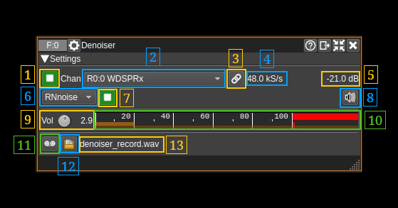

<h1>Demoiser</h1>

<h2>Introduction</h2>

This audio denoiser plugin can be used to reduce or remove noise from audio. For now it only implements the RNNoise noise reduction (more details next)

It connects to the "demod" stream of Rx channels similarly to the Demod analyzer plugin. Hence it covers:

  - AM demodulator
  - Broadcast FM demodulator
  - NFM demodulator
  - SSB demodulator
  - WFM demodulator
  - WDSP plugin (multimode)

Note that this plugin is available only in Linux

The following noise reduction schemes are covered. It can be selected via the (6) combo box:

<h3>RNNoise</h3>

Noise reduction based on the RNnoise library originally from J.M. Valin. It uses a fork for easier integration in the build system (Cmake support with download of the model file): https://github.com/f4exb/rnnoise

The noise reduction is based on a mix of DSP functions and a recursive neural network (RNN). Basically the RNN helps the DSP functions to adjust the gain in various spectral bands thus very efficiently cancelling the background noise in many situations. Although the model was not particularly trained on radio transmissions it can do a pretty good job at AM, SSB noise reduction however you will need a reasonable SNR to get something out of it else it will consider the audio is just noise. Do not expect it to dig signals out of the noise the goal is to reduce ear fatigue by removing background white noise and other noises e.g birdies. Results for FM signals may vary.

You will find all the details about RNnoise here: https://jmvalin.ca/demo/rnnoise/

Please note the following points:

  - Audio sample rate must be 48 kS/s (check 4)
  - When taking the audio source from the WDSP plugin it should be used without noise reduction
  - You should have enough input level but not exceed 100% on peaks (check 9 and 10). An average level between 10 and 20% should already provide good results
  - The model has been trained on human voice therefore anything else like music is considered to be noise. It may however be successful at selecting the voice from songs.
  - It should have enough original spectral components therefore any noise processing before the input will only deteriorate its performance. It should also have enough bandwidth it is recommended to have at least 100-3000 Hz. It is not an issue to extend beyond 3000 Hz because any high frequency hiss will be cancelled and it may benefit from the extra bandwidth on some transmissions.
  - With SSB transmisions the pitch should be as close as possible to the natural pitch of the voice. In any case prefer a higher pitch to a lower one. Note that some voices are better processed than others which may also depend on voice processing before transmission.

<h2>Interface</h2>

<h3>1: Start/Stop plugin</h3>

This button starts or stops the plugin

<h3>2: Channel selection</h3>

Use this combo to select which channel to use for display. Channel is selected at start time and upon change. You may use button (3) to force association with the channel if necessary.

<h3>3: (Re)apply channel selection</h3>

Applies or re-applies channel association (2) so that the channel gets effectively (re)connected to the denoiser. Normally it should not be necessary to use it.

<h3>4: Input sample rate</h3>

This is the input audio stream sample rate and for RNNoise it should always be 48 kS/s

<h3>5: Input power</h4>

Indication of the input audio stream power

<h3>6: Noise reduction scheme</h3>

Selects the noise reduction scheme

  - **None**: No noise reduction (passthrough)
  - **RNnoise**: RNNoise (see introduction)

<h3>7: Noise reduction enable</h3>

Enable or disable noise reduction. When disabled it just passes audio through

<h3>8: Audio mute and device selection</h3>

 - Left click: Mute or unmute audio
 - Right click: opens a dialog to select audio output device

<h3>9: Input volume</h3>

This button lets you adjust the input volume. Adjust for best dynamic but the peaks should not exceed 100% as displayed in the VU meter next (10)

<h3>10: Input VU meter</h3>

This is the VU meter of the audio entering the noise reduction block. The peaks should not exceed 100%

<h3>11: Record audio output</h3>

Start/stop recording. Each start -> stop creates a new record file (see next)

<h3>12: Select output record file</h3>

Click on this icon to open a file selection dialog that lets you specify the location and name of the output files.

Each recording is written in a new file with the starting timestamp before the `.wav` extension in `yyyy-MM-ddTHH_mm_ss_zzz` format. It keeps the first dot limited groups of the filename before the `.wav` extension if there are two such groups or before the two last groups if there are more than two groups. Examples:

  - Given file name: `test.wav` then a recording file will be like: `test.2020-08-05T21_39_07_974.wav`
  - Given file name: `test.2020-08-05T20_36_15_974.wav` then a recording file will be like (with timestamp updated): `test.2020-08-05T21_41_21_173.wav`
  - Given file name: `test.first.wav` then a recording file will be like: `test.2020-08-05T22_00_07_974.wav`
  - Given file name: `record.test.first.wav` then a recording file will be like: `record.test.2020-08-05T21_39_52_974.wav`

If a filename is given without `.wav` extension then the `.wav` extension is appended automatically before the above algorithm is applied. If a filename is given with an extension different of `.wav` then the extension is replaced by `.wav` automatically before the above algorithm is applied.

The file path currently being written (or last closed) appears at the right of the button (13).

<h3>13: Output record file name</h3>

File path currently being written (or last closed)
