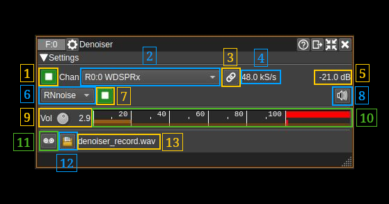

<h1>Denoiser</h1>

<h2>Introduction</h2>

This feature can process demodulated audio with RNNoise, NVIDIA Noise Removal,
or an installed VST3 audio effect, such as a [denoiser](https://github.com/werman/noise-suppression-for-voice)
or [EQ](https://www.manda-audio.com/products.php).

It connects to the "demod" stream of RX channels or features similarly to the Demod Analyzer plugin. 
It also outputs its processed stereo audio on a "demod" stream, so another Denoiser or Demod Analyzer can use it as an input. 

Supported sources include:

  - AM demodulator
  - Broadcast FM demodulator
  - DAB demodulator
  - DSD demodulator
  - NFM demodulator
  - SSB demodulator
  - WFM demodulator
  - WDSP plugin (multimode)
  - Another Denoiser feature

The processing mode is selected with the (6) combo box:

<h3>RNNoise</h3>

Noise reduction based on the RNnoise library originally from J.M. Valin. It uses a fork for easier integration in the build system (Cmake support with download of the model file): https://github.com/f4exb/rnnoise

The noise reduction is based on a mix of DSP functions and a recursive neural network (RNN). Basically the RNN helps the DSP functions to adjust the gain in various spectral bands thus very efficiently cancelling the background noise in many situations. Although the model was not particularly trained on radio transmissions it can do a pretty good job at AM, SSB noise reduction however you will need a reasonable SNR to get something out of it else it will consider the audio is just noise. Do not expect it to dig signals out of the noise the goal is to reduce ear fatigue by removing background white noise and other noises e.g birdies. Results for FM signals may vary.

You will find all the details about RNnoise here: https://jmvalin.ca/demo/rnnoise/

<h3>NVIDIA Noise Removal</h3>

On Windows, this option uses the NVIDIA Audio Effects SDK redistributable installed separately from NVIDIA Broadcast. 
Install the redistributable for your RTX GPU from [NVIDIA's Broadcast SDK resources](https://www.nvidia.com/en-us/geforce/broadcasting/broadcast-sdk/resources/). 
The feature looks in `NVAFX_SDK_DIR` if set, otherwise in `%ProgramFiles%\NVIDIA Corporation\NVIDIA Audio Effects SDK`. 
SDRangel does not include NVIDIA binaries or models.

On Linux, install the [NVIDIA Audio Effects SDK core and Denoiser feature package](https://docs.nvidia.com/maxine/afx/latest/LinuxAFXSDK/InstallTheAFXSDK.html). 
Set `NVAFX_SDK_DIR` to the extracted SDK root (or use `AFX_SDK_ROOT`). Put the SDK's `nvafx/lib`, 
Denoiser feature `lib`, and `external/cuda/lib` directories on `LD_LIBRARY_PATH` before starting SDRangel. 
The feature selects `features/denoiser/models/sm_*/denoiser_48k.trtpkg` automatically when exactly one GPU-specific model is installed; otherwise set `NVAFX_MODEL_PATH` to the model for your GPU. 
NVIDIA officially supports the Linux SDK for its listed server GPUs; consumer GeForce cards are outside that support list.

NVIDIA Noise Removal is not available on macOS.

Set the demodulated audio stream to 48 kS/s. The SDK's 48 kHz speech denoiser receives mono audio; stereo input is mixed to mono. 
If the SDK, model, or supported GPU is unavailable, the feature passes audio through and reports the reason in the feature's error status and SDRangel log. 
NVIDIA's model is trained for speech, so tones, music, and weak radio signals may be suppressed.

When NVIDIA Noise Removal is selected, **Strength** controls the intensity ratio from 0% (passthrough) to 100% (strongest suppression). 
If weak speech is being removed, try 30–50% and adjust by ear. **VAD** enables voice activity detection, which can mute frames classified as non-speech; leave it off when receiving weak or distorted voices. 
Changes to these controls reload the NVIDIA model briefly. Neither setting can guarantee preservation of speech that the model classifies as noise.

<h3>VST3 Audio Effects</h3>

Select **VST3 Effect** to scan automatically for effects in the standard VST3 folders on Windows, Linux, or macOS. 
Denoiser also scans when the feature starts; use **Scan** to refresh the list after installing a plugin. 
On macOS the folders include the user, system, and network Audio/Plug-ins/VST3 folders, plus the app's Contents/VST3 folder. 
The scanner runs in a separate process so a plugin that fails during discovery cannot crash SDRangel. 
The **...** button lets you select a module outside those folders. 
Select an effect from the list and start the feature. 
**Params** opens the effect's own editor when available, or a slider dialog for its editable parameters. 
Changes to exposed parameters are saved with the Denoiser settings. 
When **Params** is closed, the effect's complete state (including editor settings and presets that are not exposed as parameters) is also saved, and the running effect is reloaded with it. 
The effect runs at the selected channel's sample rate when reported, and otherwise assumes 48 kS/s.

The host accepts effects with one main mono or stereo audio input and output. 
Effects that require other layouts or host services may report an error; in that case audio passes through. 
**Params** tries the native editor on Windows, macOS, and Linux when Qt uses X11. If the editor cannot attach, it uses the slider dialog.
Editor changes that a plugin does not expose as parameters are only heard once **Params** is closed.

<h3>Notes</h3>

Please note the following points:

  - Audio sample rate must be 48 kS/s (check 4)
  - When taking the audio source from the WDSP plugin it should be used without noise reduction
  - You should have enough input level but not exceed 100% on peaks (check 9 and 10). An average level between 10 and 20% should already provide good results
  - The model has been trained on human voice therefore anything else like music is considered to be noise. It may however be successful at selecting the voice from songs.
  - It should have enough original spectral components therefore any noise processing before the input will only deteriorate its performance. It should also have enough bandwidth it is recommended to have at least 100-3000 Hz. It is not an issue to extend beyond 3000 Hz because any high frequency hiss will be cancelled and it may benefit from the extra bandwidth on some transmissions.
  - With SSB transmisions the pitch should be as close as possible to the natural pitch of the voice. In any case prefer a higher pitch to a lower one. Note that some voices are better processed than others which may also depend on voice processing before transmission.

<h2>Interface</h2>

<h3>1: Start/Stop plugin</h3>

This button starts or stops the plugin

<h3>2: Source selection</h3>

Use this combo to select an Rx channel or Feature as the audio source. The selection takes effect at start time and upon change. You may use button (3) to force association with the source if necessary.

<h3>3: (Re)apply source selection</h3>

Applies or re-applies source association (2) so that the source gets effectively (re)connected to the denoiser. Normally it should not be necessary to use it.

<h3>4: Input sample rate</h3>

This is the input audio stream sample rate. RNNoise and NVIDIA Noise Removal require 48 kS/s.

<h3>5: Input power</h4>

Indication of the input audio stream power

<h3>6: Noise reduction scheme</h3>

Selects the noise reduction scheme

  - **None**: No noise reduction (passthrough)
  - **RNnoise**: RNNoise (see introduction)
  - **NVIDIA Noise Removal**: NVIDIA Audio Effects SDK speech denoiser
  - **VST3 Effect**: An installed VST3 audio effect

<h3>7: Noise reduction enable</h3>

Enable or disable noise reduction or VST3 effect. When disabled it just passes audio through.

<h3>8: Audio mute and device selection</h3>

 - Left click: Mute or unmute audio
 - Right click: opens a dialog to select audio output device

<h3>9: Input volume</h3>

This button lets you adjust the input volume. Adjust for best dynamic but the peaks should not exceed 100% as displayed in the VU meter next (10)

<h3>10: Input VU meter</h3>

This is the VU meter of the audio entering the noise reduction block. The peaks should not exceed 100%

<h3>11: Record audio output</h3>

Start/stop recording. Each start -> stop creates a new record file (see next)

<h3>12: Select output record file</h3>

Click on this icon to open a file selection dialog that lets you specify the location and name of the output files.

Each recording is written in a new file with the starting timestamp before the `.wav` extension in `yyyy-MM-ddTHH_mm_ss_zzz` format. It keeps the first dot limited groups of the filename before the `.wav` extension if there are two such groups or before the two last groups if there are more than two groups. Examples:

  - Given file name: `test.wav` then a recording file will be like: `test.2020-08-05T21_39_07_974.wav`
  - Given file name: `test.2020-08-05T20_36_15_974.wav` then a recording file will be like (with timestamp updated): `test.2020-08-05T21_41_21_173.wav`
  - Given file name: `test.first.wav` then a recording file will be like: `test.2020-08-05T22_00_07_974.wav`
  - Given file name: `record.test.first.wav` then a recording file will be like: `record.test.2020-08-05T21_39_52_974.wav`

If a filename is given without `.wav` extension then the `.wav` extension is appended automatically before the above algorithm is applied. If a filename is given with an extension different of `.wav` then the extension is replaced by `.wav` automatically before the above algorithm is applied.

The file path currently being written (or last closed) appears at the right of the button (13).

<h3>13: Output record file name</h3>

File path currently being written (or last closed)
