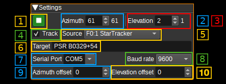

<h1>Rotator Controller Feature Plugin</h1>

<h2>Introduction</h2>

The Rotator Controller feature plugin allows SDRangel to send commands to GS-232 and SPID rotators as well as hamlib's rotctld, via a serial or TCP connection. 
This allows SDRangel to point antennas mounted on a rotator to a specified azimuth and elevation.

Azimuth and elevation can be set manually by a user in the GUI, via the REST API, or via another plugin, such as the Map Feature, the ADS-B Demodulator, or the Star Tracker.

<h2>Interface</h2>

<h3>1: Start/Stop plugin</h3>

This button starts or stops the plugin. When the plugin is stopped, azimuth and elevation commands will not be sent to the rotator.

When started, the background will be green if the rotator is pointing at target azimuth and elevation within the specified tolerance. When off target (i.e. while rotating) the background will be yellow.

<h3>2: Azimuth</h3>

Specifies the target azimuth (angle in degrees, clockwise from North) to point the antenna towards. Valid values range from 0 to 450 degrees.
The value to the right of the target azimuth, is the current azimuth read from the rotator.

<h3>3: Elevation</h3>

Specifies the target elevation (angle in degrees) to point the antenna towards. Valid values range from 0 to 180 degrees, where 0 and 180 point towards the horizon and 90 degrees to zenith.
The value to the right of the target elevation, is the current elevation read from the rotator.

<h3>4: Track</h3>

When checked, the target azimuth and elevation will be controlled by the Channel or Feature Source (5).
For example, this allows an aircraft to be tracked, by setting the Source to the ADS-B Demodulator plugin, or the Moon to be tracked by setting Source to the Star Tracker plugin.

<h3>5: Source</h3>

Specify the SDRangel Channel or Feature that that will control the target aziumth and elevation values, when Track (4) is checked.

<h3>6: Target</h3>

When tracking is enabled, this field will display a name for the target being tracked, as indicated by the selected Source plugin (5).
For example, the ADS-B plugin will display the flight number of the target aircraft. The Star Tracker plugin will display Sun, Moon or Star.

<h3>7: Protocol</h3>

Selects which protocol to use. This can be GS-232, SPID (rot2prog) or rotctld.

<h3>8: Connection</h3>

Selects whether to use a serial connection or TCP.

<h3>9: Serial Port</h3>

Specifies the serial port (E.g. COM3 on Windows or /dev/ttyS0 on Linux) that will be used to send commands to the rotator.

<h3>10: Baud rate</h3>

Specifies the baud rate that will be used to send commands to the rotator. Typically this is 9600 for GS-232.

<h3>11: Host</h3>

Specifies the hostname / IP address of the computer to connect to.

<h3>12: Port</h3>

Specifies the TCP port number to connect to.

<h3>13: Azimuth Offset</h3>

The azimuth offset specifies an angle in degrees that is added to the target azimuth before sending to the controller. This allows for a misalignment of the rotator to be corrected.

<h3>14: Elevation Offset</h3>

The elevation offset specifies an angle in degrees that is added to the target elevation before sending to the controller. This allows for a misalignment of the rotator to be corrected.

<h3>15 and 16: Azimuth Min and Max</h3>

The azimuth min and max values specify the minimum and maximum azimuth values (after offset has been applied), that will be sent to the rotator.
These values can be used to prevent the rotator from rotating an antenna in to an obstable.

<h3>17 and 18: Elevation Min and Max</h3>

The elevation min and max values specify the minimum and maximum elevation values (after offset has been applied), that will be sent to the rotator.
These values can be used to prevent the rotator from rotating an antenna in to an obstable.
If the maximum elevation is set to 0, the controller will only use the M GS-232 command, rather than M and W.

<h3>19: Tolerance</h3>

Specifies a tolerance in degrees, below which, changes in target azimuth or elevation will not be sent to the rotator.
This can prevent some rotators that have a limited accuracy from making unbeneficial movements.

If this set to 0, every target azimuth and elevation received by the controller will be send to the rotator.
If it is set to 2, then a change in azimuth of +-1 degree from the previous azimuth, would not be sent to the rotator.

<h3>20: Precision</h3>

Specifies the number of decimal places used for coordinates and the tolerance setting.
For GS-232 this is fixed to 0. For SPID it is fixed to 1.

<h3>21: Coordinates</h3>

Specifies the coordinate system used by the GUI for entry and display of the position of the rotator. This can be:

* Az/El - For azimuth and elevation in degrees.
* X/Y 85' - For X/Y coordinates in degrees. 0,0 is zenith. X is positive Southward. Y is positive Eastward.
* X/Y 30' - For X/Y coordinates in degrees. 0,0 is zenith. X is positivie Eastward. Y is positive Northward.

Equations for translating between these coordinate systems can be found [here](https://ntrs.nasa.gov/citations/19670030005).

<h2>Protocol Implementations</h2>

<h3>GS-232 Protocol Implementation Notes</h3>

The controller uses the Waaa eee command when elevation needs to be set.
When only azimuth needs to be set, the Maaa command is used.
The C2 command is used to read current azimuth and elevation. A response of AZ=aaaEL=eee is expected.

<h3>SPID rot2prog Protocol Implementation</h3>

The controller uses the 0x2f set command with PH/PV=2 to set azimuth and elevation.
The 0x1f status command is used to read current azimuth and elevation.
A 12 byte response is expected for set and status commands.
All frames start with 0x57 and end with 0x20.

<h3>rotctld Protocol Implementation</h3>

The controller uses the 'P' and 'p' commands to set and get azimuth and elevation.

<h2>API</h2>

Full details of the API can be found in the Swagger documentation. Here is a quick example of how to set the azimuth and elevation from the command line:

    curl -X PATCH "http://127.0.0.1:8091/sdrangel/featureset/0/feature/0/settings" -d '{"featureType": "GS232Controller",  "GS232ControllerSettings": { "azimuth": 180, "elevation": 45 }}'

To start sending commands to the rotator:

    curl -X POST "http://127.0.0.1:8091/sdrangel/featureset/0/feature/0/run"
