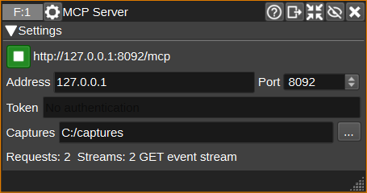

<h1>MCP Server Feature Plugin</h1>

<h2>Introduction</h2>

This feature exposes SDRangel to AI agents through the [Model Context Protocol](https://modelcontextprotocol.io/) (MCP), so that an assistant such as Claude or ChatGPT/Codex can inspect and control SDRangel: create device sets, select SDR hardware, tune, add demodulators, change settings, read reports, load presets and so on.

The plugin runs an MCP server using the Streamable HTTP transport. MCP clients connect to `http://address:port/mcp`. Everything the server does goes through the same in-process API as SDRangel's REST Web API, so what an agent can do matches what the Web API allows.

<h2>Interface</h2>

<h3>1: Start/Stop</h3>

Starts or stops the MCP server. The button is green when the server is listening and red if it could not listen on the requested address and port.

<h3>2: Endpoint URL</h3>

The URL to give to MCP clients.

<h3>3: Address</h3>

IP address to listen on. The default of 127.0.0.1 only accepts connections from the local computer. Use 0.0.0.0 to accept connections from any network interface, in which case a token should be set.

<h3>4: Port</h3>

TCP port to listen on. The default is 8092.

<h3>5: Capture directory</h3>

Directory that the capture tools write IQ and audio files to. It defaults to `SDRangel/captures` under your documents folder. File names given to the capture tools are relative to it, and names that would write outside it are refused, so a connected agent cannot write anywhere else on the machine.

<h3>6: Token</h3>

Optional bearer token. When set, clients must send an `Authorization: Bearer <token>` HTTP header. Leave empty for no authentication.

<h3>7: Add to Codex</h3>

Writes this server into Codex's `config.toml`.
Codex reads its configuration at startup, so restart it afterwards.

<h3>8: Add to Claude Desktop</h3>

Opens the extension bundle with Claude Desktop, which then shows its own dialog asking whether to install it.

<h3>9: Status</h3>

Number of MCP requests served since the server was started and the last request received.

<h2>Connecting a client</h2>

<h3>Claude Code</h3>

For clients that support remote (HTTP) MCP servers, add the endpoint URL directly:

    claude mcp add --transport http sdrangel http://127.0.0.1:8092/mcp

<h3>Claude Desktop</h3>

Claude Desktop cannot connect to a server on http://127.0.0.1: its custom connectors are
fetched from Anthropic's cloud, which cannot reach your machine. Install the SDRangel
extension, which carries a small [bridge](bridge/readme.md) that relays the stdio
transport Claude Desktop does support to this server. Press Add to Claude Desktop (8) to hand
it the bundle; on Windows the installer also offers to do this at the end of a fresh install.
Failing either, take `sdrangel-<version>-<platform>.mcpb` from the release and open it with
Claude Desktop, or drag it onto Settings > Extensions. Set the port in the extension's
settings if it is not the default 8092.

For other clients that only support local stdio servers, run the same bridge directly, in:

- Windows: %APPDATA%\Claude\claude_desktop_config.json
- Linux: ~/.config/Claude/claude_desktop_config.json
- macOS: ~/Library/Application Support/Claude/claude_desktop_config.json

    "mcpServers": {
      "sdrangel": {
        "command": "C:\\Program Files\\SDRangel\\sdrangel-mcp-bridge.exe",
        "args": ["--port", "8092"]
      }
    }

`npx -y mcp-remote http://127.0.0.1:8092/mcp` does the same job for a client that has no
bridge built for its platform, at the cost of needing Node.js installed.

<h3>ChatGPT/Codex</h3>

Codex speaks the HTTP transport, so does not need a bridge. Press Add to Codex (7) to have the
servers address written to its configuration file, or add the following by hand to:

- Windows: %USERPROFILE%\.codex\config.toml
- macOS/Linux: ~/.codex/config.toml

    [mcp_servers.sdrangel]
    url = "http://127.0.0.1:8092/mcp"

With a token set, the header goes alongside it:

    [mcp_servers.sdrangel]
    url = "http://127.0.0.1:8092/mcp"
    http_headers = { "Authorization" = "Bearer <token>" }

<h2>Tools</h2>

The intent tools do a whole task in one call: `listen` sets up a receiver on a frequency in a given mode, `scan` sets up a Frequency Scanner over a list or range of frequencies and reports every frequency above the threshold with its level (and, for intermittent signals, where the scanner parked), stepping by the channel spacing usual for the mode unless told otherwise and refusing modes that live on fixed frequencies, and `get_status` returns one line per device set and feature. Both `listen` and `scan` keep track of the channels they add: by default the next of either on the same device set removes them first, so that exploring a band does not leave a trail of demodulators all playing audio, and `cleanup` removes them all. A `listen` that finds a demodulator of the type it needs among them retunes it instead, as a person would, so stepping through a band in one mode keeps one channel open throughout. Both measure and set the receiver gain, as `tune_gain` does, when they create a device set or move one to another band, and leave it alone otherwise or when told `tuneGain` false. A mode whose output goes to a feature (AIS, radiosondes, APRS) has `listen` add that feature when it is absent, and remove it again, along with the channels, once nothing it added feeds it; a feature that was already there is left alone. AIS gets a demodulator on each of its two channels with the device centred between them. Channels added any other way are kept on the frequency they had, by moving their offset, when the retuned baseband still holds them; an audio demodulator it cannot hold is removed, since all it could do is play noise, while anything else (a file sink, an analyser) is left in place and named in the reply. The rest mirror the Web API. Creation tools wait for SDRangel to complete the operation and return the index of the new object; the `set_*` tools reply with only the keys that were changed, since a client carries every reply in its context for the rest of the conversation.

| Area | Tools |
|------|-------|
| Intent | `listen`, `scan`, `cleanup`, `tune_gain`, `get_status` |
| Discovery | `get_instance_summary`, `list_available_devices`, `list_channel_types`, `list_feature_types`, `describe_settings`, `get_receiving_guide`, `list_docs`, `get_docs`, `list_audio_devices`, `get_location`, `set_location` |
| Device sets | `add_deviceset`, `remove_last_deviceset`, `get_deviceset`, `set_device`, `get_device_settings`, `set_device_settings`, `set_center_frequency`, `start_device`, `stop_device`, `get_device_report`, `device_action`, `get_spectrum_settings`, `set_spectrum_settings` |
| Channels | `add_channel`, `delete_channel`, `get_channel_settings`, `set_channel_settings`, `get_channel_report`, `channel_action` |
| Features | `add_feature`, `delete_feature`, `get_feature_settings`, `set_feature_settings`, `get_feature_report`, `start_feature`, `stop_feature`, `feature_action` |
| Presets | `list_presets`, `load_preset`, `save_preset`, `list_configurations`, `load_configuration`, `save_configuration` |
| Workspaces (GUI only) | `add_workspace`, `delete_empty_workspaces`, `set_workspace`, `arrange_workspace` |
| Live data | `get_packets`, `clear_packets`, `get_map_items` |
| Capture | `capture_audio`, `record_iq`, `start_iq_recording`, `stop_iq_recording` |
| Server | `get_server_status` (open streams, capture directory and active recordings, data feed sources) |

Each tool carries MCP annotations: whether it only reads, whether it overwrites state rather than only adding to it, whether repeating it lands in the same place, and whether it reaches beyond this application, which covers commanding the radio and data received from transmitters SDRangel does not control.

`describe_settings` returns the OpenAPI documentation of the settings, report and actions keys of a device, channel or feature type, so that an agent can learn the valid keys rather than guess them. The `set_*_settings` tools accept a partial settings object containing only the keys to change.

`get_packets` returns the packets received on the `packets`, `ais` and `radiosonde` message pipes of the packet, ChirpChat, M17, Meshtastic, MeshCore, Inmarsat, AIS and radiosonde demodulators, kept in a buffer of the last 1000. Each packet carries the raw bytes and, where possible, a decode: AIS message type, MMSI, position, course and speed; AX.25 addresses and data with the APRS position and comment; RS41 serial, position and height. `get_map_items` returns the objects that the same channels and features that feed the Map send on the `mapitems` pipe (aircraft, ships, APRS stations, radiosondes, satellites, Sun and Moon, beacons), with the image, text and, on request, the track. Items are removed when their source removes them or is deleted. Both work whether or not a Map or AIS/APRS feature is present.

`record_iq` records baseband IQ to an `.sdriq` file for a fixed number of seconds and returns the files written; `start_iq_recording` and `stop_iq_recording` do the same without a time limit for longer captures. Both work by adding a File Sink channel to the device set, so the recording has the offset and decimation the tools are given. `capture_audio` records the demodulated audio of a channel to a WAV file, and reports the sample rate, the peak level and whether the audio was silent, which tells an agent that a squelch is closed rather than that nothing is wrong. It works with demodulators that feed the Demod Analyzer, such as NFMDemod, AMDemod, SSBDemod, WFMDemod and BFMDemod. Both blocking tools are capped at 30 seconds so they cannot hold an MCP client's connection open indefinitely.

`get_receiving_guide` serves a hand written guide in `bandguide.md`: which demodulator and frequency to use for each signal SDRangel can receive, the minimum device sample rate that ADS-B, DAB and broadcast FM need, and the usual reasons nothing is received. Its frequencies come from the plugin readmes, and a test checks that every channel id it names is registered in the build. Edit that file to correct or extend it; it is compiled into the plugin, so re-run cmake after changing it.

`list_docs` and `get_docs` serve the readme of every plugin registered in the running instance, and the GUI's own pages for what no plugin owns: the spectrum display (`spectrum`, with `spectrummarkers`, `spectrummeasurements` and `spectrumcalibration`), the main spectrum window, audio management, configurations, device user arguments and the transverter dialog. The readmes are compiled into this plugin at build time (re-run cmake after adding a plugin), converted to plain markdown with images removed, and matched to plugin ids by name; the GUI pages are listed in `CMakeLists.txt` and given their ids in `MCPDocs::addGuiDocs`. `get_docs` accepts a plugin id or its displayed name and an optional section heading, so an agent can read just the part it needs from a long document.

<h2>Event stream</h2>

A client can be told when a resource changes instead of polling for it. An HTTP GET on the endpoint with `Accept: text/event-stream` opens a Server-Sent Events stream, and `resources/subscribe` asks for a resource on it. Updates arrive as `notifications/resources/updated`, at most once a second per resource so that a busy decoder cannot flood the stream. `sdrangel://instance`, `sdrangel://packets`, `sdrangel://map/items` and `sdrangel://deviceset/{index}` can be subscribed to; the other resources never change.

`initialize` returns an `Mcp-Session-Id` header. A client that sends it back keeps its own subscriptions and stream, and can end them with an HTTP DELETE. Clients that ignore it share an anonymous session, which works fully for one client at a time. A client keeps one stream: opening a second replaces the first, so a notification is never delivered twice. That applies to clients that send no session id as well, since they already share the anonymous subscriptions. Sessions with no stream are dropped after a day idle, and at most 32 are kept. Up to eight streams may be open at once, and a stream is closed after ten minutes so that a client which vanished without closing its connection cannot hold a thread forever; clients reconnect.

<h2>Resources</h2>

| URI | Content |
|-----|---------|
| `sdrangel://instance` | Instance summary |
| `sdrangel://plugins/devices` | Available sampling devices |
| `sdrangel://plugins/channels` | Available channel types |
| `sdrangel://plugins/features` | Available feature types |
| `sdrangel://presets` | Saved presets |
| `sdrangel://configurations` | Saved configurations |
| `sdrangel://deviceset/{index}` | A device set |
| `sdrangel://schema/{type}` | Settings documentation for a type |
| `sdrangel://packets` | The 100 most recent decoded packets, from a buffer of the last 1000 |
| `sdrangel://map/items` | Objects currently plotted on the map |
| `sdrangel://guide` | The receiving guide |
| `sdrangel://docs` | Index of plugin and GUI documentation with section headings |
| `sdrangel://docs/{kind}/{id}` | A document as markdown, e.g. `sdrangel://docs/channel/ADSBDemod` or `sdrangel://docs/gui/spectrum` |

<h2>Prompts</h2>

`setup_receiver`, `record_iq` and `explain_configuration` are prompt templates that guide an agent through common tasks.

<h2>Security</h2>

The server has no access control beyond the optional bearer token, and an agent connected to it can change anything in SDRangel. Keep the address at 127.0.0.1 unless a token is set.

To keep web pages from driving the server through a browser, requests carrying an `Origin` header are only accepted from an `http` or `https` localhost origin (the opaque `null` origin is rejected), and the request body must be declared as `application/json`.

