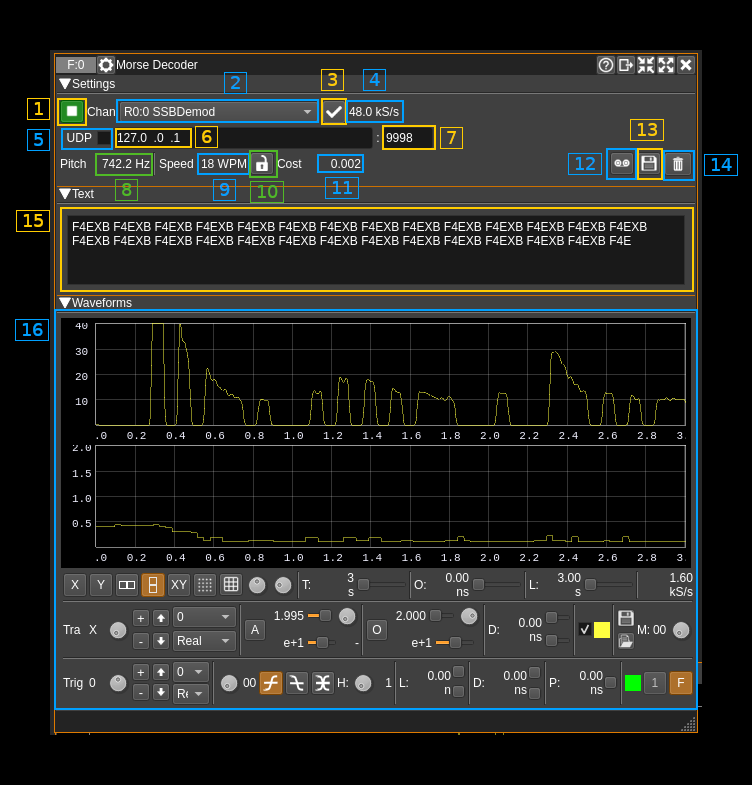
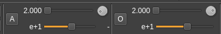
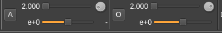
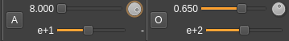
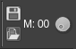

<h1>Morse Decoder Plugin</h1>

<h2>Introduction</h2>

This feature plugin can be used to decode Morse (CW) transmissions. It is based on a decoding library called [GGMorse](https://github.com/ggerganov/ggmorse.git). You must compile and install this library to build this plugin. The GGMorse installation folder is specified as `-DGGMORSE_DIR` on the cmake command line.

This plugin uses the demodulated audio of some Rx channel plugins.

  - AM demodulator
  - NFM demodulator
  - SSB demodulator (use mono audio - not binaural)
  - WFM demodulator

Typical sequence of operations:

  1. Start the plugin (1)
  2. Select channel (2)
  3. If channel is unique or default selection has not been changed press the (re)apply button (3)

<h2>Interface</h2>

The top and bottom bars of the channel window are described [here](../../../sdrgui/channel/readme.md)

<h3>1: Start/Stop plugin</h3>

This button starts or stops the plugin

<h3>2: Channel selection</h3>

Use this combo to select which channel to use for display. Channel is selected upon change. If channel is not changed or there is only one in the list you have to use the (re)apply button (A.4) to effectively connect the channel to the analyzer.

<h3>3: (Re)apply channel selection</h3>

Applies or re-applies channel selection (A.3) so that the channel gets effectively connected to the analyzer and signal is displayed. This will update the sample rate.

<h3>4: Input sample rate</h3>

This is the sample rate of the stream sent by the channel. GGMorse uses a sample rate of 4 kS/s internally and has its own decimation stage. However the input sample rate must be a multiple of 4 kS/s.

<h3>5: UDP</h3>

When checked, decoded text is forwarded to the specified UDP address (6) and port (7).

<h3>6: UDP address</h3>

IP address of the host to forward decoded text to via UDP.

<h3>7: UDP port</h3>

UDP port number to forward decoded text to.

<h3>8: Detected pitch</h3>

This is the CW tone pitch detected by GGMorse.

<h3>9: Detected keying speed</h3>

This is Morse keying speed detected by GGMorse.

<h3>10: Lock pitch and speed</h3>

Lock the pitch and speed to the current values detected by GGMorse. Unlock to return to auto detection.

<h3>11: Decoder cost factor</h3>

This is the GGMorse decoder cost factor. Successful decodes yield from a few millis to a few tens of millis.

<h3>11a: Show decoder threshold</h3>

Enable or disable the GGMorse decoder threshold display on the imaginary trace of the scope.

<h3>12: Start/stop Logging Messages to .txt file</h3>

When checked, writes all received characters to the .txt file specified by (13).

<h3>13: .txt Log Filename</h3>

Click to specify the name of the .txt file which decoded text is logged to.

<h3>14: Clear text</h3>

Push this button to clear the text in the text window (15)

<h3>15: Decoded Text</h3>

This area shows the decoded text. New text appears every 3 seconds which is the GGMorse analysis window length.

<h3>16. Waveforms view</h3>

This scope display shows waveforms related to the decoding with GGMorse.

  * On the real part it shows the average output of the Goertzel filter as exposed by GGMorse and that is used for decoding.
  * On the imaginary part
    * When the show decoder threshold is set (11a) it shows the threshold level being used in GGMorse for decoding. It is not necessary on the same scale as the Goertzel output.
    * When the show decoder threshold is not set (11a) a constant 0.0316227766017 is applied which corresponds to a power of -30 dB.

The elementary trace length is 3 seconds. This is the time window used by GGMorse thus a new trace appears every 3 seconds. The actual traces are interpolated to fit in the 4800 samples of the elementary trace. Thus the sample rate is a fixed 1.6 kS/s.

The best settings to visualize the Goertzel waveform is the following:

* For "Real" (X) and "Imag" (Y) display mode:
  * For the X trace (real): 
  * For the Y trace (imag): 

* For "MagDB" display mode (X trace): 

Note: the scope display has memories so you can come back to previous waveforms using the "M" dial button: . You can also save and load traces.
