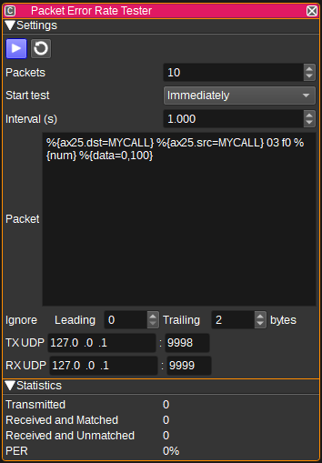

<h1>Packer Error Rate (PER) Tester Feature Plugin</h1>

<h2>Introduction</h2>

The Packet Error Rate (PER) Tester feature can be used to measure the packet error rate over digital, packet based protocols such as AX.25 (Packet mod/demod), LoRa (ChipChat mod/demod), AIS and 802.15.4.

The PER Tester feature allows you to define the contents of the packets to transmit, which can include a per-packet 32-bit identifier, as well as a user-defined or random payload, how many packets are sent and the interval between them.

Packets are sent and received from the feature to modulators and demodulators via UDP. This allows the transmitter or receiver to be connected to remote computer.

<h2>Interface</h2>

<h3>1: Start/Stop plugin</h3>

This button starts or stops the PER test. If when starting the test, the number of transmitted packets is equal to the number of packets to transmit, the statistics will be reset and the test restarted. Otherwise, the test will be resumed.

<h3>2: Reset Statistics</h3>

Pressing the reset statistics button will clear the number of packets transmitted and received.

<h3>3: Packets</h3>

Specify the number of packets to transmit.

<h3>4: Start test</h3>

Controls when the test is started, after the start button (1) is pressed. This can be either:

* Immediately
* On satellite AOS (Acquistion of signal)
* On satellite mid pass ((AOS-LOS)/2)

When either satellite option is selected, the Satellites field appears, allowing you to enter the names of satellites which should start the test.

<h3>5: Interval</h3>

Specify the interval in seconds between packet transmissions.

<h3>6: Packet</h3>

Specify the contents of the packet to transmit and expect to be received. Data should be entered in hexadecimal bytes (E.g: 00 11 22 33 44).

The exact format required will depend on the underlying protocol being used. For AX.25 using the Packet modulator, LoRo using the ChirpChat modulator, AIS and 802.15.4, it is not necessary to include the trailing CRC, as this is appended automatically by the SDRangel modulators.

Aside from hex values, a number of variables can be used:

* %{num} - Inserts a 32-bit packet identifier, that counts from 0 to the number of packets to be transmitted minus 1.
* %{data=n,m} - Inserts a random number of bytes, ranging in length from n to m bytes.
* %{ax25.dst=MYCALL} - Encodes the callsign MYCALL as an AX.25 destination address.
* %{ax25.src=MYCALL} - Encodes the callsign MYCALL as an AX.25 source address.
* "some text" - Encode the string contained within the quotes as ASCII.

As an example, for AX.25, the following packet could be used:

    %{ax25.dst=MYCALL} %{ax25.src=MYCALL} 03 f0 %{num} "Hello" %{data=0,100}

This:

* Encodes MYCALL as a 7-byte AX.25 destination address.
* Encodes MYCALL as a 7-byte AX.25 source address.
* Inserts hex value 0x03.
* Inserts hex value 0xf0.
* Inserts a 32-bit packet identifier.
* Inserts the 5 bytes of the ASCII encoding of Hello.
* Inserts a random payload of between 0 and 100 bytes.

<h3>7: Ignore Leading and Trailing bytes</h3>

When the PER Tester receives a packet, it compares it against a list of packets that it has transmitted. The ignore Leading and Trailing bytes field, reduce the number of bytes in the received packet, used for this comparison.

This can be used in cases where the demodulator outputs a different byte sequence than what the modulator requires. For example, the Packet Modulator does not require the CRC to be included, but the Packet Demodulator includes the CRC in the packet it outputs. Therefore, for the packet to match, the trailing two bytes should be ignored.

* For AX.25 (with Packet mod/demod), set Leading to 0 and Trailing to 2.
* For LoRa (with ChirpChat mod/demod), set Leading to 0 and Trailing to 0.
* For AIS set Leading to 0 and Trailing to 0.

<h3>8: TX UDP port</h3>

Specifies the IP address and UDP port number of the modulator to send to packets to, to be transmitted.

<h3>9: RX UDP port</h3>

Specifies the IP address and UDP port number of the demodulator to receive packets from.

<h2>Statistics</h2>

The statistics fields display the statistics for the current test:

* Transmitted - number of packets transmitted.
* Received and Matched - number of packets received that matched a packet that was transmitted.
* Received and Unmatched - number of packets received that did not match a packet that was transmitted.
* PER - packet error rate - calculated as 100-(matched/transmitted)*100.

<h2>API</h2>

Full details of the API can be found in the Swagger documentation. Here is a quick example of how to set the azimuth and elevation from the command line:

    curl -X PATCH "http://127.0.0.1:8091/sdrangel/featureset/0/feature/0/settings" -d '{"featureType": "PERTester",  "PERTesterSettings": { "packetCount": 100 }}'

To start sending the test:

    curl -X POST "http://127.0.0.1:8091/sdrangel/featureset/0/feature/0/run"
