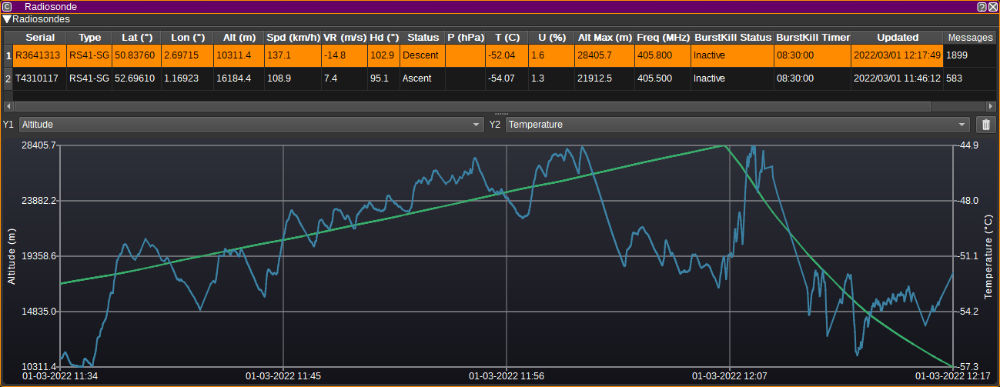
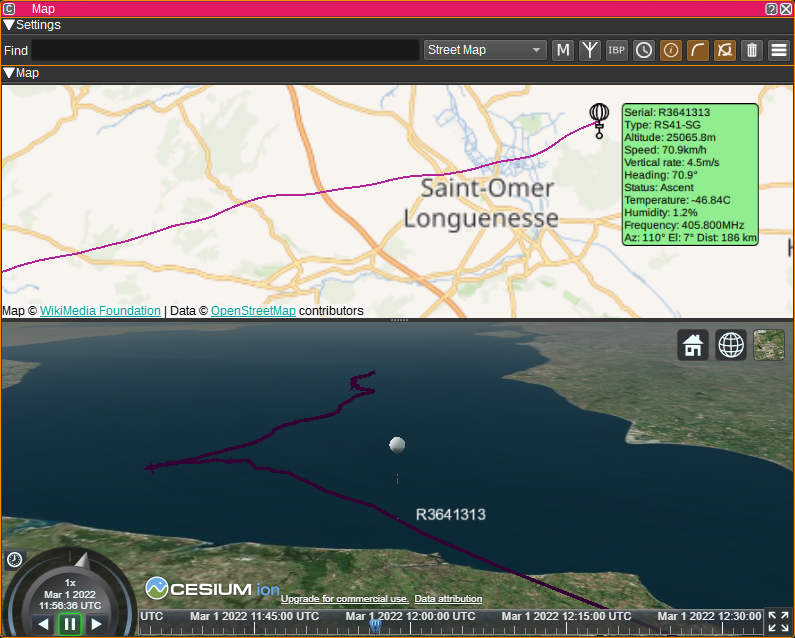

<h1>Radiosonde Feature Plugin</h1>

<h2>Introduction</h2>

The Radiosonde feature displays a table containing the most recent information received from radiosondes
based on data received via [Radiosonde Demodulators](../../channelrx/demodradiosonde/readme.md).

The chart can plot two data series vs time for the radiosonde selected in the table.

The Radiosonde feature can draw balloons objects on the [Map](../../feature/map/readme.md) feature in 2D and 3D.

<h2>Interface</h2>

<h3>Radiosonde Table</h3>

The Radiosonde table displays the current status of each radiosonde, based on the latest received data from all Radiosonde Demodulators.

* Serial - The serial number that uniquely identifiers each radiosonde.
* Type - The type of radiosonde.
* Lat (°) - Latitude in degrees. East positive. Double clicking on this column will center the map on this object.
* Lon (°) - Longitude in degrees. West positive. Double clicking on this column will center the map on this object.
* Alt (m) - The altitude of the radiosonde in metres.
* Spd (km/h) - Speed over ground in kilometres per hour.
* VR (m/s) - Vertical climb rate in metres per second.
* Hdg (°) - Heading in degrees.
* Status - Flight status of the radiosonde (E.g. On ground, ascent or descent).
* P (hPA) - Air pressure in hectopascals. Not all RS41s include a pressure sensor. A value ending with 'U' indicates a uncalibrated estimate and may be inaccurate.
* T (°C) - Air temperature in degrees Celsius.  A value ending with 'U' indicates a uncalibrated estimate and may be inaccurate.
* U (%) - Relative humidity in percent.  A value ending with 'U' indicates a uncalibrated estimate and may be inaccurate.
* Alt Max (m) - The maximum altitude seen for the radiosonde in metres.
* Freq (MHz) - The transmission frequency in megahertz as indicated by the radiosonde.
* BurstKill status - Whether the BurstKill timer is active.
* BurstKill timer - BurstKill timer.
* Updated - Gives the date and time the last message was received.
* Messages - Displays the number of messages received.

Right clicking on the table header allows you to select which columns to show. The columns can be reordered by left clicking and dragging the column header.

Right clicking on a table cell allows you to copy the cell contents, or find the radiosonde on the map.

<h3>Map</h3>

The Radiosonde feature can plot balloons (during ascent) and parachutes (during descent) on the [Map](../../feature/map/readme.md).
To use, simply open a Map feature and the Radiosonde plugin will display objects based upon the data it receives from that point.
Selecting a radiosonde item on the map will display a text bubble containing information from the above table.
To centre the map on an item in the table, double click in the Lat or Lon columns.

<h2>Attribution</h2>

* Hot-air-balloon icons created by Freepik - https://www.flaticon.com/free-icons/hot-air-balloon
* Parachute icons created by Freepik - https://www.flaticon.com/free-icons/parachute
