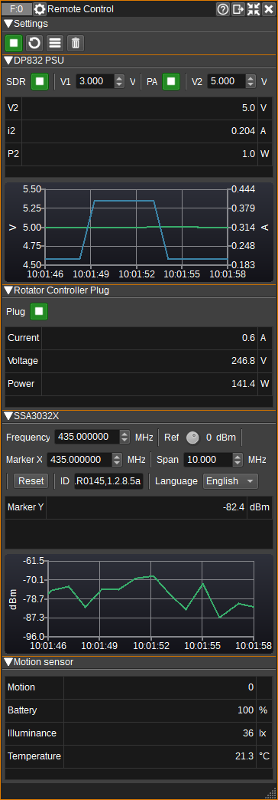
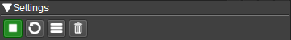
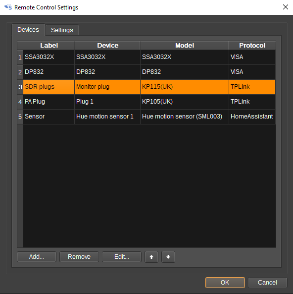
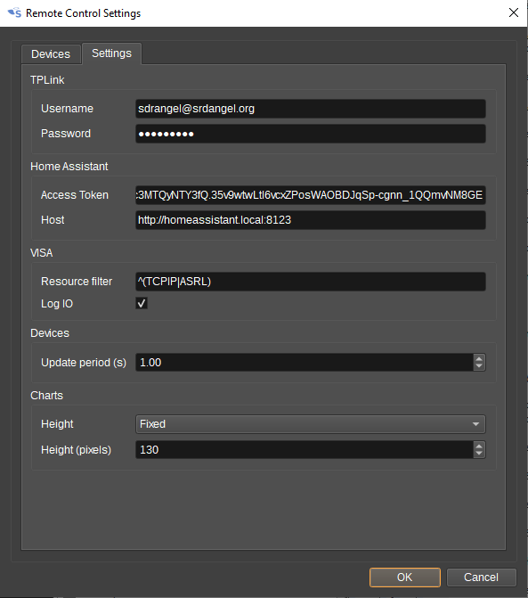
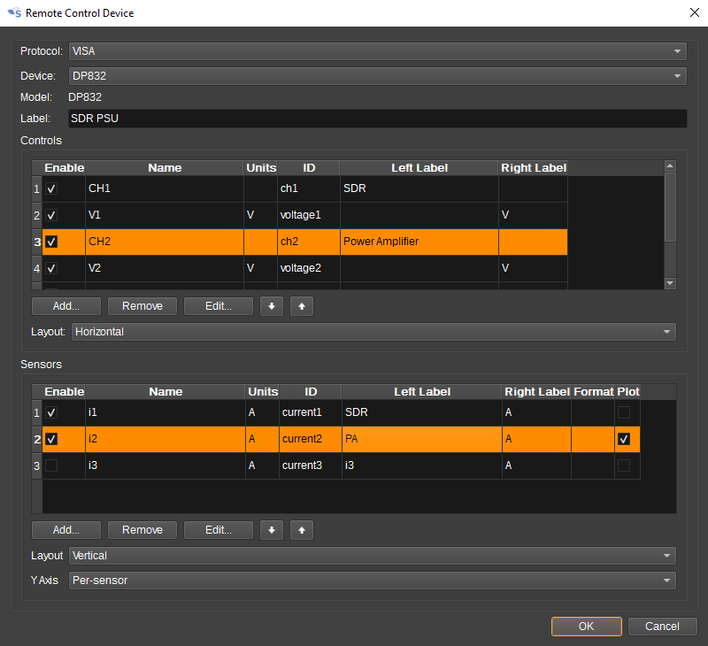
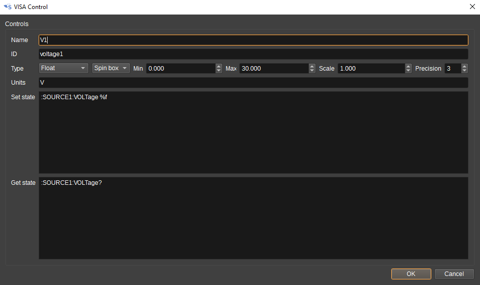
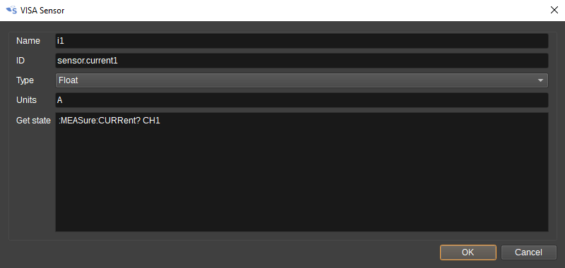

<h1>Remote Control Feature Plugin</h1>

<h2>Introduction</h2>

The Remote Control Feature can be used to control and view the status of Smart Home / IoT devices,
such as plugs and switches, and test equipment that supports the VISA API, such as benchtop power
supplies, multimeters and spectrum analyzers.

In a SDR context, this can be useful for remotely controlling and monitoring power to SDRs, power
amplifiers and rotator controllers. Or it can be used to make and display signal power measurements
from a spectrum analyzer, in SDRangel.

The Remote Control feature can interface to devices via the following APIs:

* Home Assistant (https://www.home-assistant.io/)
* TP-Link's Kasa (https://www.tp-link.com/uk/home-networking/smart-plug/)
* VISA (https://www.ivifoundation.org/specifications/default.aspx)

A user-configurable GUI is supported, that allows customization of which controls and sensors are displayed for each device.
Sensor values can be plotted versus time on charts.

<h2>Interface</h2>

<h3>1: Start/Stop</h3>

Starts or stops periodic reading of the state of all devices. The update period can be set in the Settings dialog (3).

<h3>2: Update State</h3>

Press to manually read the state of all devices. This can be used regardless of whether the plugin is started or stopped (1).

<h3>3: Display Settings Dialog</h3>

Pressing this button opens the Settings dialog.

<h3>4: Clear Chart Data</h3>

Pressing this button will clear all data from all charts.

<h3>5: Device GUIs</h3>

GUIs for the enabled controls and sensors within a device will be displayed below the settings.
If a device is not available, it will be greyed out. If an error occurs when getting the state for a specific
control or sensor, or an out of range value is received, the background of the corresponding widget will turn red.

<h2>Settings Dialog</h2>

<h3>Devices Tab</h3>

The Devices tab displays a list of devices that have been added to this Remote Control.

* Press Add... to add a new device.
* Press Remove to remove the selected device.
* Press Edit... to edit settings for the selected device.
* The up and down arrows move the selected device up or down in the list.
The order of devices in the list determines the display order of the device's controls and senors in the Remote Control's GUI.

<h3>Settings Tab</h3>

<h4>TP-Link Settings</h4>

The TP-Link fields must be completed in order to discover TP-Link Kasa Smart Plugs using TP-Link's protocol.

Enter the e-mail address and password used for the TP-Link Kasa Smart Home app.

<h4>Home Assistant Settings</h4>

The Home Assistant fields must be completed in order to discover devices connected to Home Assistant.

* Access token - Access token required to use the Home Assistant API. Access tokens can be created on the user profile page, typically at: http://homeassistant.local:8123/profile
* Host - The hostname or IP address and port number of the computer running the Home Assistant server. This is typically http://homeassistant.local:8123

<h4>VISA Settings</h4>

* Resource filter - A regular expression of VISA resources not to attempt to open. This can be used to speed up VISA device discovery. As an example, devices using TCP and serial connections can be filted with: ^(TCPIP|ASRL). Leave the field empty to try to connect to all VISA devices.
* Log I/O - Check to log VISA commands and responses to the SDRangel log file.

<h4>Devices Settings</h4>

* Update period - Period in seconds between automatic updates of device control and sensor state.

<h4>Chart Settings</h4>

* Height - Specifies whether charts are a fixed height (Fixed), or can be expanded vertically (Expanding). This setting also determines where the 'Stack sub windows' button will place the GUI.
* Height (pixels) - When 'Height' is 'Fixed', this specifies the height in pixels of each chart.

<h2>Device Dialog</h2>

The Device Dialog allows selecting devices to add to the Remote Control, as well as customing what controls and sensors are displayed for the device in the GUI.

When the dialog first appears when adding a new device, all fields will be disabled except for Protocol. You should first select a protocol in order to discover all devices that are currently
available via the selected protocol. The available devices will be added to the Device field. Select from this field the device you wish to add.

The device name is the name assigned by the selected protocol. If you wish to use a different label for the device in the GUI, this can be entered in the Label field.

The Controls and Sensors tables allow you to customize which are controls and sensors are visible in the GUI, via the checkbox in the Enable column.

The Left Label and Right Label fields hold the text that will be displayed either side of the control or sensor in the GUI.
The Left Label is initialised with the device name and the Right Label is initialised with the units.
These fields can be changed by double clicking in the cell.

The Format column in the sensor table allows custom formatting of sensor values in the GUI. 
printf format specifiers can be used: 
* %i for integers, 
* %e, %f and %g for real numbers (floats) and 
* %s for strings.

By default, real numbers are displayed to 1 decimal place. To increase this to 3, you can use %.3f. 

Checking the Plot column will result in a chart being drawn that plots sensor data versus time.
All enabled sensors for a device will be plotted on the same chart.
The Y Axis field below the table determines whether each series will have it's own Y axis (Per-sensor) or whether a single Y axis will be used for all series (Common).

The Layout fields control how the Controls and Sensors will be laid-out in the GUI. This can be set to be either Horizontally or Vertically.

When the Protocol is set to VISA, additional buttons will be displayed under the tables that allow controls and sensors to be added or removed, as unlike when selecting
TP-Link and Home Assistant devices, these are not automatically defined for most instruments. Some basic controls are included for Rigol DP832 and Siglent SSA3032X.

<h3>VISA Control Dialog</h3>

The VISA Control Dialog allows the specification of a control for a VISA device. Both the GUI element and the SCPI commands to set and get the state must be specified:

* Name - A name for the control. E.g. Voltage for a voltage control on a power supply.  This field is used as the default value for the Left Label in the GUI.
* ID - A unique identifier for the control. This must be unique between all controls and sensors in a device.
* Type - The data type of the state being controlled. This can be:
   * Boolean - For on/off controls. A toggle button is used in the GUI.
   * Integer - For integers. Minimum and maximum limits can be specified. A spin box is used in the GUI.
   * Float - For real numbers. Minimum and maximum limits can be specified, as well as the precision (number of decimals). The GUI can use either a spin box, dial or slider. The Scale field specifies a scale factor that is applied to the value from the GUI that is sent to the device. E.g. If you wish to have a value displayed in MHz, but the value in the SCPI command should be in Hz, then the Scale field should be set to 1000000.
   * String - For a text string.
   * List - For a list of text strings, selectable from a ComboBox in the GUI.
   * Button - For a button that executes a specific command, but does not have any state to be displayed. E.g. for a Reset button that executes *RST.
* Units - The units of the control, if applicable. E.g V or Volts for a voltage control. This field is used as the default value for the Right Label in the GUI.
* Set state - SCPI commands that set the state in the device. The value of the control in the GUI can be substituted in to the command by using %d for boolean and integer, %f for float and %s for strings.
* Get state - SCPI commands that get the state in the device. This is used to update the control in the GUI. If multiple queries are specified, the value is taken from the last response.

<h3>VISA Sensor Dialog</h3>

The VISA Sensor Dialog allows the specification of a sensor for a VISA device. Both the GUI element and the SCPI commands to get the state must be specified:

* Name - A name for the sensor. E.g. Current for a current measurement from a power supply. This field is used as the default value for the Left Label in the GUI.
* ID - A unique identifier for the sensor. This must be unique between all controls and sensors in a device.
* Type - The data type of the sensor. This can be:
   * Boolean - For on/off, true/false and 1/0 values.
   * Float - For real numbers.
   * String - For text strings.
* Units - The units of the sensor, if applicable. E.g A or Amps for a current sensor. This field is used as the default value for the Right Label in the GUI and also for the Chart Y-axis label.
* Get state - SCPI commands that get the state of the sensor from the device.
