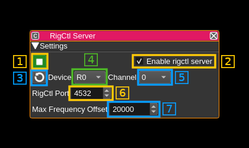

<h1>RigCtl server plugin</h1>

<h2>Introduction</h2>

The rigctl server plugin allows SDRangel to be controlled via [Hamlib](http://hamlib.sourceforge.net/manuals/hamlib.html)'s rigctld protocol. This allows other software that implements the rigctld protocol, such at the satellite tracking software GPredict, to control SDRangel, to adjust for doppler or to automatically switch between different satellite frequencies and modes.

<h2>Interface</h2>

<h3>1: Start/Stop plugin</h3>

This button starts or stops the plugin

<h3>2: Enable rigctrl server</h3>

Checking this option will enable the rigctrl server in SDRangel. The default is disabled.

<h3>3: Refresh list of devices and channels</h3>

Use this button to refresh the list of devices (4) and channels (5)

<h3>4: Select device set</h3>

Specify the SDRangel device set that will be controlled by received rigctl commands. Defaults to R0.

<h3>5: Select channel</h3>

The channel index specifies the SDRangel channel that will be controlled by received rigctl commands. Defaults to 0.

<h3>6: Port</h3>

The rigctl server plugin opens a TCP port to receive commands from a rigctl client. Please specify a free TCP port number. The default rigctld port is 4532.

<h3>7: Max Frequency Offset in Hz</h3>

The maximum frequency offset controls whether the center frequency or frequency offset is adjusted when a new frequency is received by a rigctl command.
If the difference between the new frequency and the current center frequency is less than this value, the input offset (in the demodulator) will be adjusted.
If the difference is greater than this value, the center frequency will be set to the received frequency.
To only ever set the center frequency, set this value to 0. The default value is 10000.

<h2>Supported rigctrl Commands</h2>

The following rigctrl commands are supported:

<ul>
<li>F / set_freq
<li>f / get_freq
<li>M / set_mode
<li>m / get_mode
<li>get_powerstat
<li>set_powerstat
</ul>

<h2>Example rigctrl Session</h2>

Run SDRangel and from the Preferences menu select rigctrl. Check "Enable rigctrl server" and press OK.

In a terminal window, run:

<pre>
telnet localhost 4532
set_mode AM 1000
set_freq 100000000
set_powerstat 1
</pre>
