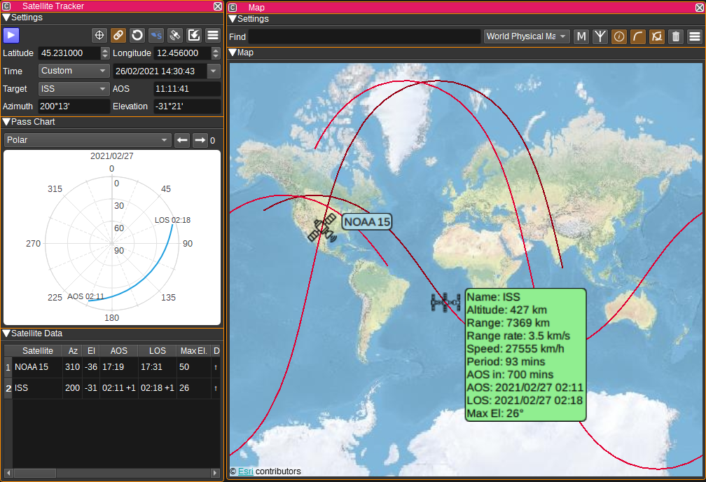
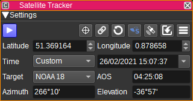
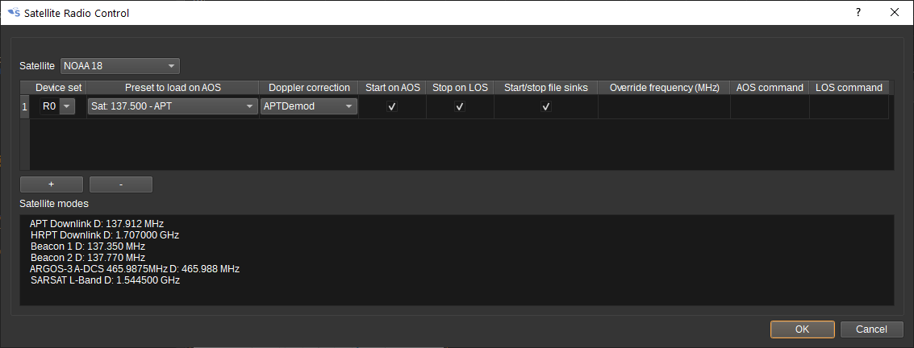
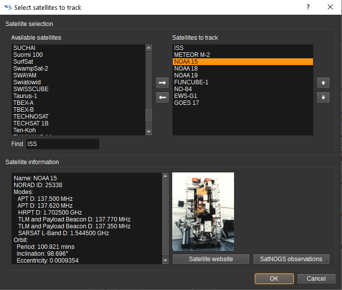
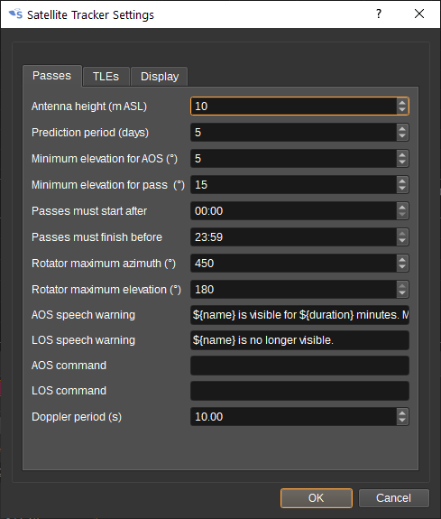
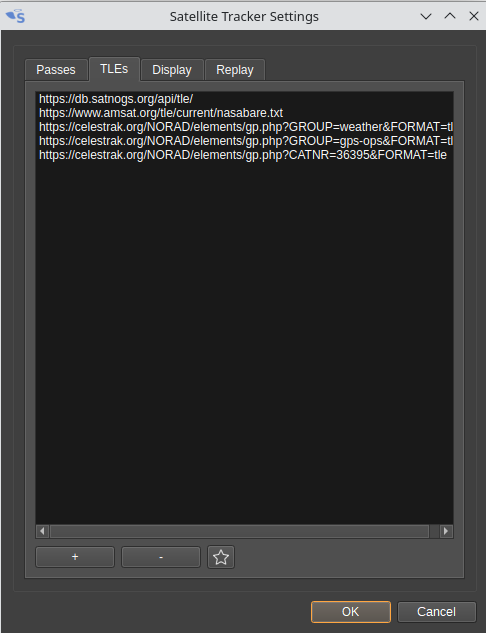
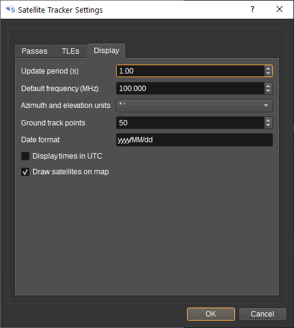
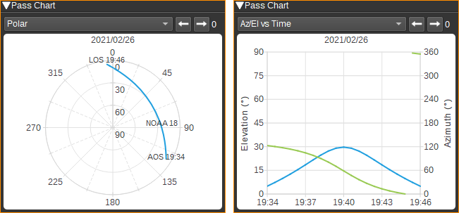
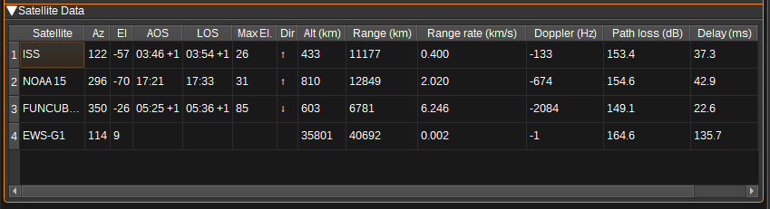
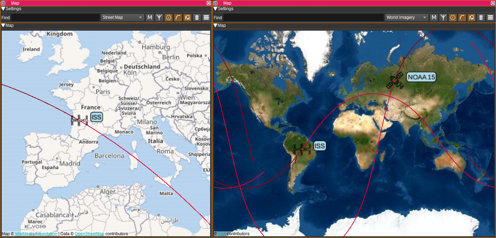

<h1>Satellite Tracker Feature Plugin</h1>

<h2>Introduction</h2>

The Satellite Tracker feature plugin can be used to:

* Track satellites, pointing antennas at them via SDRangel's Rotator Controller Features
* Control SDRangel by loading presets, starting/stopping acquisition and setting center frequencies on AOS (Acquisition of Signal) for each satellite
* Adjust channels' input frequency offset to account for Doppler shift
* Display polar and elevation/azimuth vs time plots for satellite passes
* Display the overhead position of satellites on the Map Feature, along with the ground track of the satellites
* Display a variety of information about the satellite

<h2>Interface</h2>

<h3>1: Start/Stop plugin</h3>

This button starts or stops the satellite tracking. The plugin will only calculate satellite positions or adjust for Doppler when started.

<h3>2: Find satellite on map</h3>

Pressing this button centres the Map Feature (if open) on the target satellite.

<h3>3: Automatically select target on AOS</h3>

When checked, the target satellite will be automatically changed on any selected satellite's AOS, if it is a higher priority than the current target or if the current target satellite is not visible.
Priority is determined by the order the satellites appear in the Satellite Selection dialog.

<h3>4: Update satellite data</h3>

When clicked, the TLE (two line element) files selected in the Settings dialog are downloaded, as well as the latest SatNogs satellite database, containing details of satellites' transmitter and receiver frequencies. While downloading, this button will appear green.

Satellite positions can only be predicted with limited accuracy, so the TLEs need to be updated frequently for accurate positioning. This could be daily, weekly or monthly depending upon the individual satellite. This downloads around 1MB of data.

<h3>5: Show SDRangel Control dialog</h3>

Pressing this button displays the SDRangel Control dialog.

This dialog determines the actions the Satellite Tracker will take when AOS or LOS occurs for a satellite. First, select a satellite from the dropdown box. Information about the satellite's transmit and receive modes should appear in the field at the bottom of the dialog, if available in the SatNogs database.

To perform an action on an SDRangel device set on AOS or LOS, press the "Add device set" button. This will add a new, allowing you to select:

* The device set that will be controlled. This will list all currently open device sets. You can also type the name of a new device set.
* The preset to load on AOS. This allows preset device settings (E.g. centre frequency) and demodulators to be opened when the satellite becomes visible.
* Which channels Doppler correction should be applied to. The list of channels is taken from the selected preset. Check a channel to enable Doppler correction for that channel. The Doppler correction is applied to the channel's input frequency offset.
* Whether to start acquisition (i.e. start the SDR device) on AOS.
* Whether to stop acquisition on LOS.
* Whether any file sinks in the preset should be started on AOS and stopped on LOS. This allows the baseband signal received from the satellite to be recorded to a file.
* Whether to override the centre frequency in the preset. This allows a single preset to be used with multiple satellites.
* A command or script to execute on AOS. See (8) for list of subsitituions.
* A command or script to execute on LOS. See (8) for list of subsitituions.

Multiple tabs can be added, to allow independent control of multiple device sets. To remove a tab, click the cross next to the device set name in the tab list.

<h3>6: Show Satellite Selection dialog</h3>

Pressing this button displays the Satellite Selection dialog.

On the left hand side are a list of all available satellites, as determined by the TLE files that have been downloaded. (If none are visible, ensure the TLEs tab of the Satellite Settings dialog (8) contains at least https://db.satnogs.org/api/tle/ and then press the Update satellite data (4) button)

The list of satellites that the Satellite Tracker will track is on the right hand side.

To move satellites from side to side, either double click them, or select them and press the left or right arrows in the middle.

The Satellites to track list is ordered in priority for the auto target feature (3). The change the order, select a satellite in the list and press the up or down arrows to the right.

Satellite information at the bottom of the dialog comes from the SatNogs database: https://db.satnogs.org/

<h3>7: Set latitude and longitude from My Position</h3>

When clicked, it sets the latitude, longitude and height fields to the values from SDRangel's My Position preferences.

<h3>8: Show Settings dialog</h3>

Pressing this button displays the Settings dialog.

On the Settings tab, you can set:

* Height above sea level in metres of the antenna.
* The prediction period in days. This limits the maximum number of days ahead for which satellite passes are predicted until.
* The elevation in degrees from the antenna location, which a satellite much reach in order for AOS to be indicated.
* The minimum elevation in degrees from the antenna location, which a satellite much reach in order for a pass to be indicated.
* A time window for which passes must start and end between, to be displayed or acted upon. For example, for day time passes, you could set "must start after" to 8:00 and "must end before" to 18:00. For night time passes, set "must start after" to 20:00 and "must end before" to 6:00.
* The maximum azimuth angle in degrees supported by your rotator. 450 degree support is beneficial for passes that pass through 360/0 degrees, to avoid the rotator having to do a complete rotation mid pass.
* The maximum elevation angle in degrees supported by your rotator. 180 degree support is beneficial for passes that pass through 360/0 degrees, to avoid the rotator having to do a complete rotation mid pass.
* A speech warning to be given on AOS. See below for a list of variable substitutions.
* A speech warning to be given on LOS.
* A command/script to be executed on AOS. This applies to all satellites. It is also possible to set a per-satellite command in the SDRangel Control dialog. See below for a list of variable substitutions.
* A command/script to be executed on LOS. This applies to all satellites. It is also possible to set a per-satellite command in the SDRangel Control dialog.
* The Doppler correction period in seconds, which controls how frequently Doppler correction is applied. Which channels have Doppler correction applied is set on a per-channel basis in the SDRangel Control dialog.

For commands, scripts and speech, the following variables can be substituted: `${name}`, `${duration}`, `${aos}`, `${los}`, `${elevation}`, `${aosAzimuth}`, `${losAzimuth}`, `${northToSouth}`, `${latitude}`, `${longitude}`, `${altitude}`, `${azimuth}`, `${elevation}`, `${range}`, `${rangeRate}`, `${speed}` and `${period}`.

On the TLEs tab, you can provide a list of URL from which satellite Two Line Element files can be downloaded from.
TLE files contain the orbital parameters for a satellite and are required in order to be able to calculate a satellites position.
TLEs for may satellites can be obtained from https://www.celestrak.com/NORAD/elements/
To use a TLE file on a local disk, use a URL such as file:my_tle.txt

On the display tab, you can set:

* The update period in seconds, which controls how frequently satellite positions are calculated.
* The default frequency in MHz that is used for calculating Doppler and free space path loss in the Satellite Data table.
* The units used to display azimuth and elevation to the target satellite. This can be in degrees, minutes and seconds or decimal degrees.
* The number of points used for ground tracks on the map. More points result in smoother tracks, but require more processing.
* Which rotators are displayed on the polar chart. This can be All, None or Matching target. When Matching target is selected, the rotator will
only be displayed if the source in the Rotator Controller is set to this Satellite Tracker and Track is enabled.
* The format used for displaying dates. E.g. yyyy/MM/dd
* Whether times are displayed in the local time zone or UTC.
* Whether to draw the satellites on the map.

<h3>9: Latitude</h3>

Specifies the latitude in decimal degrees (North positive) of the antenna location.

<h3>10: Longitude</h3>

Specifies the longitude in decimal degrees (East positive) of the antenna location.

<h3>11: Time</h3>

Select the date and time at which the position of the satellite should be calculated. Select either:

* Now, for the current time based on the computers clock,
* Custom to manually enter a date and time,
* Map to get the time from the 3D map or
* File to get the time from a File Input device.

When Map or File are selected, a combo box is displayed that allows choosing which Map feature or File Input device, should there be several.

<h3>12: Target</h3>

Select the target satellite. The target satellite is the source of data for the Time to AOS, Azimuth and Elevation fields. The azimuth and elevation of the target satellite is sent to the Rotator Controller features.

<h3>13: Time to AOS</h3>

This field displays the time to AOS (Acquisition of Signal) for the target satellite. It is displayed in hours, minutes and seconds, unless the satellite is currently visible, in which case it will display "Now".

<h3>14: Azimuth</h3>

Displays the calculated azimuth (angle in degrees, clockwise from North) to the target satellite.

<h3>15: Elevation</h3>

Displays the calculated elevation (angle in degrees - 0 to horizon and 90 to zenith) to the target satellite.

<h2>Pass Charts</h2>

Pass charts can be plotted showing the azimuth and elevation of the target satellite from AOS to LOS. This can be in polar of Cartesian form:

The arrows next to the chart combobox, allow the pass number to be selected. Pass 0 is the next pass, with higher numbered passes occurring later in time.
The amount of passes is determined by the prediction period, which can be set in the Settings dialog.

click on this icon  to switch between light and dark themes for the charts.

<h2>Satellite Data</h2>

The satellite data table displays calculated data about the selected satellites.

The table contains:

* The satellite name.
* The azimuth in degrees to the satellite from the antenna location.
* The elevation in degrees to the satellite from the antenna location.
* The time of the next AOS. If this time is some days in the future, the number of days will be displayed as +days. E.g. +1 for tomorrow.
* The time of the next LOS.
* The maximum elevation in degrees that the satellite will be from the antenna location in the next pass.
* Whether the satellite will be heading South to North (up arrow) or North to South (down arrow) in the next pass.
* The altitude of the satellite in kilometres.
* The range to the satellite from the antenna location in kilometres.
* The rate range (i.e. speed the satellite is moving away from the antenna location) in kilometres per second.
* The Doppler shift due to the satellite's motion that would be observed on a signal at the default frequency (which can be set in the Settings dialog).
* The free space path loss to the satellite, at the default frequency.
* The one-way propagation delay to the satellite from the antenna location in milliseconds.
* The NORAD catalogue identifier for the satellite.

Rows can be ordered by left clicking column headers.
Columns can be hidden by right clicking on the header and unchecking them.

<h2>Map</h2>

The Satellite Tracker feature can send the overhead position of the satellite to the Map, along with a ground track.

When using the Find feature in the Map GUI, you can search by the name of the satellite.

<h2>Attribution</h2>

sgp4 library by Daniel Warner https://github.com/dnwrnr

SatNogs satellite database https://db.satnogs.org/

Satellite two-line elements (TLEs) are from Celestrak https://celestrak.com/

Icons are by Freepik from Flaticon https://www.flaticon.com/

<h2>API</h2>

Full details of the API can be found in the Swagger documentation. Here is a quick example of how to set the satellites to track:

    curl -X PATCH "http://127.0.0.1:8091/sdrangel/featureset/0/feature/0/settings" -d '{"featureType": "SatelliteTracker",  "SatelliteTrackerSettings": { "satellites": [ "NOAA 15", "NOAA 19" ] }}'

And how to set the target:

    curl -X PATCH "http://127.0.0.1:8091/sdrangel/featureset/0/feature/0/settings" -d '{"featureType": "SatelliteTracker",  "SatelliteTrackerSettings": { "target": "NOAA 15"  }}'

Or, to set the device settings:

    curl -X PATCH "http://127.0.0.1:8091/sdrangel/featureset/0/feature/0/settings" -d '{"featureType": "SatelliteTracker",  "SatelliteTrackerSettings": {  "deviceSettings": [ {  "satellite": "ISS",  "deviceSettings": [ { "deviceSet": "R0", "doppler": [0], "frequency": 0, "presetDescription": Sat", "presetFrequency": 145.825, "presetGroup": "ISS Digi", "startOnAOS": 1, "startStopFileSinks": 1, "stopOnLOS": 1}] } ] }}'
