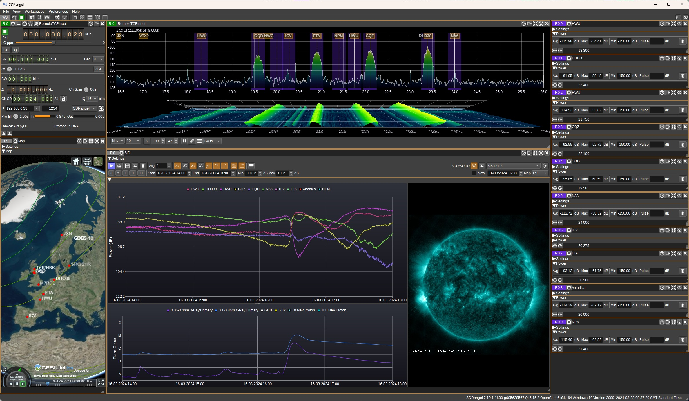
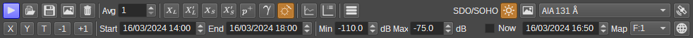
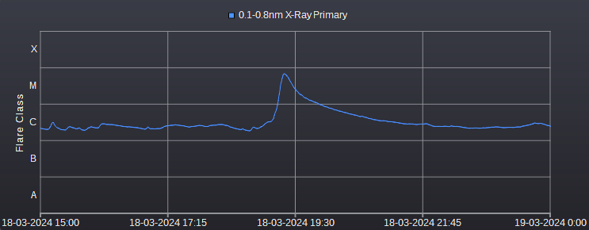
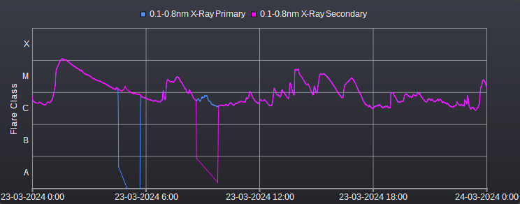
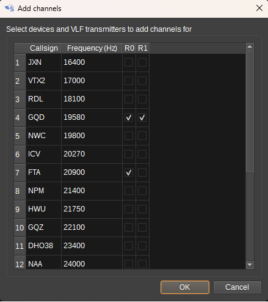
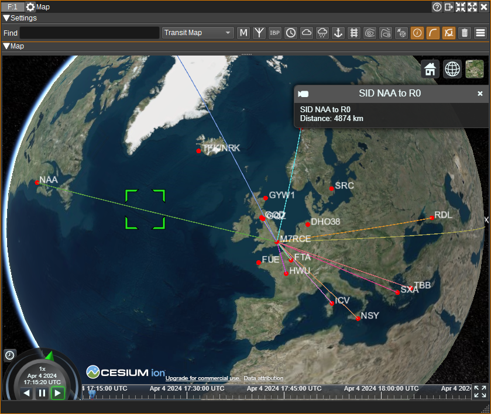

<h1>SID Feature Plugin</h1>

<h2>Introduction</h2>

The SID feature displays a chart that plots channel power vs time, which can be useful for detecting solar flares, CMEs (Coronal Mass Ejections)
and GRBs (Gamma Ray Bursts) via SIDs (Sudden Ionospheric Disturbances).
The signal source for which power is measured should typically be a VLF signal from a distant transmitter with near constant day-time power output, 
such as the VLF transmitters that are used by navies to communicate with submarines 
(E.g. [GQD](https://en.wikipedia.org/wiki/Anthorn_Radio_Station) / [HWU](https://en.wikipedia.org/wiki/HWU_transmitter) / [NAA](https://en.wikipedia.org/wiki/VLF_Transmitter_Cutler)).
This can be measured within SDRangel using the [Channel Power](../../channelrx/channelpower/readme.md) plugin.

When a solar flare occurs, EUV (Extreme Ultraviolet) and X-ray radiation is emitted from the Sun. When the radiation reaches the Earth's atmosphere (after ~8 minutes), 
it can increase the ionization of the D and E regions in the ionosphere, enhancing VLF propagation. Gamma-rays from powerful GRBs can also have a similar effect on the ionosphere.
The enhancement of the VLF sky-wave can interfere with the ground-wave, causing constructive or destructive interference depending on the phase. If strong enough, this can be observed
in the plot of received power vs time.

The SID chart can plot multiple series, allowing different signals from different transmitters to be monitored. 
This can be useful as SIDs can be localized to specific regions in the atmosphere, thus not all signals may be affected. 
Data can come from multiple [Channel Power](../../channelrx/channelpower/readme.md) plugins within a single device, or separate devices.

To help determine the cause of a SID, additional data can be plotted from a variety of sources:

* the chart can plot X-ray data from the GOES satellites, to allow visual correlation of spikes in the X-ray flux measurement with spikes in the VLF power measurements,
* it can display images and video from the Solar Dynamics Observatory at EUV wavelengths, which may visually show the solar flare,
* it can display GRB events on the chart, measured by satellites such as Fermi and Swift,
* it can display solar flare events detected by the STIX X-ray instrument on the Solar Orbiter satellite,
* it can display proton flux measured by the GOES satellites,
* it can control the time in a 3D [Map](../../feature/map/readme.md), to see the corresponding effect on MUF (Maximum Usable Frequency) and foF2 (F2 layer critical frequency).

The SID feature can record power from any RX channel plugin that has a channelPowerDB value in its channel report, so can be used for recording and plotting power vs time for purposes other than SID monitoring.

<h2>Interface</h2>

<h3>1: Start/stop</h3>

Press to start/stop collection and plotting of data.

<h3>2: Open .csv</h3>

Press to open a .csv file to read data from.

<h3>3: Save to .csv</h3>

Press to select a .csv file to write data to.

<h3>4: Save chart to image</h3>

Press to save the chart to a .png or .jpg file.

<h3>5: Clear all data</h3>

Press to clear all data.

<h3>6: Average</h3>

Number of samples to use in a moving average filter that can be applied to the data. Set to 1 for no filtering.

<h3>7: Display Primary Long Wavelength X-Ray Data</h3>

Check to display long wavelength (0.1-0.8nm) X-Ray data from the primary GOES satellite (Currently GOES 16) on the chart.

This is probably the most useful data in order to see when a solar flare has occurred, as there will typically be a sharp peak.
The GOES satellites are in a geostationary orbit around the Earth, so the measured increase in X-ray flux from a flare will be approximately 8 minutes
after it has occurred.
The Y-axis indicates the flare classification. M and X class flares are those most likely to have a measurable impact on the ionosphere.

<h3>8: Display Secondary Long Wavelength X-Ray Data</h3>

Check to display long wavelength (0.1-0.8nm) X-Ray data from the secondary GOES satellite (Currently GOES 18) on the chart.
Data from the secondary satellite may be useful when the primary is unavailable, such as when it is in eclipse.
In the following plot we can see the primary and secondary data is nearly identical, apart from where there are dropouts
while in eclipse:

<h3>9: Display Primary Short Wavelength X-Ray Data</h3>

Check to display short wavelength (0.1-0.8nm) X-Ray data from the primary GOES satellite (Currently GOES 16) on the chart.

<h3>10: Display Secondary Short Wavelength X-Ray Data</h3>

Check to display short wavelength (0.05-0.4nm) X-Ray data from the secondary GOES satellite (Currently GOES 18) on the chart.
Data from the secondary satellite may be useful when the primary is in eclipse.

<h3>11: Display Proton Flux</h3>

Check to display 10 MeV and 100 MeV proton flux measurements from the primary GOES satellite on the chart.
A peak in the proton flux can occur one to three days after a CME (Coronal Mass Ejection) is directed towards Earth.
Whereas X-rays from flares can impact any part of the ionosphere that is facing the sun, the Earth's magnetosphere typically directs
the particles in the CME towards the poles, so a corresponding SID is most likely to be detected if you are receiving 
a signal from a transmitter crossing the polar region.

<h3>12: Display GRBs</h3>

Check to display Gamma Ray Bursts (GRB) on the chart. GRBs are plotted as a scatter plot. You can right click on a GRB to display the context
menu, which contains a number of links to additional data from the Fermi satellite for the GRB. The GRB data is not realtime, and it may take 
up to 7 days for a GRB to appear in the data, so this is typically only useful for the analysis of historical data.
The context menu also has an item to display the location of the GRB in the [Sky Map](../../feature/skymap/readme.md) feature.

<h3>13: Display Solar Flares</h3>

Check to display solar flares on the chart as record by the STIX X-ray instrument on the Solar Orbiter satellite.
You can right click on a solar flare to display the context menu, which contains a number of links to additional data from the STIX instrument.
The solar flare data is not realtime and can sometimes be delayed by 24 hours.

<h3>14: Combined or Separate Charts</h3>

When unchecked, data from [Channel Power](../../channelrx/channelpower/readme.md) plugins is displayed on a separate chart to other data such as X-ray and proton flux and GRBs.
When checked, all data is displayed on a single combined chart.

<h3>15: Display Legend</h3>

Check to display a legend on the chart. When unchecked the legend will be hidden. You can click on items in the legend to temporarily hide and then show the corresponding series on the chart.
The position of the legend can be set in the Settings Dialog.

<h3>16: Add Channels</h3>

Click to open the Add Channels Dialog. This allows you to easily add the Channel Power channels for each VLF transmitter on each RX device.
This dialog shows a table with one row for each VLF Transmitter, and a column for each RX device. 
When OK is pressed, a corresponding Channel Power channel will be created for every cell that is checked.

For example, in the image below, Channel Power channels will be added for the GDQ transmitter on both devices R0 and R1, with one for FTA on device R0 only.

<h3>17: Open Settings Dialog</h3>

Click to open the Settings Dialog. The settings dialog allows a user to:

- Select which channels data is recorded from.
- What colours are used for the data series.
- What labels will be used for the series.
- Whether auto-save is enabled. When auto-save is enabled, data will be automatically saved as the specified interval.
- Whether auto-load is enabled. When auto-load is enabled, auto-save data will be automatically loaded when the SID feature is opened.
- The filename is use for auto-save.
- How often, in minutes, the data is auto-saved.
- Where the chart legend should be positioned.

<h3>18: Display SDO/SOHO Imagery</h3>

When checked, displays imagery from NASA's SDO (Solar Dynamic Observatory) and ESA/NASA's SOHO (Solar and Heliospheric Observatory) satellites.

SDOs images the Sun in a variety of UV and EUV wavelengths. SOHO shows images of the solar corona. The images are near real-time, updated every 15 minutes.

Solar flares are particularly visible in the AIA 131 Å images.

<h3>19: Image or Video Selection</h3>

Selects whether to display images (unchecked) or video (checked).

<h3>20: Image/Wavelength Selection</h3>

Selects which image / wavelength to view.

* AIA 94 Å to 1700 Å - The AIA (Atmospheric Imaging Assembly) images the solar atmosphere at multiple EUV (Extreme Ultraviolet) and UV (Ultraviolet) wavelengths:
   
| Band    | Region									|
|---------|-----------------------------------------|
| 94 Å    | Flaring									|
| 131 Å   | Flaring									|
| 171 Å   | Quiet corona, upper transition region 	|
| 193 Å   | Corona and hot flare plasma			 	|
| 211 Å   | Active corona							|
| 304 Å   | Chromosphere, transition region		    |
| 335 Å   | Active corona							|
| 1600 Å  | Transition region, upper photosphere	|
| 1700 Å  | Temperature minimum, photosphere		|

[Ref](https://sdo.gsfc.nasa.gov/data/channels.php)

* MHI Magnetogram - HMI (Helioseismic and Magnetic Imager) Magnetogram shows the magnetic field in the photosphere, with black and white indicating opposite polarities.
* MHI Intensitygram - Brightness in a visible light band (6173 Å - Red - Iron spectral line), useful for observing sun spots.
* Dopplergram - Shows velocities along the line-of-sight.

* LASCO (Large Angle Spectrometric Coronagraph) shows solar corona. C2 shows corona up to 8.4Mkm. C3 shows corona up to 23Mkm.

<h3>21: Show GOES 16, 18 and SDO</h3>

When checked, opens a [Satellite Tracker](../../feature/satellitetracker/readme.md) feature and sets it to display data for the GOES 16, GOES 18 and SDO satellites.
The position and tracks of the satellites will then be visible on a [Map](../../feature/map/readme.md) feature.

<h3>22: Autoscale X</h3>

When clicked, the chart X-axis is automatically scaled so that all power data is visible. When right-clicked, autoscaling of the X-axis will occur whenever new data is added to the chart.

<h3>23: Autoscale Y</h3>

When clicked, the chart Y-axis is automatically scaled so that all power data is visible. When right-clicked, autoscaling of the Y-axis will occur whenever new data is added to the chart.

<h3>24: Set X-axis to Today</h3>

When clicked, the X-axis is set to show today, from midnight to midnight.

When right-clicked, the X-axis is set to show sunrise to sunset. This uses latitude and longitude from Preferences > My position.

<h3>25: Set X-axis to -1 day</h3>

When clicked, the X-axis is set 1 day earlier than the current setting, at the same time.

<h3>26: Set X-axis to +1 day</h3>

When clicked, the X-axis is set 1 day later than the current setting, at the same time.

<h3>27: Start Time</h3>

Displays/sets the current local start time of the chart (X-axis minimum). It's possible to scroll through hours/days/months by clicking on the relevant segment and using the mouse scroll wheel.

<h3>28: End Time</h3>

Displays/sets the current local end time of the chart (X-axis maximum). It's possible to scroll through hours/days/months by clicking on the relevant segment and using the mouse scroll wheel.

<h3>29: Min</h3>

Displays/sets the minimum Y-axis value.

<h3>30: Max</h3>

Displays/sets the maximum Y-axis value.

<h3>31: Now</h3>

When checked, the latest SDO imagery is displayed. When unchecked, you can enter a date and time for which imagery should be displayed.

<h3>32: Date Time</h3>

Specifies the local date and time for which SDO imagery should be displayed. Images are updated every 15 minutes. The date and time can also be set by clicking on the chart.

<h3>33: Map</h3>

Select a Map to link to the SID feature. When a time is selected on the SID charts, the [Map](../../feature/map/readme.md) feature will have it's time set accordingly. 
This allows you, for example, to see the corresponding impact on MUF/foF2 displayed on the 3D map.

<h3>34: Show Paths on Map</h3>

When clicked, shows the great circle paths between transmitters and receivers on a [Map](../../feature/map/readme.md).

The positions of the transmitters are taken from the Map's VLF database. The position of the receiver is for most devices taken from Preferences > My Position. 
For KiwiSDRs, the position is taken from the GPS position indicated by the device.

In order to match a transmitter in the Map's VLF database, the label used in the SID chart must match the transmitter's name. It is possible to add user-defined VLF transmitters via 
a `vlftransmitters.csv` file. See the [Map](../../feature/map/readme.md) documentation.

<h2>Tips</h2>

In order to check that a peak in the spectrum is a real VLF signal, you can:

* If using a magnetic loop or other directional antenna, rotate it and make sure the amplitude varies, as mag loops should have a null orthogonal to the plane of the loop.
* Check that the signal has diurnal variation (it should vary with the time of day, due to the changes in the ionosphere). 
* Check with online lists of VLF signals (E.g. https://sidstation.loudet.org/stations-list-en.xhtml or https://www.mwlist.org/vlf.php). A number of these are plotted on the [Map](../../feature/map/readme.md) feature.

Occasionally, the X-ray flux data may drop to 0. This is typically when the GOES satellite is in eclipse (The Earth or Moon is in between the satellite and the Sun).

SIDs are most likely to be detected when it's day time in the path between the signal source and receiver, as at night, the atmosphere is shielded from the X-rays by the Earth.
Also, as the D layer in the ionosphere essentially disappears at night, the received power is not as constant as during the day.

<h2>Codecs</h2>

You may need to install an mp4/h264 codec to view the SDO videos. 

On Windows, try [K-Lite Codecs](https://www.codecguide.com/download_k-lite_codec_pack_basic.htm).

On Linux, install gstreamer libav. This can be installed on Ubuntu with: `sudo apt install gstreamer1.0-libav`

<h2>Attribution</h2>

X-Ray and proton data is from [NOAA](https://www.swpc.noaa.gov/products/goes-x-ray-flux).
 
Solar images are from [SDO | Solar Dynamics Observatory](https://sdo.gsfc.nasa.gov/).

Corona images are from [SOHO](https://soho.nascom.nasa.gov/home.html).

GRB data is from [GRBweb](https://user-web.icecube.wisc.edu/~grbweb_public/index.html).

Solar flare data is from [Solar Orbiter STIX Data Center](https://datacenter.stix.i4ds.net/).
