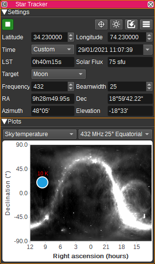
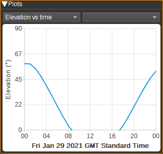
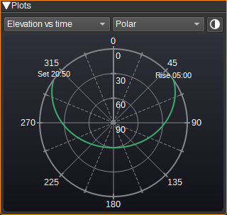
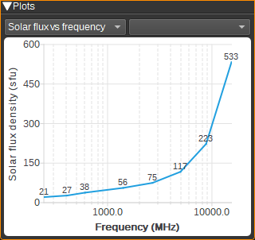
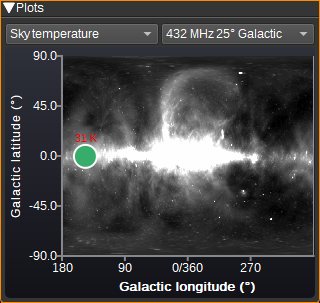
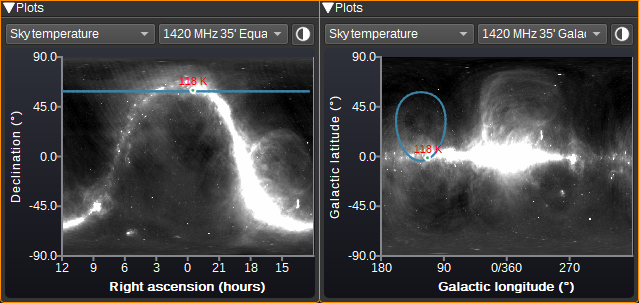
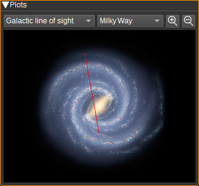
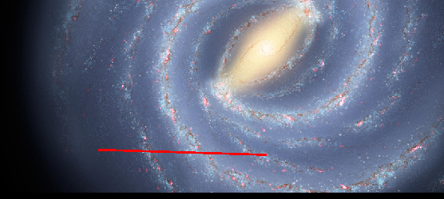
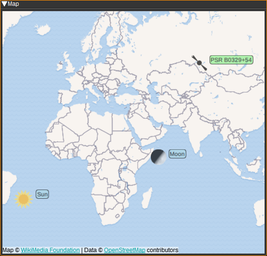

<h1>Star Tracker Feature Plugin</h1>

<h2>Introduction</h2>

The Star Tracker feature plugin is for use in radio astronomy and EME (Earth-Moon-Earth) communication.

* It calculates the azimuth and elevation of celestial objects and can send them to the Rotator Controller or other plugins to point an antenna at that object.
* It can plot drift scan paths in both equatorial and galactic charts.
* The overhead position of the Sun, Moon and selected star can be displayed on the Map Feature.
* It can display local Sidereal time, solar flux density and sky temperature.
* It can plot the line of sight through the Milky Way.
* The plugin can communicate with Stellarium, allowing Stellarium to control SDRangel as though it was a telescope and for the direction the antenna is pointing to be displayed in Stellarium.

<h2>Settings</h2>

<h3>1: Start/Stop plugin</h3>

This button starts or stops the plugin. The plugin will only calculate azimuth and elevation or communicate with Stellarium when started.

<h3>2: Find target on map</h3>

Pressing this button centres the Map Feature (if open) on the current target.

<h3>3:Download Solar flux density data</h3>

Pressing this button downloads the Solar flux density data from the DRAO and Learmonth Observatories.

<h3>4: Set latitude and longitude from My Position</h3>

When clicked, it sets the latitude, longitude and height fields to the values from SDRangel's My Position preferences.

<h3>5: Show settings dialog</h3>

Pressing this button displays a settings dialog, that allows you to set:

* The epoch used when entering RA and Dec. This can be either J2000 (which is used for most catalogues) or JNOW which is the current date and time.
* The units used for the display of the calculated azimuth and elevation. This can be either degrees, minutes and seconds or decimal degrees.
* Whether to correct for atmospheric refraction. You can choose either no correction, the Saemundsson algorithm, typically used for optical astronomy or the more accurate Positional Astronomy Library calculation, which can be used for >250MHz radio frequencies or light. Note that there is only a very minor difference between the two.
* API key for openweathermap.org which is used to download real-time weather (Air temperature, pressure and humidity) for the specified latitude (6) and longitude (7).
* How often to download weather (in minutes).
* Air pressure in millibars. This value can be automatically updated from OpenWeatherMap.
* Air temperature in degrees Celsius. This value can be automatically updated from OpenWeatherMap.
* Relative humidity in %. This value can be automatically updated from OpenWeatherMap.
* Height above sea level in metres of the observation point (anntenna location).
* Temperature lapse rate in Kelvin per kilometre.
* What data to display for the Solar flux measurement. Data can be selected from 2800 from DRAO or a number of different frequencies from Learmonth. Also, the Learmonth data can be linearly interpolated to the observation frequency set in the main window.
* The units to display the solar flux in, either Solar Flux Units, Jansky or Wm^-2Hz-1. 1 sfu equals 10,000 Jansky or 10^-22 Wm^-2Hz-1.
* The update period in seconds, which controls how frequently azimuth and elevation are re-calculated.
* The IP port number the Stellarium server listens on.
* Which rotators are displayed on the polar chart. This can be All, None or Matching target. When Matching target is selected, the rotator will
only be displayed if the source in the Rotator Controller is set to this Star Tracker and Track is enabled.
* Whether to start a Stellarium telescope server.
* Whether to draw the Sun in the map.
* Whether to draw the Moon on the map.
* Whether to draw the target star (or galaxy) on the map.

<h3>6: Latitude</h3>

Specifies the latitude in decimal degrees (North positive) of the observation point (antenna location).

<h3>7: Longitude</h3>

Specifies the longitude in decimal degrees (East positive) of the observation point (antenna location).

<h3>8: Time</h3>

Select the date and time at which the position of the target should be calculated. Select either Now, for the current time, or Custom to manually enter a date and time.

<h3>9: LST - Local Sidereal Time</h3>

The LST field displays the local sidereal time at the specified location (6&7) and Solar time (8).

<h3>10: Solar Flux</h3>

Displays the Solar flux density. The observatory where the data is sourced from, frequency and units can be set in the Settings dialog (5). The field is updated every 24 hours, or can be manually by pressing the download Solar flux density data button (3).

<h3>11: Target</h3>

Select a target object to track from the list.
To manually enter RA (right ascension) and Dec (declination) of an unlisted target, select Custom RA/Dec.
To allow Stellarium to set the RA and Dec, select Custom RA/Dec, and ensure the Stellarium Server option is checked in the Star Tracker Settings dialog.

| Target           | Type              | Details                                        | Flux density (Jy) or Temperature (K)       |
|------------------|-------------------|------------------------------------------------|---------------------------------------------
| Sun              | Star              | Targets our Sun                                | 10k-10M (50MHz), 500k-10M (1.4GHz)         |
| Moon             | Moon              | Targets our Moon                               | 2 (50MHz), 1000 (1.4GHz)                   |
| PSR B0329+54     | Pulsar            | Strongest in Northern hemisphere (J0332+5434)  | 1.8 (50MHz), 1.5 (400MHz), 0.2 (1.4GHz)    |
| PSR B0833-45     | Pulsar            | Strongest in Southern hemisphere (J0835-4510)  | 5.4 (150MHz), 5.0 (400MHz), 1.0 (1.4GHz)   |
| Sagittarius A    | Galactic centre   | First detected source of extrasolar radio      | ~0.5 (<1GHz) for Sgr A*                    |
| Cassiopeia A     | Supernova         | Brightest extrasolar radio source              | 27k (50MHz), 10k (150MHz), 1768 (1.4GHz)   |
| Cygnus A         | Galaxy            | First radio galaxy                             | 22k (50MHz), 11k (150MHz), 1579 (1.4GHz)   |
| Taurus A (M1)    | Supernova/Pulsar  | Crab Nebular                                   | 2008 (50MHz), 1368 (150MHz), 829 (1.4GHz)  |
| Virgo A (M87)    | Galaxy            |                                                | 2635 (50MHz), 1209 (150MHz), 212 (1.4GHz)  |
| Custom RA/Dec    |                   | Manually enter RA and Dec                      |                                            |
| Custom Az/El     |                   | Manually enter azimuth and elevation           |                                            |
| Custom l/b       |                   | Manually enter Galactic longitude and latitude |                                            |
| S7               | HI                | IAU secondary calibration region (l=132,b=-1)  | Tb=100 peak                                |
| S8               | HI                | IAU primary calibration region (l=207,b=-15)   | Tb=72 peak                                 |
| S9               | HI                | IAU secondary calibration region (l=356,b=-4)  | Tb=85 peak                                 |

References:

* ATNF Pulsar Catalogue - https://www.atnf.csiro.au/research/pulsar/psrcat/
* Cassiopeia A, Cygnus A, Taurus A, and Virgo A at ultra-low radio frequencies - https://research.chalmers.se/publication/516438/file/516438_Fulltext.pdf
* Repeating Jansky - https://www.gb.nrao.edu/~fghigo/JanskyAntenna/RepeatingJansky_memo10.pdf
* Studies of four regions for use as standards in 21CM observations - http://articles.adsabs.harvard.edu/pdf/1973A%26AS....8..505W

<h3>12: Frequency</h3>

Enter the frequency of observation in MHz. This value is used for sky temperature and refraction calculations.

<h3>13: Beamwidth</h3>

Enter the half power (-3dB) beamwidth of your antenna. This value is used for sky temperature calculation.

<h3>14: Right Ascension</h3>

When target is set to Custom RA/Dec, you can specify the right ascension in hours of the target object. This can be specified as a decimal (E.g. 12.23, from 0 to 24) or in hours, minutes and seconds (E.g. 12h05m10.2s or 12 05 10.2). Whether the epoch is J2000 or JNOW can be set in the Star Tracker Settings dialog.

When target is set to Custom Az/El or Custom l/b, this will display the corresponding right ascension.

<h3>15: Declination</h3>

When target is set to Custom RA/Dec, you can specify the declination in degrees of the target object. This can be specified as a decimal (E.g. 34.6, from -90.0 to 90.0) or in degrees, minutes and seconds (E.g. 34d12m5.6s, 34d12'5.6"  34 12 5.6). Whether the epoch is J2000 or JNOW can be set in the Star Tracker Settings dialog.

When target is set to Custom Az/El or Custom l/b, this will display the corresponding declination.

<h3>16: Azimuth</h3>

When target is set to Custom Az/El, you specify the azimuth in degrees of the target object. The corresponding RA/Dec and l/b will be calculated and displayed.

For all other target settings, this displays the calculated azimuth (angle in degrees, clockwise from North) to the object.

<h3>17: Elevation</h3>

When target is set to Custom Az/El, you specify the elevation in degrees of the target object. The corresponding RA/Dec and l/b will be calculated and displayed.

For all other target settings, this displays the calculated elevation (angle in degrees - 0 to horizon and 90 to zenith) to the object.

<h3>18: Az Offset</h3>

An offset in degrees that is added to the computed target azimuth.

<h3>19: El Offset</h3>

An offset in degrees that is added to the computed target elevation.

<h3>20: l - Galactic Longitude</h3>

When the target is set to Custom l/b, you specify the galactic longitude (angle in degrees, Eastward from the galactic centre) of the target object.

For all other target settings, this sisplays the calculated galactic longitude to the object.

<h3>21: b - Galactic Latitude</h3>

When the target is set to Custom l/b, you specify the galactic latitude (angle in degrees) of the target object.

For all other target settings, displays the calculated galactic latitude to the object.

<h2>Plots</h2>

<h3>Light or dark theme</h3>

Click on this icon  to switch between light and dark themes for the charts.

<h3>Elevation vs time</h3>

 

In order to assist in determining whether and when observations of the target object may be possible, an elevation vs time plot is drawn for the 24 hours encompassing the selected date and time.
This can be plotted on Cartesian or polar axis.
Some objects may not be visible from a particular latitude for the specified time, in which case, the graph title will indicate the object is not visible on that particular date.

<h3>Solar flux vs frequency</h3>

The Solar flux vs frequency plot, shows the solar flux density data from the Learmonth observatory as a function of frequency. The measurements are made at 245, 410, 610, 1415, 2695, 4995, 8800 and 15400MHz.

<h3>Sky temperature</h3>

  

Background sky temperature maps are available for display at 150MHz, 408MHz and 1420MHz, in both equatorial and galactic coordinates.
For these first six temperature maps, the temperature reported, which is in Kelvin, is for the single pixel corresponding to the target coordinates.
This temperature is therefore valid for a beamwidth of less than 1 degree.

The Star Tracker plugin can also estimate a sky temperature based on the user entered observation frequency and beamwidth.
To see this figure, which will be typically lower than the above, select one of the last two temperature maps from the right hand combo box.

The position of the Sun and Moon can also be drawn on the chart. Note that the sky temperature estimate does not take these in to account.

<h3>Drift scan path</h3>

When the target (11) is set to Custom Az/El and the Sky temperature plot is displayed, a curve showing the drift scan path over a 24 hour period will be displayed.
This assumes the azimuth and elevation will be held constant and the path shows the part of the sky the antenna will point to as the Earth rotates.

To setup a drift scan through a particular target object, first set the target (11) to that object. This will set the azimuth and elevation to point at the object.
You may want to set the Time (8) to Custom and a few hours in the future, so that the elevation is at a maximum when pointing at the target.
Then switch the target to Custom Az/El and Time back to Now, and the drift scan path that sweeps through the object will displayed.

<h3>Galactic line of sight</h3>

Displays a top down image of the Milky Way and draws a line from the Sun along the galactic longitude through the target object.
This can be useful to help identify spiral arms in hydrogen line observations.

Two images of the Milky Way are available: a purely graphical image and one annotated with the names of the major spiral arms and a grid with distance and galactic longitude.

The image can be zoomed in to or out from using the mouse wheel or the buttons. Hold CTRL to pan with the mouse wheel.

<h4>Spiral Arm Animations</h4>

When used with the Radio Astronomy plugin, markers corresponding to the position of HI clouds calculated from a marker on the spectrogram, can be plotted to display the estimated position of the cloud.

An animated PNG file can then be created from multiple plots to show how the markers follow the positions of Milky Way's spiral arms as galactic longitude is varied.
This process requires a marker to be placed on a peak in the spectrogram and then the  button to be pressed to add the current plot to the animation.
The process then repeats, by selecting the next measurement at a different longitude in the spectrogram and marking the appropriate peak, and then adding it to the animation.
When all frames have been added, the animation can be saved to a PNG file by pressing .
To start a new animation, press .

<h2>Map</h2>

The Star Tracker feature can send the overhead position of the Sun, Moon and target Star to the Map. These can be enabled individually in the settings dialog. The Moon should be displayed with an approximate phase. Stars (or galaxies) are displayed as an image of a pulsar.

When using the Find feature in the Map GUI, you can search for "Sun", "Moon" or "Star".

<h2>Stellarium Interface</h2>

In Star Tracker:

* Set target to Custom RA/Dec
* Press Show settings dialog and ensure Stellarium server is checked
* Press Start

Then in Stellarium:

* Enable Telescope Control plugin and restart
* Press the telescope button in the main toolbar
* Press "Configure telescopes..."
* Press "Add a new telescope"
* Set "Telescope controlled by" to "External software or a remote computer"
* Set "Name" to "SDRangel" (Optional)
* Set "Coordinate system" to "J2000 (default)"
* Press OK
* Press Connect
* Enter Right Ascension/Declination or press "Current object" to get RA/Dec of currently selected object
* Press "Slew" to send the RA/Dec to Star Tracker

Star Tracker will continually send the RA/Dec of its target to Stellarium and this should be displayed in Stellarium with a crosshair/reticle and the label SDRangel (or whatever name you entered for the telescope).

To see the rough field of view of your antenna, open the Ocular configuration window and under Eyepieces, add a new eyepiece with name SDRangel.
Set aFOV to the half-power beam width of your antenna, focal length to 100 and field stop to 0.
Then select the SDRangel telescope reticle and press Ocular view.

<h2>Attribution</h2>

Solar radio flux measurement at 10.7cm/2800MHz is from National Research Council Canada and Natural Resources Canada: https://www.spaceweather.gc.ca/forecast-prevision/solar-solaire/solarflux/sx-4-en.php

Solar radio flux measurements at 245, 410, 610, 1415, 2695, 4995, 8800 and 15400MHz from the Learmonth Observatory: http://www.sws.bom.gov.au/World_Data_Centre/1/10

150MHz (Landecker and Wielebinski) and 1420MHz (Stockert and Villa-Elisa) All Sky images from MPIfR's (Max-Planck-Institut Fur Radioastronomie) Survey Sampler: https://www3.mpifr-bonn.mpg.de/survey.html

408MHz (Haslam) destriped (Platania) All Sky image and spectral index (Platania) from Strasbourg astronomical Data Center: http://cdsarc.u-strasbg.fr/viz-bin/cat/J/A+A/410/847

Milky Way image from NASA/JPL-Caltech: https://photojournal.jpl.nasa.gov/catalog/PIA10748

Icons are by Adnen Kadri, iconsphere and Erik Madsen, from the Noun Project Noun Project: https://thenounproject.com/

Icons are by Freepik from Flaticon https://www.flaticon.com/

<h2>API</h2>

Full details of the API can be found in the Swagger documentation. Here is a quick example of how to set the target to the Moon at the current time:

    curl -X PATCH "http://127.0.0.1:8091/sdrangel/featureset/0/feature/0/settings" -d '{"featureType": "StarTracker",  "StarTrackerSettings": { "target": "Moon", "dateTime": "" }}'

Or to a custom RA and declination on a given date and time:

    curl -X PATCH "http://127.0.0.1:8091/sdrangel/featureset/0/feature/0/settings" -d '{"featureType": "StarTracker",  "StarTrackerSettings": { "target": "Custom", "ra": "03h32m59.35s", "dec": "54d34m45.05s", "dateTime": "1921-04-15T10:17:05" }}'

To start tracking:

    curl -X POST "http://127.0.0.1:8091/sdrangel/featureset/0/feature/0/run"

<h2>Developer Notes</h2>

To convert FITS images between projections, use Montage:

    sudo apg-get install montage wcslib-tools

Create header for desired output image. E.g. For galactic coordinates, 0.3deg per pixel, covering 360/180 degrees:

    mHdr -c ga -p 1200 -h 180.0 "0.0 +0.0" 360 header.hdr

This uses a gnomonic projection. To change to cylindrical/plate carree, with the centre of the galaxy at the centre of the image, edit header.hdr to have:

    CTYPE1  = 'GLON-CAR'
    CTYPE2  = 'GLAT-CAR'
    CRVAL1  =  0
    CRVAL2  =  0

Then convert with:

    mProjectQL source.fits dest.fits header.hdr

FITS files can be scaled (Scale > ZScale) and exported to .png with SAOImageDS9: https://sites.google.com/cfa.harvard.edu/saoimageds9
