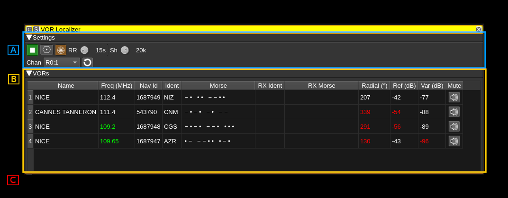
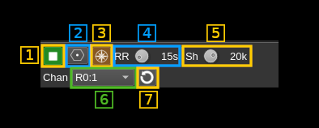
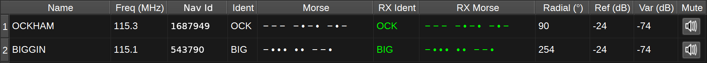

<h1>VOR Localizer plugin</h1>

<h2>Introduction</h2>

This plugin can control and receive information from VOR demodulators (see [VOR demodulator](../../channelrx/demodvor/readme.md) for details) and collate information from multiple VOR demodulators in order to show your position on a map.

<h2>Interface</h2>

There are 3 sections in this interface:
  - **A**: settings
  - **B**: VOR table
  - **C**: map (not shown on this picture)

<h2>A: Settings section</h2>

<h3>1: Start/Stop plugin</h3>

This button starts or stops the plugin.

<h3>2: Download VOR Database</h3>

Pressing this button downloads the OpenAIP.net Navaid database, which contains the details (position, frequencies, name and ident) for each VOR. This needs to be performed at least once.

<h3>3: Draw Radials Adjusted for Magnetic Declination</h3>

When checked, radials on the map will drawn adjusted for magnetic declination. For example, if a VOR has a magnetic declination of 5 degrees, and the radial is calculated at 0 degrees, the radial will be drawn to magnetic North, i.e. -5 degrees from true North. If not checked, the same radial would be drawn to true North (i.e 0 degrees), which may result in a less accurate position estimate.

<h3>4: Round robin turn time</h3>

Available VOR demodulator channels are allocated to service the selected VORs on the map and displayed in the VOR table (B). There could be less available channels than the number of VORs to service in which case the channel(s) of the same device can be used to service VORs in turn in a round robin fashion. This sets the time in seconds dedicated to each turn. More details on channels allocation algorithm is given in (7).

<h3>5: Round robin turn time progress</h3>

Shows the round robin turn time progress.

<h3>6: Force averaging over round robin turn time</h3>

Averaging of radial direction and signal magnitudes normally take place only if there is more than one round robin turn for a device. This forces averaging even if only one round robin turn exists i.e. the channels for this device are active continuously. Such an averaging may help in getting a better position fix.

<h3>7: Center frequency shift</h3>

The center frequency of the device may be shifted from its value computed from VOR allocation. This can help moving the channel center away from the device DC if necessary.

<h3>8: List of VOR demodulator channels in the system</h3>

This combo is not used to select anything but just to show the VOR demodulators that have been detected and that will be used to service the list of selected VORs int the (B) table.

The display is `Rn:m` where `n` is the device set index and `m` the channel index in the device set.

Channels may be used in round robin turns if their number is not enough to cover all VORs. The allocation algorithm will use devices with multiple channels first in order to accommodate several VORs with just one device. The baseband must be large enough to fit the VORs simultaneously. If there are VORs remaining more turns are added with just one channel being used. It is always possible to service any number of VORs with a single channel.

When there is more than one turn for a device valid radial directions are averaged and the resulting average is used during the round robin loop. Averaging also takes place for reference and variable signal levels.

<h2>B: VOR Table</h2>

The VOR table displays information about selected VORs. To select or deselect a VOR, double click it on the map. The information displayed includes:

* Name - The name of the VOR. For example: 'LONDON'.
* Freq (MHz) - The center frequency the VOR transmits on in MHz. The frequency is highlighted in green when the VOR is serviced by a demodulator.
* Ident - A 2 or 3 character identifier for the VOR. For example: 'LON'.
* Morse - The Morse code identifier for the VOR. For example: '.-.. --- -.'
* RX Ident - This contains the demodulated ident. If it matches the expected ident, it will be displayed in green, if not, it will be displayed in red. If an ident is received that is not 2 or 3 characters, it will not be displayed, but the last received ident will be displayed in yellow.
* RX Morse - This contains the demodulated Morse code ident. Colour coding is as for RX Ident.
* Radial - This contains the demodulated radial direction in degrees (unadjusted for magnetic declination). If there is a low confidence the value is correct (due to a weak signal), it will be displayed in red.
* Ref (dB) - This displays the magnitude of the received 30Hz FM reference signal in dB.
* Var (dB) - This displays the magnitude of the received 30Hz AM variable signal in dB.
* Mute - This button allows you to mute or unmute the audio from the corresponding VOR.

<h2>C: Map</h2>

The map displays the locations of each VOR, with an information box containing the information about the VOR, such as its name, frequency, ident (in text and Morse), range and magnetic declination.

To initialise the VORs on the map, first set your position using the Preferences > My position menu. Then press the Download VOR Database button (This only needs to be performed once). The map should then display VORs in your vicinity.

Double clicking on a VOR will select and add it to the list of VORs to demodulate. It will be added to the VOR table. The frequency will be highlighted green when the VOR is serviced by a VOR demodulator. Double clicking a selected VOR, will remove it from the list of VORs to demodulate and it will be removed from the VOR table.

When a signal from a VOR is correctly being demodulated, a radial line will be drawn on the map, at the angle provided by the VOR demodulator or their average over the round robin turn if this is the case. Your receiver should be somewhere along this radial line. The length of the radial line is set according to the range of the VOR as recorded in the database, which is valid for aircraft at altitude. Range on the ground will be considerably less. An approximate position for the receiver is where the radial lines from two or more VORs intersect.

<h2>Attribution</h2>

Icons by Denelson83 and mamayer, via Wikimedia Commons and RULI from the Noun Project https://thenounproject.com/
