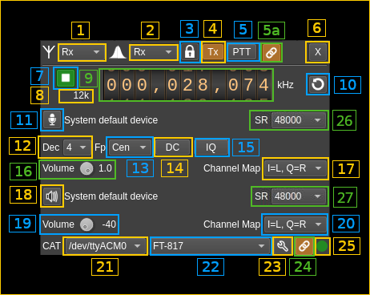
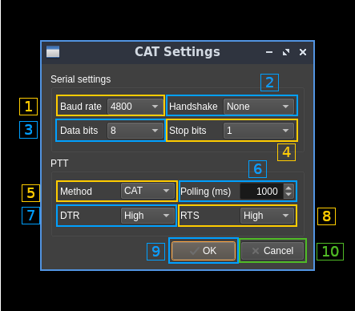

<h1>Audio CAT SISO plugin</h1>

<h2>Introduction</h2>

This MIMO plugin gets its samples from an audio device on the Rx side and sends its samples to an audio device on the Tx side. It is single stream on both Rx and Tx therefore it has "SISO" in the name. In addition it allows CAT control of a radio device using Hamlib.

CAT control is limited to frequency and PTT for transceivers. You can enable or disable the Tx side. It does not use VFO-A and VFO-B to manage split operation instead it holds one frequency for Rx and one for Tx and switches the current VFO to the appropriate value according to PTT status.

It is specifically designed for radios with internal audio cards but you may also connect the audio I/O of a "traditional" radio to the line in and out of a soundcard. Not a lot of radios (if any) allow true I/Q modulation through their audio in interface therefore transmission will be limited to mono audio transfer with the radio in USB mode and have limited bandwidth only on the positive frequencies of the baseband.

<h2>Interface</h2>

The top and bottom bars of the device window are described [here](../../../sdrgui/device/readme.md)

<h3>1. Rx/Tx settings selection</h3>

Use this combo to target UI to Rx or Tx streams for Rx/Tx specific items.

<h3>2. Rx/Tx spectrum display selection</h3>

Use this combo to select Rx or Tx side for main spectrum display.

<h3>3: Active stream / spectrum source lock</h3>

This ties together the stream selection and spectrum source stream selections.

<h3>4: Tx enable</h3>

Enable or disable Tx functions. Accessible only if device plugin is stopped (7).

<h3>5: PTT</h3>

Push To Talk toggle button. Turns on/off Tx via CAT thus works only when connected (24)

<h3>5a: Spectrum follows PTT</h3>

Use this toggle button to have the Rx or Tx spectrum display follow PTT or not.

<h3>6. Transverter mode open dialog</h3>

This button opens a dialog to set the transverter mode frequency translation options. The details about this dialog can be found [here](../../../sdrgui/gui/transverterdialog.md)

<h3>7: Start/Stop</h3>

Device plugin start / stop button.

<h3>8: Audio sample rate</h3>

Audio sample rate in Hz (Sa/s) with multiplier indicator (k).

<h3>9. Center frequency</h3>

This controls the center frequency of the rig in Rx or Tx mode in kHz depending on the Rx/Tx settings selection (1). This may allow split operation if frequencies are different when in Rx and Tx mode.

<h3>10. Refresh list of audio devices</h3>

<h3>11: Select input (Rx) audio device</h3>

Use this push button to open a dialog that lets you choose the audio input device. See [audio management documentation](../../../sdrgui/audio.md) for details. The name of the audio device in use appears next.

<h3>12. Decimation factor</h3>

Sets the decimation factor on Rx side.

<h3>13. Baseband center frequency position relative to the center frequency</h3>

Possible values are:

  - **Cen**: the decimation operation takes place around the Rx center frequency Fs
  - **Inf**: the decimation operation takes place around Fs - Fc.
  - **Sup**: the decimation operation takes place around Fs + Fc.

<h3>14. DC auto correction option (Rx)</h3>

This button controls the local DSP DC auto remove DC component.

<h3>15. IQ auto correction option (Rx)</h3>

  This button controls the local DSP auto make I/Q balance. The DC correction must be enabled for this to be effective.

<h3>16. Input volume</h3>

Controls the input volume (Rx)

<h3>17. Input channel mapping (Rx)</h3>

  * **I=L Q=R**: Left channel is connected to in-phase and right channel is connected to quadrature. Works with a complex signal.
  * **I=R Q=L**: Left channel is connected to quadrature and right channel is connected to in-phase. Works with a complex signal.
  * **Mono L**: Left channel is connected to both in-phase and quadrature. Works with real signals.
  * **Mono R**: Right channel is connected to both in-phase and quadrature. Works with real signals.

In mono modes only the positive side of frequencies is displayed in the main spectrum.

<h3>18: Select output (Tx) audio device</h3>

Use this push button to open a dialog that lets you choose the audio playback device. See [audio management documentation](../../../sdrgui/audio.md) for details. The name of the audio device in use appears next.

<h3>19. Output volume</h3>

Controls the output (Tx) volume in decibels. You may adjust Tx output power this way.

<h3>20. Output channel mapping</h3>

  * **I=L Q=R**: Left channel represents the in-phase signal and right channel represents the quadrature signal. To be used when radio accepts complex I/Q modulation.
  * **I=R Q=L**: Left channel represents the quadrature signal and right channel represents the in-phase signal. To be used when radio accepts complex I/Q modulation.
  * **Mono L**: Left channel is used as a real signal. To be used when radio works with real signals i.e. USB mode.
  * **Mono R**: Right channel is used as a real signal. To be used when radio works with real signals i.e. USB mode.

In mono modes only the positive side of frequencies is displayed in the main spectrum.

<h3>21. Serial device used for CAT</h3>

Select device from the combo list

<h3>22. Hamlib radio model</h3>

Select model from the combo list

<h3>23. CAT details</h3>

Opens a dialog to set serial connection and CAT details:

<h4>23.1. Serial link baud rate</h3>

Choice between 1200, 2400, 4800, 9600, 19200, 38400, 57600 and 115200 bauds.

<h4>23.2. Handshake method</h3>

Choice between none, XON/XOFF and hardware.

<h4>23.3. Data bits</h3>

Choice between 7 or 8 bits.

<h4>23.4. Stop bits</h3>

Choice between 1 or 2 bits.

<h4>23.5. PTT method</h3>

Choice between CAT, DTR or RTS signals.

<h4>23.6. Polling interval</h3>

Set polling interval in milliseconds. Polls current VFO frequency via CAT regularly at this interval.

<h4>23.7. DTR signal type</h3>

When selecting PTT control via DTR signal (23.5) selects if a low or high signal triggers PTT.

<h4>23.8. RTS signal type</h3>

When selecting PTT control via RTS signal (23.5) selects if a low or high signal triggers PTT.

<h4>23.9. Accept dialog</h3>

Click **OK** to validate changes and close dialog.

<h4>23.10. Dismiss dialog</h3>

Click **Cancel** to dismiss dialog changes and close dialog.

<h3>24. Connect to radio</h3>

Use this toggle button to connect or disconnect the radio.

<h3>25. Radio connection status</h3>

 * **grey**: idle (not connected)
 * **green**: connected
 * **red**: error
