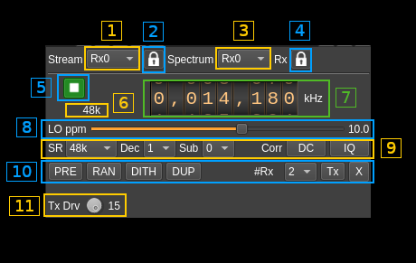
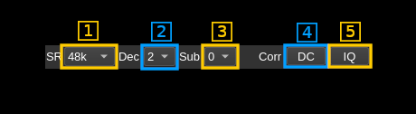
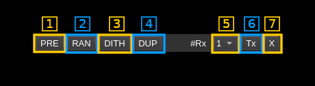

<h1>Metis Multiple Input Single Output plugin</h1>

<h2>Introduction</h2>

This plugin is mainly intended to be used to process samples to/from a [Red Pitaya board](https://www.redpitaya.com/) with [Pavel's HPSDR compatible applications](http://pavel-demin.github.io/red-pitaya-notes/). More precisely:

  - [SDR transceiver compatible with HPSDR](http://pavel-demin.github.io/red-pitaya-notes/sdr-transceiver-hpsdr/)
  - [SDR receiver compatible with HPSDR](http://pavel-demin.github.io/red-pitaya-notes/sdr-receiver-hpsdr-122-88/)

The plugin has 8 receiving (sink) streams and one transmitting (source) stream. Depending on the design of the Metis compatible hardware you may or may not have all of them available. Streams with no connection will just be filled with zero samples. You may choose the number of active streams with the control (9.5) - see next.

While compatible with [Metis HPSDR-2 protocol](https://github.com/softerhardware/Hermes-Lite2/wiki/Protocol) implementation is minimal in order to be able to control and work with the Red Pitaya. It has not been tested in another context nor has provision to control the Red Pitaya or HPSDR peripherals. These controls may be added in the future as needs arise.

<h2>Build</h2>

The plugin is present in the core of the software and thus is always present in the list of MIMO devices.

<h2>Interface</h2>

The top and bottom bars of the device window are described [here](../../../sdrgui/device/readme.md)

<h3>1: Active stream selection</h3>

Select for which streams the controls are active. Controls specific to each stream are:

  - Center frequency
  - Subsampling index

<h3>2: Spectrum source selection</h3>

Select which stream is routed to the main spectrum display

<h3>3: Active stream / spectrum source lock</h3>

This ties together the stream selection and spectrum source stream selections.

<h3>4: Start/Stop</h3>

Device start / stop button.

  - Blue triangle icon: device is ready and can be started
  - Green square icon: device is running and can be stopped
  - Magenta (or pink) square icon: an error occurred. In the case the device was accidentally disconnected you may click on the icon, plug back in and start again.

Starting the device means that the network stream from the Metis compatible device is started. It will be stopped by the stop button. This effectively starts all available streams that can be controlled with the Rx number select (9.5) or Tx enable (9.6)

<h3>5: Stream sample rate</h3>

Baseband I/Q sample rate in kS/s. This is the device to host sample rate (8.1) divided by the software decimation factor (8.2).

<h3>6: Center frequency</h3>

Tunes the center frequency of the active stream

<h3>7: Local Oscillator frequency correction in ppm</h3>

This lets you compensate for the main oscillator frequency inaccuracy. Value is in ppm (parts per million)

<h3>8: Sample rate - Decimation - Subsampling - DC and IQ corrections</h3>

<h4>8.1: Sample rate</h4>

This combo box lets you control the four possible values for the device to host sample rate (Rx). Host to device (Tx) sample rate is fixed by design of the Metis interface at 48 kS/s:

  - **48k**: 48000 samples per second
  - **96k**: 96000 samples per second
  - **192k**: 192000 samples per second
  - **384k**: 384000 samples per second

<h4>8.2: Decimation factor</h4>

The I/Q stream from the Metis stream is downsampled by a power of two before being sent to the passband. Possible values are increasing powers of two: 1 (no decimation), 2, 4, 8.

Note that there is no interpolation on the Tx side.

<h4>8.3: Subsampling index</h4>

The Red Pitaya has a LTC2185 ADC specified for a bandwidth up to 550 MHz. This lets you use the Red Pitaya receivers in subsampling mode with appropriate filtering and LNA chain as a front end. In this mode the received frequency may extend above 61.44 MHz in successive 61.44 MHz wide bands. This index corresponds to the frequency band index from 0 to 7 and let you input the frequency directly corresponding to the subsampling scheme. The band limits appear in the tooltip and are the following:

  - **0**: 0 to 61.44 MHz - fundamental no subsampling
  - **1**: 61.44 to 122.88 MHz
  - **2**: 122.88 to 184.32 MHz
  - **3**: 184.32 to 245.76 MHz
  - **4**: 245.76 to 307.2 MHz
  - **5**: 307.2 to 368.64 MHz
  - **6**: 368.64 to 430.08 MHz
  - **7**: 430.08 to 491.52 MHz

Of course the more the higher the frequency above the fundamental range the worse the performance is. In practice it is still OK at VHF frequencies but not much above.

<h4>8.4: DC correction</h4>

This corrects residual DC present at the center of the passband. By construction this is useless for the Red Pitaya.

<h4>8.5: IQ imbalance correction</h4>

This corrects I/Q imbalance. By construction this is useless for the Red Pitaya.

<h3>9: Preamp - Random - Dither - Duplex - Number of receivers - Tx enable - Transverter</h3>

<h4>9.1: Preamp</h4>

Toggle Rx preamplifier - not found to be effective

<h4>9.2: Random</h4>

Toggle LTC2185 randomization - not found to be effective

<h4>9.3: Dither</h4>

Toggle LTC2185 dithering - not found to be effective

<h4>9.4: Duplex</h4>

Toggle duplex - not found to be effective

<h4>9.5: Number or active receivers</h4>

Controls the number of active receivers. Each receiver allocates a slot in the data stream from the Metis interface.

  - For the SDR receiver compatible with HPSDR choose a maximum of 4 receivers
  - For the SDR receiver compatible with HPSDR choose a maximum of 8 receivers

It is a waste to have more active receivers than you actually need because it will increase network traffic for nothing

<h4>9.6: Toggle Tx activation</h4>

Use this button to toggle the generation and sending of Tx samples in the Metis stream from host to device. When inactivated null samples are sent in the return payload from host to device.

<h4>9.7: Transverter mode</h4>

This button opens a dialog to set the transverter mode frequency translation options. The details about this dialog can be found [here](../../../sdrgui/gui/transverterdialog.md)

Transverter mixing is the same for all receivers and may be different for the transmitter.

<h3>10: Tx drive level</h3>

Choose a level from 0 (deactivated) to 15 (full power)
