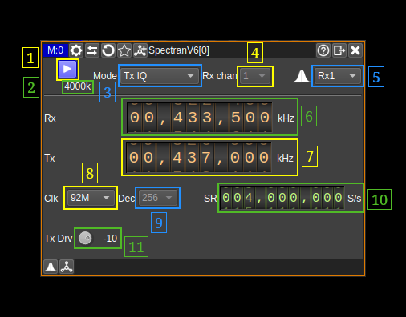

<h1>Aaronia Spectran V6 and V6 Eco using SDK plugin</h1>

<h2>Introduction</h2>

This plugin makes it possible to use an Aaronia Spectran V6 or V6 Eco connecting directly to the PC via the USB cable(s). It uses the SDK developed by Aaronia and you will need to install the Aaronia RTSA suite in your system to be able to compile and use this plugin. As there is not distribution of this plugin you will have to compile it from source (see next).

This plugin is marked as a "MISO" plugin meaning it supports multiple inputs i.e. receivers (Spectran V6) and single output i.e. transmitter (both models) in the same plugin. When connecting a V6 Eco the second receiver is simply disabled. There are also a few other restrictions with the V6 Eco vs the V6 that will be covered in the relevant sections of the interface description next.

<h2>Compilation</h2>

You have to install the Aaronia RTSA suite first from https://aaronia.com/en/support/downloads.

The SDK is part of the RTSA suite installation which default location depends on the O/S:
  - Linux: `/opt/aaronia-rtsa-suite/Aaronia-RTSA-Suite-PRO`
  - Windows: `C:\Program Files\Aaronia AG\Aaronia RTSA-Suite PRO`

The RTSA suite installation directory is hardcoded in the cmake module `cmake/Modules/FindRTSAAPI.cmake` and the `devices/spectran/aaroniartsasdkhelper.h` then when the RTSA suite is installed in the default location the plugin will be built automatically with the rest of the software.

Please note that this has been experimented only in Linux.

The SDK makes use of the `libAaroniaRTSAAPI.so` shared library (Linux) and the rest resides in the `sdk/` subdirectory with sample code in `sdk/Samples` that comes from the `https://github.com/Aaronia-Open-source/RTSA-API-Samples` Github repository. You may want to either clone this repository or copy the `sdk/Samples` directory in a writable location of your choice and compile and run the samples to validate your installation.

A forum to discuss SDK related questions is located at `https://v6-forum.aaronia.de/forum/forum/dll-dynamic-link-library/`

<h2>Interface</h2>

The top and bottom bars of the device window are described [here](../../../sdrgui/device/readme.md)

<h3>1: Start/Stop</h3>

Device start / stop button.

  - Blue triangle icon: device is ready and can be started
  - Green square icon: device is running and can be stopped

<h3>2: Baseband sample rate</h3>

This is the sample rate and thus bandwidth available in the baseband after any processing.

<h3>3: Processing modes</h3>

Selects the processing mode. With the Aaronia SDK there are two essential processing modes IQ and raw.

The IQ mode is downsampling or upsampling a chunk of the bandwidth allowed by the main clock setting (8) at the sample rate provided in (10). It allows to finely tune the sample rate and thus bandwidth. It acts similarly to the local sink or local source channel plugins in SDRangel but via the SDK. This is what is called modulators (upstream for transmission) or demodulators (downstrean for reception). It supports the single receiver and all transmitter modes.

The Raw mode provides direct access to the raw IQ data from the device. The data packets arrive at the base clock speed, which can be configured for V6 devices (or is fixed for V6 ECO). The choice of sample rates is thus limited but you can then apply decimation within the SDK (9) to reduce the sample rate. It works in receive mode only and supports dual synchronous receivers.

Below are the options in the combo box:

  - **Rx IQ**: Single receiver in IQ mode
  - **Tx IQ**: Transmitter only
  - **Rx+Tx IQ**: Transceiver
  - **Rx > Tx IQ**: Transponder (Transmitter spectrum is not active)
  - **Rx Raw**: Single receiver in Raw mode
  - **Rx 1+2 I**: Dual receivers in Raw mode with interleaved samples - dual receiver needed
  - **Rx 1+2 Raw**: Dual receivers in Raw mode with non-interleaved samples - dual receiver needed

<h3>4. Select receiver</h3>

For dual receiver devices and single receiver mode this control allows selection between receivers. For single receiver models like the V6 Eco switching to the second receiver just reverts to the first and the spectrum remains visible with the "Rx1" selection (5).

Note that in any case when switching receivers the streaming is briefly suspended.

<h3>5. Select spectrum to display</h3>

This control allows to select the source of the spectrum display:

  - **Rx1**: Shows spectrum coming from the first receiver
  - **Rx2**: Shows spectrum coming from the second receiver
  - **Tx**: Shows spectrum of data sent to the transmitter (not available in transponder or receive only modes)

<h3>6. Receiver frequency</h3>

Sets the frequency of the receiver or receivers. When in dual receive modes this is the frequency of both receivers as receivers are synchronous.

<h3>7. Transmitter frequency</h3>

Sets the frequency of the transmitter. It is independent of the receiver frequency within the limit of the common frequency span between receiver and transmitter sides which is fixed at 50 MHz. Practically it means that the transmitter frequency cannot be further away than 25 MHz from the receiver frequency on any side also limited by the transmitter bandwidth so that it is actually the far side of the bandwidth that cannot be further away than 25 MHz from the receiver center frequency.

Another limitation is that upon restart the transmitter frequency is reset to the receiver frequency.

<h3>8. Clock rate</h3>

This is the device main clock rate that is in effect in raw mode. For the Eco mode the clock is fixed at 61.44 MHz therefore this control is disabled. In IQ mode it limits the actual sample rate (10). On the V6 all values may not be available depending on the enabled options. 92 and 122 MHz should always be present. Selectring an invalid value will fallback to a valid one but the assumed sample rate will be wrong.

<h3>9. Decimation in raw mode</h3>

This is available only in raw mode. The full bandwidth conditioned by the main clock rate (8) can be decimated within the SDK down to a factor of 512 by powers of two.

<h3>10. Sample rate in IQ mode</h3>

This is the sample rate in IQ mode for the receivers or the transmitter. For the transmitter it is limited from 48 kS/s to 20 MS/s.

<h3>11. Transmitter drive factor</h3>

This is the transmitter drive factor in dB referenced to the full power (0 dB) and goes down to -50dB in 1dB steps.
