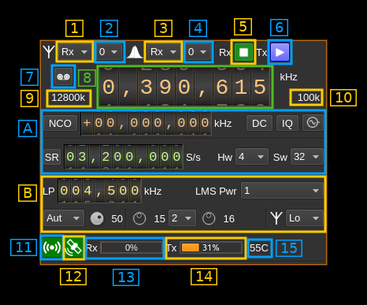
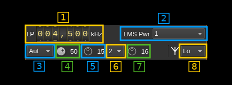

<h1>XTRX MIMO plugin</h1>

<h2>Introduction</h2>

This MIMO plugin sends and receives its samples to/from a [XTRX device](https://xtrx.io). It handles both input (Rx) and output (Tx) streams synchronously. There is no option to synchronize Rx with Tx streams.

&#9888; There are USB errors when first starting with XTRX after plugging it in. The only way to work around this is to restart SDRangel application.

&#9888; Reception may stall sometimes particularly with sample rates lower than 5 MS/s and also after changes. You may need to stop and restart the device (stop/start button) to recover.

&#9888; Right after (re)start you may need to move the main frequency dial back and forth if you notice that you are not on the right frequency.

&#9888; Simultaneous Rx and Tx is not supported. Dual Tx is not working either.

<h2>Build</h2>

The plugin will be built only if XTRX support libraries are installed in your system.

If libraries are installed in a custom place like `/opt/install/xtrx-images` add the following defines on `cmake` command line:

`-DXTRX_DIR=/opt/install/xtrx-images`

<h2>Real time scheduling</h2>

You may find in the log some info (green) messages from `libxtrx` mentioning that some task cannot be set with real time priority. While this is not an absolute necessity to make XTRX work you may want to allow your user or a specific group your user belongs to to set tasks with real time scheduling.

In most Linux systems this is done by editing the `/etc/security/limits.conf` file (with sudo rights). In this file you may add these lines for your user (ex: `user`):

```
user             -       rtprio          99
user             -       memlock         unlimited
```

For a group the syntax is the same but the group name is prefixed with `@` like:

```
@realtime        -       rtprio          99
@realtime        -       memlock         unlimited
```

<h2>Interface</h2>

The top and bottom bars of the device window are described [here](../../../sdrgui/device/readme.md)



<h3>1. Rx/Tx settings selection</h3>

Use this combo to target UI to Rx or Tx streams for Rx/Tx specific items.

<h3>2. Stream settings selection</h3>

Use this combo to target UI to stream 0 or stream 1 for stream specific items.

<h3>3. Rx/Tx spectrum display selection</h3>

Use this combo to select Rx or Tx side for main spectrum display.

<h3>4. Stream spectrum display selection</h3>

Use this combo to select stream 0 or stream 1 for main spectrum display.

<h3>5. Start/Stop Rx</h3>

This button controls the start/stop of the Rx subsystem.

<h3>6. Start/Stop Tx</h3>

This button controls the start/stop of the Tx subsystem.

<h3>7. Record button</h3>

  - Left click: record baseband I/Q stream toggle button (inactive: waiting for synchronous streams recording)
  - Right click: choose record file

<h3>8. Center frequency</h3>

This controls the center frequency of Rx or Tx subsystems in kHz depending on the Rx/Tx settings selection (1). This frequency can effectively be different for Rx and Tx but is the same for both Rx or both Tx streams.

<h3>9. ADC/DAC sample rate</h3>

This is the sample rate at which the ADC or DAC runs in kS/s (k) or MS/s (M) before hardware decimation or after hardware interpolation. Thus this is the device to host sample rate (A.7) multiplied by the hardware decimation or interpolation factor (A.8).

<h3>10. Baseband sample rate</h3>

In device to host sample rate input mode (A.6) this is the baseband I/Q sample rate in kS/s. This is the device to host sample rate (A.7) divided by the software decimation or interpolation factor (A.9).

In baseband sample rate input mode (A.6) this is the device to host sample rate in kS/s. This is the baseband sample rate (A.7) multiplied by the software decimation or interpolation factor (A.9)

<h3>A. Section</h3>


<h4>A.1. NCO toggle</h4>

The button is lit when NCO is active and dark when inactive.

Use this button to activate/deactivate the TSP NCO. The LMS7002M chip has an independent NCO in each Rx channel that can span the bandwidth received by the ADC. This effectively allows non zero digital IF.

<h4>A.2. NCO frequency shift</h4>

This is the frequency shift applied when the NCO is engaged thus the actual LO frequency is the center frequency of reception minus this value. Use the thumbwheels to adjust frequency as done with the LO (8). Pressing shift simultaneously moves digit by 5 and pressing control moves it by 2. The boundaries are dynamically calculated from the LO center frequency, sample rate and hardware decimation factor.

&#9758; Engaging the NCO shifts the center frequency of reception or transmission by the shift amount. You have to retune the center frequency (8) to get back to the frequency before the NCO was engaged. You may also select the NCO frequency and then tune the center frequency.

&#9758; In the LMS7002M TSP Rx block the NCO sits before the decimator (see Fig.14 of the [datasheet](http://www.limemicro.com/wp-content/uploads/2015/09/LMS7002M-Data-Sheet-v2.8.0.pdf) p.7) so it runs at the actual ADC rate. Hence the NCO limits are calculated as +/- half the device to host sample rate multiplied by the hardware decimation factor. For example with a 4 MS/s device to host sample rate (A.7) and a hardware decimation of 16 (A.8) you have +/- 32 MHz span around the LO for the NCO. In this example you can tune all HF frequencies with the center frequency set at its lowest (30 MHz).

A similar logic is used on the Tx / DAC side.

<h4>A.3. DC auto correction options</h4>

This button controls the local DSP DC auto remove DC component.

<h4>A.4. IQ auto correction options</h4>

This button controls the local DSP auto make I/Q balance. The DC correction must be enabled for this to be effective.

<h4>A.5. External clock control</h4>

Use this button to open a dialog that lets you choose the external clock frequency and enable or disable it. When disabled the internal 30.72 MHz VCTCXO is used.


<h5>A.5.1. External clock frequency</h5>

Can be varied from 5 to 300 MHz

Use the thumbwheels to adjust frequency as done with the LO (1.1). Pressing shift simultaneously moves digit by 5 and pressing control moves it by 2. The boundaries are dynamically calculated from the LO center frequency, sample rate and hardware decimation factor.

<h5>A.5.2. Enable/disable external clock input</h5>

Use this checkbox to enable or disable the external clock input

<h5>A.5.3. Confirm changes</h5>

Use the "OK" button to confirm your changes

<h5>A.5.4. Dismiss changes</h5>

Use the "Cancel" button to dismiss your changes

<h4>A.6. Device to host sample rate / Baseband sample rate input toggle</h4>

Use this toggle button to switch the sample rate input next (A.7) between device to host sample rate and baseband sample rate input. The button shows the current mode:

  - **SR**: device to host sample rate input mode. The baseband sample rate (10) is the device to host sample rate (A.7) divided by the software decimation or interpolation factor (A.9).
  - **BB**: baseband sample rate input mode. The device to host sample rate (A.7) is the baseband sample rate (10) multiplied by the software decimation or interpolation factor (A.9).

<h4>A.7. Sample rate</h4>

This is the LMS7002M device to/from host stream sample rate or baseband sample rate in samples per second (S/s). The control (A.6) is used to switch between the two input modes. The device to/from host stream sample rate is the same for the Rx and Tx systems.

The limits are adjusted automatically. In baseband input mode the limits are driven by the decimation or interpolation factor (A.9). You may need to increase this factor to be able to reach lower values.

Use the wheels to adjust the sample rate. Pressing shift simultaneously moves digit by 5 and pressing control moves it by 2. Left click on a digit sets the cursor position at this digit. Right click on a digit sets all digits on the right to zero. This effectively floors value at the digit position. Wheels are moved with the mousewheel while pointing at the wheel or by selecting the wheel with the left mouse click and using the keyboard arrows.

The LMS7002M uses the same clock for both the ADCs and DACs therefore this sample rate affects all of the 2x2 MIMO channels.

<h4>A.8. Hardware decimation or interpolation factor</h4>

The TSP block in the LMS7002M hardware has a decimation/interpolation chain that acts on both Rx/Tx channels and therefore can achieve decimation/interpolation between 1 (no decimation/interpolation) and 64 in increasing powers of 2: 1, 2, 4, 8, 16, 32, 64. However the  position "1" (no decimation/interpolation) is replaced by an automatic decimation/interpolation.

<h4>A.9. Software decimation or interpolation factor</h4>

The I/Q stream from the LimeSDR is downsampled/upsampled by a power of two by software inside the plugin before being sent to the passband/device. Possible values are increasing powers of two: 1 (no decimation/interpolation), 2, 4, 8, 16, 32.

<h3>B. section</h3>



<h4>B.1. Analog filter bandwidth</h4>

This is the hardware filter bandwidth in kHz in the LMS7002M device for the given channel. Boundaries are updated automatically. Use the wheels to adjust the value. Pressing shift simultaneously moves digit by 5 and pressing control moves it by 2.

<h4>B.2. Power mode</h4>

XTRX power mode

<h4>B.3. Gain mode</h4>

This is the gain mode control that applies to Rx only:
- **automatic**: AGC based on a global gain (B.4)
- **manual**: Manual. Use LNA, TIA and PGA controls (B.5 to B.7) to adjust gain

<h4>B.4. Manual gain setting</h4>

  - Rx: this sets the gain manually per stream if (B.3) is set to "Manual".
  - Tx: this sets the gain

<h4>B.5. LNA gain</h4>

Rx only. This is the LNA gain stage in dB

<h4>B.6. TIA gain</h4>

Rx only. This is the TIA gain block settings in 3 increasing stages.

<h4>B.7. PGA gain</h4>

Rx only. This is the PGA gain stage in dB

<h4>A.8. Antenna path select</h4>

<h5>Rx side</h5>

Use this combo box to select the input path (network):

  - **Lo**: Selects the low frequency input. You should use this one and this is the default
  - **Wide**: Selects the wide band frequency input. This is not connected and should not be used
  - **Hi**: Selects the high frequency input. You may use this one as well with no actual difference with "Lo".

<h5>Tx side</h5>

Use this combo box to select the output path (network):

  - **Hi**: Tx high range
  - **Wi**: Tx wide range: you should use this one (default)

<h3>11. Stream status indicator</h3>

This label turns green when status can be obtained from the current stream. Usually this means that the stream is up and running but not necessarily streaming data. The various status elements appear next on the same line (13)

<h3>12. GPS status</h3>

This label turns green when the GPS used for the GPSDO is locked.

<h3>13. Rx FIFO status</h3>

This is the fill percentage of the Rx FIFO in the XTRX interface. It should be zero most of the time.

<h3>14. Tx FIFO status</h3>

This is the fill percentage of the Tx FIFO in the XTRX interface. It should be near 100% most of the time.

<h3>15. Board temperature</h3>

This is the board temperature in degrees Celsius updated every ~5s. Before the first probe the display marks "00C" this is normal.
