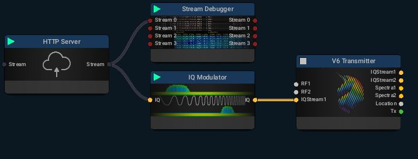
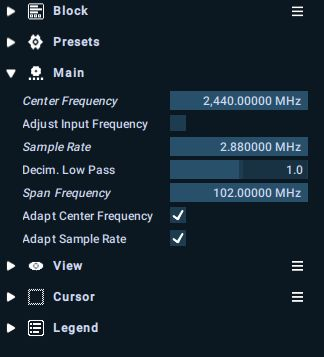
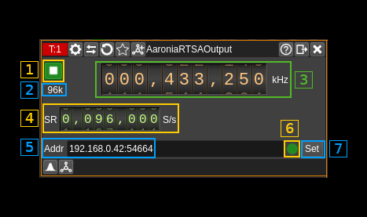

<h1>Aaronia RTSA output plugin</h1>

<h2>Introduction</h2>

You can use this plugin to interface with a http server block in the Aaronia RTSA suite connected to a Spectran V6 device. It is assumed that you have prior knowledge of the Aaronia RTSA suite software and operation of the Spectran V6 RTSA (Real Time Spectrum Analyzer). However in this context there are some specificities i.e. it assumes that the "mission" (in RTSA suite terms) that is the equivalent of a "configuration" in SDRangel has a `HTTP Server` block followed by an `IQ Modulator` block.

An example flow graph could be the following (Stream Debugger is optional):

You have to check the "Adapt Center Frequency" and "Adapt Sample Rate" options in the IQ modulator settings so that SDRangel can control center frequency and sample rate:

You can obviously run the RTSA suite and SDRangel on the same machine and connect via localhost but there are advantages on a split setup:

  - The workload can be split between RTSA suite and SDRangel on two different machines. RTSA suite has to perform the upsampling at a very high sample rate so this is demanding on CPU and latency. Often it is better to run it on its own dedicated machine.

  - You can have the RTSA suite run on a machine close to the Spectran. This is in fact mandatory due to the length of the USB cables. And you can run SDRangel on another machine (possibly quite more lightweight) anywhere on the network.

<h2>Interface</h2>

The top and bottom bars of the device window are described [here](../../../sdrgui/device/readme.md)

<h3>1: Start/Stop</h3>

Device start / stop button.

  - Blue triangle icon: device is ready and can be started
  - Green square icon: device is running and can be stopped

<h3>2: Stream sample rate</h3>

This is the sample rate of the I/Q stream sent to RTSA suite. It should be equal to the value set in (4)

<h3>3: Frequency</h3>

This is the center frequency to which set the IQ modulator center frequency.

<h3>4: Stream sample rate</h3>

Sets the I/Q stream sample rate in S/s

<h3>5: Remote address and port</h3>

This is the remote address and port of the HTTP server block in RTSA suite. The address has to be in the form of an IPv4 address.

Press button (7) to validate your change.

<h3>6: Status indicator</h3>

This ball can take the following colors depending on the status:

 * **Gray**: Idle
 * **Yellow**: Unstable
 * **Green**: Connected
 * **Red**: Error
 * **Magenta**: Disconnected

<h3>7: Set address</h3>

When you change the address in (5) you have to push this button to validate the change.
