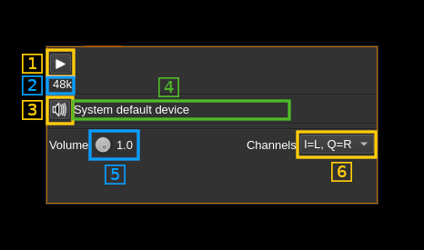

<h1>Audio output plugin</h1>

<h2>Introduction</h2>

This output plugin sends its samples to an audio device.

<h2>Interface</h2>

The top and bottom bars of the device window are described [here](../../../sdrgui/device/readme.md)

<h3>1: Start/Stop</h3>

Device start / stop button. Use this switch button to play or stop audio playback

<h3>2: Audio sample rate</h3>

Audio sample rate in Hz (Sa/s) with multiplier indicator (k).

<h3>3: Select audio device</h3>

Use this push button to open a dialog that lets you choose the audio playback device. See [audio management documentation](../../../sdrgui/audio.md) for details.

<h3>4: Audio device</h3>

The name of the audio device in use.

<h3>5: Volume</h3>

A control to set the output volume. This is not supported by all output audio devices.

<h3>6: Channel Map</h3>

This controls how the left and right audio channels map on to the IQ channels.

* I=L, Q=R - The left audio channel is driven to the I channel. The right audio channel is driven to the Q channel for a complex (analytic signal)input.
* I=R, Q=L - The right audio channel is driven to the I channel. The left audio channel is driven to the Q channel for a complex (analytic signal)input.
