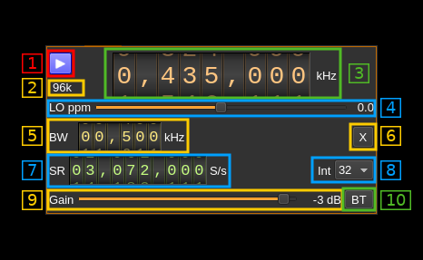

<h1>BladeRF 2.0 micro (v2) output plugin</h1>

<h2>Introduction</h2>

This output sample sink plugin sends its samples to a [BladeRF2 device](https://www.nuand.com/bladerf-2). This is available since v4.2.0.

<h2>Build</h2>

The plugin will be built only if the [BladeRF host library](https://github.com/Nuand/bladeRF) is installed in your system. If you build it from source and install it in a custom location say: `/opt/install/libbladeRF` you will have to add `-DBLADERF_DIR=/opt/install/libbladeRF/include` to the cmake command line.

The FPGA .rbf file should be copied to the folder where the `sdrangel` binary resides. You can download FPGA images from [here](https://www.nuand.com/fpga_images/)

The BladeRF Host library is also provided by many Linux distributions (check its version) and is built in the SDRangel binary releases.

<h2>Interface</h2>

The top and bottom bars of the device window are described [here](../../../sdrgui/device/readme.md)

<h3>1: Start/Stop</h3>

Device start / stop button.

  - Blue triangle icon: device is ready and can be started
  - Red square icon: device is running and can be stopped
  - Magenta (or pink) square icon: an error occurred. In the case the device was accidentally disconnected you may click on the icon, plug back in and start again.

<h3>2: Stream sample rate</h3>

In host to device sample rate input mode (7A) this is the baseband I/Q sample rate in kS/s. This is the host to device sample rate (7) divided by the interpolation factor (8).

In baseband sample rate input mode (7A) this is the host to device sample rate in kS/s. This is the baseband sample rate (7) multiplied by the software interpolation factor (8)

Transmission latency depends essentially in the delay in the sample FIFO. The FIFO size is calculated as follows:

For interpolation by 32 the size is fixed at 150000 samples, Delay is 150000 / B where B is the baseband sample rate. Below is the delay in seconds vs baseband sample rate in kS/s from 48 to 500 kS/s:

For lower interpolation rates the size is calculated to give a fixed delay of 250 ms or 75000 samples whichever is bigger. Below is the delay in seconds vs baseband sample rate in kS/s from 48 to 400 kS/s. The 250 ms delay is reached at 300 kS/s:

<h3>3: Frequency</h3>

This is the center frequency of transmission in kHz. The center frequency is the same for all Tx channels. The GUI of the sibling channel if present is adjusted automatically.

<h3>4: LO ppm correction</h3>

Use this slider to adjust LO correction in ppm. It can be varied from -20.0 to 20.0 in 0.1 steps and is applied in software. This applies to the oscillator that controls both the Rx and Tx frequency therefore it is also changed on the related Rx and Tx plugin(s) if they are active.

<h3>5: Tx filter bandwidth</h3>

This is the Tx filter bandwidth in kHz. Minimum and maximum values are adjusted automatically. Normal range is from 200 kHz to 56 MHz. The Tx filter bandwidth is the same for all Tx channels. The GUI of the sibling channel if present is adjusted automatically.

<h3>6: Transverter mode open dialog</h3>

This button opens a dialog to set the transverter mode frequency translation options:

Note that if you mouse over the button a tooltip appears that displays the translating frequency and if translation is enabled or disabled. When the frequency translation is enabled the button is lit.

<h4>6.1: Translating frequency</h4>

You can set the translating frequency in Hz with this dial. Use the wheels to adjust the sample rate. Left click on a digit sets the cursor position at this digit. Right click on a digit sets all digits on the right to zero. This effectively floors value at the digit position. Wheels are moved with the mousewheel while pointing at the wheel or by selecting the wheel with the left mouse click and using the keyboard arrows. Pressing shift simultaneously moves digit by 5 and pressing control moves it by 2.

The frequency set in the device is the frequency on the main dial (1) minus this frequency. Thus it is positive for up converters and negative for down converters.

For example with a mixer at 120 MHz for HF operation you would set the value to -120,000,000 Hz so that if the main dial frequency is set to 7,130 kHz the PlutoSDR will be set to 127.130 MHz.

If you use an up converter to transmit at the 6 cm band narrowband center frequency of 5670 MHz with the PlutoSDR set at 432 MHz you would set the translating frequency to 5760 - 432 = 5328 MHz thus dial +5,328,000,000 Hz.

For bands even higher in the frequency spectrum the GHz digits are not really significant so you can have them set at 1 GHz. Thus to transmit at the 10368 MHz frequency with 432 MHz for the PlutoSDR you would set the translating frequency to 1368 - 432 = 936 MHz. Note that in this case the frequency of the LO used in the mixer of the transverter is set at 9936 MHz.

The Hz precision allows a fine tuning of the transverter LO offset

<h4>6.2: Translating frequency enable/disable</h4>

Use this toggle button to activate or deactivate the frequency translation

<h4>6.3: Confirmation buttons</h4>

Use these buttons to confirm ("OK") or dismiss ("Cancel") your changes.

<h3>7A: Host to device sample rate / Baseband sample rate input toggle</h3>

Use this toggle button to switch the sample rate input next (7) between host to device sample rate and baseband sample rate input. The button shows the current mode:

  - **SR**: host to device sample rate input mode. The baseband sample rate (2) is the host to device sample rate (7) divided by the interpolation factor (8).
  - **BB**: baseband sample rate input mode. The host to device sample rate (2) is the baseband sample rate (7) multiplied by the interpolation factor (8).

<h3>7: Sample rate</h3>

This is the BladeRF device DAC sample rate or baseband sample rate in samples per second (S/s). The control (7A) is used to switch between the two input modes. The device to/from host stream sample rate is the same for the Rx and Tx systems.

The limits are adjusted automatically. In baseband input mode the limits are driven by the interpolation factor (8). You may need to increase this interpolation factor to be able to reach lower values.

Use the wheels to adjust the sample rate. Left click on a digit sets the cursor position at this digit. Right click on a digit sets all digits on the right to zero. This effectively floors value at the digit position. Wheels are moved with the mousewheel while pointing at the wheel or by selecting the wheel with the left mouse click and using the keyboard arrows. Pressing shift simultaneously moves digit by 5 and pressing control moves it by 2.

<h3>8: Interpolation factor</h3>

The baseband stream is interpolated by this value before being sent to the BladeRF device. Possible values are:

  - **1**: no interpolation
  - **2**: multiply baseband stream sample rate by 2
  - **4**: multiply baseband stream sample rate by 4
  - **8**: multiply baseband stream sample rate by 8
  - **16**: multiply baseband stream sample rate by 16
  - **32**: multiply baseband stream sample rate by 32

The main samples buffer is based on the baseband sample rate and will introduce ~500ms delay for interpolation by 16 or lower and ~1s for interpolation by 32.

<h3>9: Gain control</h3>

Use this slider to adjust gain in manual mode. The gain varies from -23.75 to 66 dB in 0.25 dB steps. However only integer values are taken into account.

<h3>10: Bias tee control</h3>

Use this toggle button to activate or de-activate the bias tee. Note that according to BladeRF v2 specs the bias tee is simultaneously present on all Tx RF ports. The GUI of the sibling channel if present is adjusted automatically.
