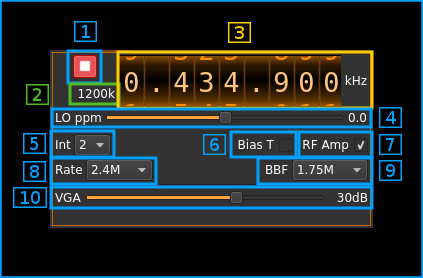
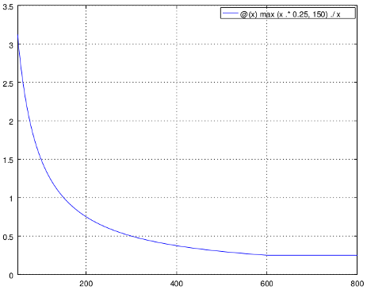

<h1>HackRF output plugin</h1>

<h2>Introduction</h2>

This output sample sink plugin sends its samples to a [HackRF device](https://greatscottgadgets.com/hackrf/).

<h2>Interface</h2>

The top and bottom bars of the device window are described [here](../../../sdrgui/device/readme.md)

<h3>1: Start/Stop</h3>

Device start / stop button.

  - Blue triangle icon: device is ready and can be started
  - Red square icon: device is running and can be stopped
  - Magenta (or pink) square icon: an error occurred. In the case the device was accidentally disconnected you may click on the icon, plug back in and start again.

If you have the Rx open in another tab and it is running then it will be stopped automatically before the Tx starts. In a similar manner the Tx will be stopped before the Rx is started from the Rx tab.

The settings on Tx or Rx tab are reapplied on start so these settings can be considered independent.

<h3>2: Stream sample rate</h3>

In host to device sample rate input mode (8A) this is the baseband I/Q sample rate in kS/s. This is the host to device sample rate (8) divided by the interpolation factor (10).

In baseband sample rate input mode (8A) this is the host to device sample rate in kS/s. This is the baseband sample rate (8) multiplied by the software interpolation factor (10)

Transmission latency depends essentially in the delay in the sample FIFO. The size of sample FIFO is calculated to give a fixed delay of 250 ms or 150000 samples whichever is bigger. Below is the delay in seconds vs baseband sample rate in kS/s from 48 to 800 kS/s. The 250 ms delay is reached at 600 kS/s:

<h3>3: Frequency</h3>

This is the center frequency of transmission in kHz.

<h3>4: Local Oscillator correction</h3>

Use this slider to adjust LO correction in ppm. It can be varied from -10.0 to 10.0 in 0.1 steps and is applied in software.

<h3>5: Rx filter bandwidth</h3>

This is the Rx filter bandwidth in kHz. Possible values are: 1750, 2500, 3500, 5000, 5500, 6000, 7000, 8000, 9000, 10000, 12000, 14000, 15000, 20000, 24000, 28000 kHz.

<h3>6: Bias tee</h3>

Use this checkbox to toggle the +5V power supply on the antenna connector.

<h3>7:RF amp</h3>

Use this checkbox to toggle the output amplifier (PA). This PA gives an additional gain of 14 dB.

According to HackRF documentation the output power when the PA is engaged and the Tx VGA (10) is at full power (47dB) is the following:

  - 10 MHz to 2150 MHz: 5 dBm to 15 dBm, generally increasing as frequency decreases
  - 2150 MHz to 2750 MHz: 13 dBm to 15 dBm
  - 2750 MHz to 4000 MHz: 0 dBm to 5 dBm, increasing as frequency decreases
  - 4000 MHz to 6000 MHz: -10 dBm to 0 dBm, generally increasing as frequency decreases

<h3>8A: Host to device sample rate / Baseband sample rate input toggle</h3>

Use this toggle button to switch the sample rate input next (8) between host to device sample rate and baseband sample rate input. The button shows the current mode:

  - **SR**: host to device sample rate input mode. The baseband sample rate (2) is the host to device sample rate (8) divided by the interpolation factor (10).
  - **BB**: baseband sample rate input mode. The host to device sample rate (2) is the baseband sample rate (8) multiplied by the interpolation factor (10).

<h3>8: Sample rate</h3>

This is the HackRF device DAC sample rate or baseband sample rate in samples per second (S/s). The control (8A) is used to switch between the two input modes. The device to/from host stream sample rate is the same for the Rx and Tx systems.

The limits are adjusted automatically. In baseband input mode the limits are driven by the interpolation factor (10). You may need to increase this interpolation factor to be able to reach lower values.

Use the wheels to adjust the sample rate. Left click on a digit sets the cursor position at this digit. Right click on a digit sets all digits on the right to zero. This effectively floors value at the digit position. Wheels are moved with the mousewheel while pointing at the wheel or by selecting the wheel with the left mouse click and using the keyboard arrows. Pressing shift simultaneously moves digit by 5 and pressing control moves it by 2.

<h3>9: Baseband center frequency position relative to the HackRF Tx center frequency</h3>

  - **Cen**: the decimation operation takes place around the HackRF Tx center frequency Fs
  - **Inf**: the decimation operation takes place around Fs - Fc.
  - **Sup**: the decimation operation takes place around Fs + Fc.

With SR as the sample rate after interpolation Fc is calculated depending on the interpolation factor:

  - **2**: Fc = SR/4
  - **4**: Fc = 3*SR/8
  - **8**: Fc = 5*SR/16
  - **16**: Fc = 11*SR/32
  - **32**: Fc = 21*SR/64
  - **64**: Fc = 21*SR/128

<h3>10: Interpolation factor</h3>

The baseband stream is interpolated by this value before being sent to the HackRF device. Possible values are:

  - **1**: no interpolation
  - **2**: multiply baseband stream sample rate by 2
  - **4**: multiply baseband stream sample rate by 4
  - **8**: multiply baseband stream sample rate by 8
  - **16**: multiply baseband stream sample rate by 16
  - **32**: multiply baseband stream sample rate by 32
  - **64**: multiply baseband stream sample rate by 64

The main samples buffer is based on the baseband sample rate and will introduce ~500ms delay for interpolation by 16 or lower and ~1s for interpolation by 32.

<h3>11: Tx variable gain amplifier gain</h3>

The Tx VGA gain can be adjusted from 0 dB to 47 dB in 1 dB steps. See (7) for an indication on maximum output power.

<h2>Frequency synchronization with Rx</h2>

When a device set for the same physical device is present the device center frequencies are synchronized because there is only one LO for the physical device.

When the center frequency position Fc (control 9) is set to center (Cen) in both Tx and Rx the actual frequency of reception and transmission are the same.

In other cases for both frequencies to match you have to set the same sample rate and Fc position (either Inf or Sup) in the Tx and Rx.
