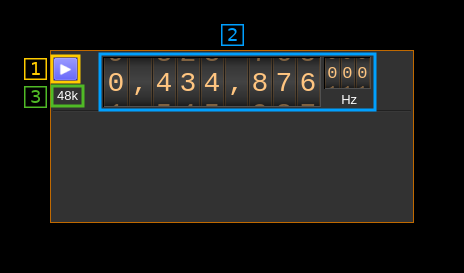

<h1>Local output plugin</h1>

<h2>Introduction</h2>

This output sample sink plugin sends its samples to a Local Source channel in another device set.

<h2>Interface</h2>

The top and bottom bars of the device window are described [here](../../../sdrgui/device/readme.md)

<h3>1: Start/Stop</h3>

Device start / stop button.

  - Blue triangle icon: device is ready and can be started
  - Green square icon: device is running and can be stopped

<h3>2: Frequency</h3>

This is the center frequency in Hz sent from the Local Source channel instance and corresponds to the center frequency of transmission.

<h3>3: Stream sample rate</h3>

Stream I/Q sample rate in kS/s
