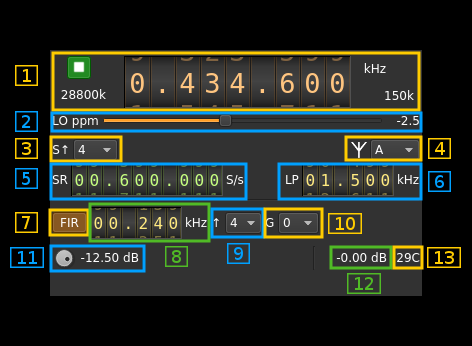
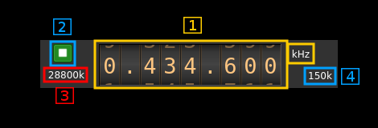

<h1>PlutoSDR output plugin</h1>

<h2>Introduction</h2>

This output sample sink plugin sends its samples to a [PlutoSDR device](https://wiki.analog.com/university/tools/pluto). This is also known as the ADALM-Pluto. ADALM stands for Analog Devices Active Learning Module and is targetting students in electrical engineering and digital signal processing. Of course it can be used as a radio device like any other SDR.

As you can see from the Wiki this is becoming a fairly popular SDR hardware platform. It does have interesting features but the library documentation and examples are poor when not misleading. Therefore while this implementation does work it should still be considered experimental.

&#9758; PlutoSDR is physically implemented as a 1x1 SISO device although the AD9363 chip does have a second Rx and a second Tx channel. Revision C of the board claims to have pads to allow hackers connecting the second ports externally however for now only the first Tx channel is supported by this plugin.

<h2>Build</h2>

The plugin will be built only if libiio is installed in your system. To build and install libiio from source do:

  - `git clone https://github.com/analogdevicesinc/libiio.git`
  - `cd libiio`
  - `git checkout v0.10 # or latest stable release`
  - `mkdir build`
  - `cd build`
  - `cmake -DCMAKE_INSTALL_PREFIX=/opt/install/libiio -DINSTALL_UDEV_RULE=OFF ..`
  - `make -j8`
  - `make install`
  
Then add the following defines on `cmake` command line when compiling SDRangel:

`-DLIBIIO_INCLUDE_DIR=/opt/install/libiio/include -DLIBIIO_LIBRARY=/opt/install/libiio/lib/libiio.so`

<h2>Interface</h2>

<h3>1: Common stream parameters</h3>

<h4>1.1: Frequency</h4>

This is the center frequency of reception in kHz. The limits are set as those of the AD9364: from 70 to 6000 MHz. PlutoSDR can be fooled to think it has a AD9364 chip with a very simple software hack described [here](https://wiki.analog.com/university/tools/pluto/users/customizing).

AD9363 extended frequency range is not guaranteed but would work normally particularly in the lower range.

<h4>1.2: Start/Stop</h4>

Device start / stop button. 

  - Blue triangle icon: device is ready and can be started
  - Green square icon: device is running and can be stopped
  - Magenta (or pink) square icon: an error occured. In the case the device was accidentally disconnected you may click on the icon to stop, plug back in, check the source on the sampling devices control panel and start again.
  
<h4>1.3: DAC sample rate</h4>

This is the sample rate at which the DAC runs in kS/s (k) or MS/s (M) after hardware interpolation. Hardware interpolation is only partially controlled by the user using the FIR interpolation factor (9). The value here is the value returned by the device interface therefore it is always exact.

<h4>1.4: Stream sample rate</h4>

Baseband I/Q sample rate in kS/s. This is the host to device sample rate (5) multiplied by the software interpolation factor (3). 

<h3>2: LO ppm correction</h3>

Use this slider to adjust LO correction in ppm. It can be varied from -20.0 to 20.0 in 0.1 steps and is applied in hardware.

<h3>3: Software decimation factor</h3>

The I/Q stream from the LimeSDR is downsampled by a power of two by software inside the plugin before being sent to the passband. Possible values are increasing powers of two: 1 (no decimation), 2, 4, 8, 16, 32.

<h3>4: Antenna (output) connection</h3>

The AD9363 has many port options however as only the A output is connected you should leave it as the default. This is a provision for people who want to hack the board. The different values may be found in the AD9363 documentation.

<h3>5: Host to device stream sample rate</h3>

This is the AD9363 device to/from host stream sample rate in S/s. It is the same for the Rx and Tx systems.

Use the wheels to adjust the sample rate. Pressing shift simultanoeusly moves digit by 5 and pressing control moves it by 2. Left click on a digit sets the cursor position at this digit. Right click on a digit sets all digits on the right to zero. This effectively floors value at the digit position. Wheels are moved with the mousewheel while pointing at the wheel or by selecting the wheel with the left mouse click and using the keyboard arrows.

The minimum sample rate depends on the hardware FIR decimation factor (12) and is the following:

  - no decimation: 25/12 MS/s thus 2083336 S/s (next multiple of 4)
  - decimation by 2: 25/24 MS/s thus 1041668 S/s
  - decimation by 4: 25/48 MS/s thus 520834 S/s
  
The maximum sample rate is fixed and set to 20 MS/s

<h3>6: Tx analog filter bandwidth</h3>

This is the Tx analog filter bandwidth in kHz in the AD9363 device. It can be varied from 625 kHz to 16 MHz in 1 kHz steps. Use the wheels to adjust the value. Pressing shift simultanoeusly moves digit by 5 and pressing control moves it by 2.

<h3>7: Hardware FIR filter toggle</h3>

The AD9363 chip has an optional FIR filter in the Rx decimation chain as the last decimation block. Use this button to activate or deactivate the filter.

The FIR filter settings are the same on Rx and Tx side therefore any change here is automatically forwarded to the Tx GUI.

<h3>8: Hardware FIR filter bandwidth</h3>

Use the wheels to adjust the bandwidth of the hardware FIR filter. Pressing shift simultanoeusly moves digit by 5 and pressing control moves it by 2.

The filter is calculated as a windowed FIR filter with a Blackman-Harris window. This has a high out of band rejection value at the expense of a slightly smoother roll off compared to other filters. The bandwidth value sets the -6 dB point approxomately.

The limits are calculated as 0.05 and 0.9 times the FIR filter input frequency for the lower and higher limit respectively. The FIR filter input frequency is the baseband sample rate (5) multiplied by the FIR interpolation factor (9)

<h3>9: Hardware FIR interpolation factor</h3>

The FIR filter block can provide an interpolation by 1 (no interpolation), 2 or 4. This controls the minimum possible baseband sample rate as already discussed in (5).

<h3>10: Hardware FIR gain</h3>

The FIR filter can introduce a gain that can be set to -6 or 0 dB.

<h4>11: Attenuation</h4>

Use this button to adjust the attenuation. It can be varied from -89.75 to 0 dB in 0.25 dB steps.

<h4>12: Indicative RSSI</h4>

This is the indicative RSSI of the transmitter. It works only when the Rx is in monitor mode set with the control (7) of the input plugin. 

<h3>13: Board temperature</h3>

This is the board temperature in degrees Celsius updated every ~5s.