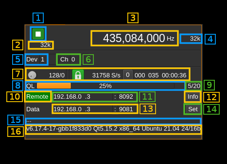

<h1>Remote output plugin</h1>

<h2>Introduction</h2>

This output sample sink plugin sends its samples over the network to a SDRangel instance's Remote source channel using UDP connection.

Forward Error Correction with a Cauchy MDS block erasure codec is used to prevent block loss. This can make the UDP transmission more robust particularly over WiFi links.

The remote SDRangel instance to which the data stream is sent is controlled via its REST API using a separate control software for example [SDRangelcli](https://github.com/f4exb/sdrangelcli)

The sample size used in the I/Q stream is the Rx sample size of the local instance. Possible conversion takes place in the remote Remote source channel plugin to match the Rx sample size of the remote instance. Best performance is obtained when both instances use the same sample size.

<h2>Build</h2>

The plugin will be built only if the [CM256cc library](https://github.com/f4exb/cm256cc) is installed in your system. For CM256cc library you will have to specify the include and library paths on the cmake command line. Say if you install cm256cc in `/opt/install/cm256cc` you will have to add `-DCM256CC_DIR=/opt/install/cm256cc` to the cmake commands.

<h2>Interface</h2>

The top and bottom bars of the device window are described [here](../../../sdrgui/device/readme.md)

<h3>1: Start/Stop</h3>

Device start / stop button.

  - Blue triangle icon: device is ready and can be started
  - Green square icon: device is running and can be stopped

<h3>2: Baseband sample rate</h3>

I/Q sample rate in kS/s of the baseband sample rate.

<h3>3: Frequency</h3>

This is the center frequency in kHz of the remote instance device.

<h3>4: Remote baseband sample rate</h3>

This is the remote instance baseband sample rate. It is normally equal to the system sample rate (2).

<h3>5: remote instance device set index</h3>

This is the device set index in the remote instance to which the stream is connected to. Use this value to properly address the API to get status.

<h3>6: remote instance channel index</h3>

This is the channel index of the Remote source in the remote instance to which the stream is connected to. Use this value to properly address the API to get status.

<h3>6a: transmission sample size</h3>

This is the size in bytes of a transmitted I or Q sample. The choice is between 1, 2 and 4 bytes. Conversion takes place if the size is different from the built-in sample size.

<h3>7: Forward Error Correction setting and status</h3>

<h4>7.1: Desired number of FEC blocks per frame</h4>

This sets the number of FEC blocks per frame. A frame consists of 128 data blocks (1 meta data block followed by 127 I/Q data blocks) and a variable number of FEC blocks used to protect the UDP transmission with a Cauchy MDS block erasure correction. The two numbers next are the total number of blocks and the number of FEC blocks separated by a slash (/).

<h4>7.2: Stream status</h4>

The color of the icon indicates stream status:

  - Green: all original blocks have been received for all frames during the last polling timeframe (ex: 134)
  - No color: some original blocks were reconstructed from FEC blocks for some frames during the last polling timeframe (ex: between 128 and 133)
  - Red: some original blocks were definitely lost for some frames during the last polling timeframe (ex: less than 128)
  - Blue: stream is idle

<h4>7.3: Remote stream rate</h4>

This is the remote stream rate calculated from the samples counter between two consecutive API polls. It is normal for it to oscillate moderately around the nominal stream rate (2).

<h4>7.4: Reset events counters</h4>

This push button can be used to reset the events counters (7.6 and 7.7) and reset the event counts timer (6.8)

<h4>7.5: Unrecoverable error events counter</h4>

This counter counts the unrecoverable error conditions found (i.e. 7.4 lower than 128) since the last counters reset.

<h4>7.6: Recoverable error events counter</h4>

This counter counts the unrecoverable error conditions found (i.e. 7.4 between 128 and 128 plus the number of FEC blocks) since the last counters reset.

<h4>7.7: events counters timer</h4>

This HH:mm:ss time display shows the time since the reset events counters button (4.6) was pushed.

<h3>8: Remote transmitter queue length gauge</h3>

This is ratio of the reported number of data frame blocks in the remote queue over the total number of blocks in the queue.

<h3>9: Remote transmitter queue length status</h3>

This is the detail of the ratio shown in the gauge. Each frame block is a block of 127 &#x2715; 126 samples (16 bit I or Q samples) or 127 &#x2715; 63 samples (24 bit I or Q samples).

<h3>10: Remote server information</h3>

Press button to get remote instance information that will be displayed in (16). The button stays green as long as the connection with the remote is established.

<h3>11: API IP address and port</h3>

IP address and port of the remote SDRangel instance REST API

<h3>12: Set API address</h3>

When the return key is hit within the address or port (11) the changes are effective immediately. You can also use this button to set again these values.

<h3>13: Remote data address and port</h3>

Address and port of the remote endpoint where UDP data blocks are sent.

<h3>14: Set remote data IP and port</h3>

When the return key is hit within the address or port (13) the changes are effective immediately. You can also use this button to set again these values.

<h3>15: Status message</h3>

The API status is displayed in this box. It shows "API OK" when the connection is successful and reply is OK

<h3>16: Remote information</h3>

This is the information returned by the remote when remote button is pressed (10)
