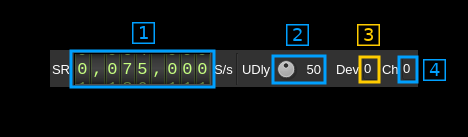

<h1>Remote output plugin</h1>

<h2>Introduction</h2>

This output sample sink plugin sends its samples over the network to a SDRangel instance's Remote source channel using UDP connection.

Forward Error Correction with a Cauchy MDS block erasure codec is used to prevent block loss. This can make the UDP transmission more robust particularly over WiFi links.

The remote SDRangel instance to which the data stream is sent is controlled via its REST API using a separate control software for example [SDRangelcli](https://github.com/f4exb/sdrangelcli)

The sample size used in the I/Q stream is the Rx sample size of the local instance. Possible conversion takes place in the remote Remote source channel plugin to match the Rx sample size of the remote instance. Best performace is obtained when both instances use the same sample size.

It is present only in Linux binary releases.

<h2>Build</h2>

The plugin will be built only if the [CM256cc library](https://github.com/f4exb/cm256cc) is installed in your system. For CM256cc library you will have to specify the include and library paths on the cmake command line. Say if you install cm256cc in `/opt/install/cm256cc` you will have to add `-DCM256CC_DIR=/opt/install/cm256cc` to the cmake commands.

<h2>Interface</h2>

<h3>1: Start/Stop</h3>

Device start / stop button.

  - Blue triangle icon: device is ready and can be started
  - Green square icon: device is running and can be stopped

<h3>2: Stream sample rate</h3>

I/Q sample rate in kS/s of the stream that is sent over the network.

<h3>3: Frequency</h3>

This is the center frequency in kHz of the remote instance device.

<h3>4: Remote baseband sample rate</h3>

This is the remote instance baseband sample rate. It can be a power of two multiple of the stream sample rate (2) but it will not work for other values.

<h3>5: Stream controls and API destination</h3>

<h4>5.1: Network stream sample rate</h4>

This is the I/Q stream sample rate transmitted via UDP over the network

<h4>5.2: Delay between UDP blocks transmission</h4>

This sets the minimum delay between transmission of an UDP block (send datagram) and the next. This allows throttling of the UDP transmission that is otherwise uncontrolled and causes network congestion.

The value is a percentage of the nominal time it takes to process a block of samples corresponding to one UDP block (512 bytes). This is calculated as follows:

  - Sample rate on the network: _SR_
  - Delay percentage: _d_
  - Number of FEC blocks: _F_
  - There are 127 blocks of I/Q data per frame (1 meta block for 128 blocks) and each I/Q data block of 512 bytes (128 samples) has a 8 bytes header (2 samples) thus there are 126 samples remaining effectively. This gives the constant 127*126 = 16002 samples per frame in the formula

Formula: ((127 &#x2715; 126 &#x2715; _d_) / _SR_) / (128 + _F_)

<h4>5.3: remote instance device set index</h4>

This is the device set index in the remote instance to which the stream is connected to. Use this value to properly address the API to get status.

<h4>5.4: remote instance channel index</h4>

This is the channel index of the Remote source in the remote instance to which the stream is connected to. Use this value to properly address the API to get status.

<h3>6: Forward Error Correction setting and status</h3>

<h4>6.1: Desired number of FEC blocks per frame</h4>

This sets the number of FEC blocks per frame. A frame consists of 128 data blocks (1 meta data block followed by 127 I/Q data blocks) and a variable number of FEC blocks used to protect the UDP transmission with a Cauchy MDS block erasure correction. The two numbers next are the total number of blocks and the number of FEC blocks separated by a slash (/).

<h4>6.2: Stream status</h4>

The color of the icon indicates stream status:

  - Green: all original blocks have been received for all frames during the last polling timeframe (ex: 134)
  - No color: some original blocks were reconstructed from FEC blocks for some frames during the last polling timeframe (ex: between 128 and 133)
  - Red: some original blocks were definitely lost for some frames during the last polling timeframe (ex: less than 128)
  - Blue: stream is idle

<h4>6.3: Remote stream rate</h4>

This is the remote stream rate calculated from the samples counter between two consecutive API polls. It is normal for it to oscillate moderately around the nominal stream rate (2).

<h4>6.4: Reset events counters</h4>

This push button can be used to reset the events counters (6.6 and 6.7) and reset the event counts timer (6.8)

<h4>6.5: Unrecoverable error events counter</h4>

This counter counts the unrecoverable error conditions found (i.e. 6.4 lower than 128) since the last counters reset.

<h4>6.6: Recoverable error events counter</h4>

This counter counts the unrecoverable error conditions found (i.e. 6.4 between 128 and 128 plus the number of FEC blocks) since the last counters reset.

<h4>6.7: events counters timer</h4>

This HH:mm:ss time display shows the time since the reset events counters button (4.6) was pushed.

<h3>7: Remote transmitter queue length gauge</h3>

This is ratio of the reported number of data frame blocks in the remote queue over the total number of blocks in the queue.

<h3>8: Remote transmitter queue length status</h3>

This is the detail of the ratio shown in the gauge. Each frame block is a block of 127 &#x2715; 126 samples (16 bit I or Q samples) or 127 &#x2715; 63 samples (24 bit I or Q samples).

<h3>9: Remote server test</h3>

Test remote connection with its API.

<h4>9.1: Remote connection indicator</h4>

The "Remote" label is lit in green when the connection is successful

<h4>9.2: API IP address</h4>

IP address of the remote SDRangel instance REST API

<h4>9.3: API port</h4>

Port of the remote SDRangel instance REST API

<h4>9.4: Get information button</h4>

When the return key is hit within the address (9.2) or port (9.3) the changes are effective immediately. You can also use this button to set again these values. Clicking on this button will send a request to the API to get the remote SDRangel instance information that is displayed in the API message box (8)

<h3>10: Local data address and port</h3>

<h4>10.1: Data IP address</h4>

IP address of the local network interface the remote SDRangel instance sends the data to

<h4>10.2: Data port</h4>

Local port the remote SDRangel instance sends the data to

<h4>10.3: Validation button</h4>

When the return key is hit within the address (10.2) or port (10.3) the changes are effective immediately. You can also use this button to set again these values.

<h3>11: Status message</h3>

The API status is displayed in this box. It shows "API OK" when the connection is successful and reply is OK

<h3>12: Remote information</h3>

This is the information returned by the remote when connection with its API is successful
