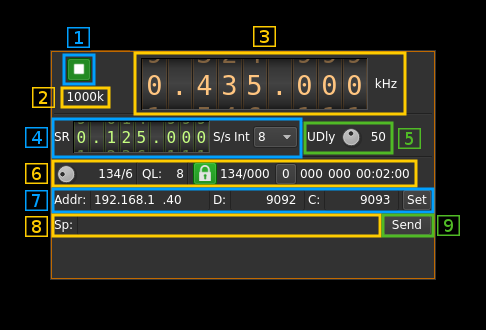
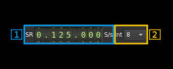
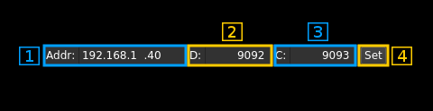

<h1>SDRdaemon sink plugin</h1>

<h2>Introduction</h2>

This output sample sink plugin sends its samples over tbe network to a SDRdaemon transmitter server using UDP connection. SDRdaemon refers to the SDRdaemon utility `sdrdaemontx`found in [this](https://github.com/f4exb/sdrdaemon) Github repository.

Forward Error Correction with a Cauchy MDS block erasure codec is used to prevent block loss. This can make the UDP transmission more robust particularly over WiFi links.

<h2>Build</h2>

The plugin will be built only if `libnanomsg` and the [CM256cc library](https://github.com/f4exb/cm256cc) is installed in your system. `libnanomasg` is present in most distributions and the dev version can be installed using the package manager. For CM256cc library you will have to specify the include and library paths on the cmake command line. Say if you install cm256cc in `/opt/install/cm256cc` you will have to add `-DCM256CC_INCLUDE_DIR=/opt/install/cm256cc/include/cm256cc -DCM256CC_LIBRARIES=/opt/install/cm256cc/lib/libcm256cc.so` to the cmake commands.

<h2>Interface</h2>

<h3>1: Start/Stop</h3>

Device start / stop button. 

  - Blue triangle icon: device is ready and can be started
  - Green square icon: device is running and can be stopped
  
<h3>2: Stream sample rate</h3>

Stream I/Q sample rate in kS/s over the network.

<h3>3: Frequency</h3>

This is the center frequency in kHz sent to the remote device.

<h3>4: Sample rate</h3>

<h4>4.1: Network stream sample rate</h4>

This is the I/Q stream sample rate transmitted via UDP over the network

<h4>4.2: Remote interpolation factor</h4>

This is the interpolation set in the remote `sdrdaemontx` server instance.

<h3>5: Delay between UDP blocks transmission</h3>

This sets the minimum delay between transmission of an UDP block (send datagram) and the next. This allows throttling of the UDP transmission that is otherwise uncontrolled and causes network congestion.

The value is a percentage of the nominal time it takes to process a block of samples corresponding to one UDP block (512 bytes). This is calculated as follows:

  - Sample rate on the network: _SR_
  - Delay percentage: _d_
  - Number of FEC blocks: _F_
  - There are 127 blocks of I/Q data per frame (1 meta block for 128 blocks) and each I/Q data block of 512 bytes (128 samples) has a 4 bytes header (1 sample) thus there are 127 samples remaining effectively. This gives the constant 127*127 = 16219 samples per frame in the formula
  
Formula: ((127 &#x2715; 127 &#x2715; _d_) / _SR_) / (128 + _F_)   

<h3>6: Forward Error Correction setting and status</h3>

<h4>6.1: Desired number of FEC blocks per frame</h4>

This sets the number of FEC blocks per frame. A frame consists of 128 data blocks (1 meta data block followed by 127 I/Q data blocks) and a variable number of FEC blocks used to protect the UDP transmission with a Cauchy MDS block erasure correction. The two numbers next are the total number of blocks and the number of FEC blocks separated by a slash (/).

<h4>6.2: Distant transmitter queue length</h4>

This is the samples queue length reported from the distant transmitter. This is a number of vectors of 127 &#x2715; 127 &#x2715; _I_ samples where _I_ is the interpolation factor. This corresponds to a block of 127 &#x2715; 127 samples sent over the network. This numbers serves to throttle the sample generator so that the queue length is close to 8 vectors.

<h4>6.3: Stream status</h4>

The color of the icon indicates stream status:

  - Green: all original blocks have been received for all frames during the last polling timeframe (ex: 134)
  - No color: some original blocks were reconstructed from FEC blocks for some frames during the last polling timeframe (ex: between 128 and 133)
  - Red: some original blocks were definitely lost for some frames during the last polling timeframe (ex: less than 128)

<h4>6.4: Frames recovery status</h4>

These are two numbers separated by a slash (/):

  - first: minimum total number of blocks per frame during the last polling period. If all blocks were received for all frames then this number is the nominal number of original blocks plus FEC blocks (Green lock icon). In our example this is 128+6 = 134.
  - second: maximum number of FEC blocks used for original blocks recovery during the last polling timeframe. Ideally this should be 0 when no blocks are lost but the system is able to correct lost blocks up to the nominal number of FEC blocks (Neutral lock icon).

<h4>6.5: Reset events counters</h4>

This push button can be used to reset the events counters (6.6 and 6.7) and reset the event counts timer (6.8)

<h4>6.6: Unrecoverable error events counter</h4>

This counter counts the unrecoverable error conditions found (i.e. 6.4 lower than 128) since the last counters reset.

<h4>6.7: Recoverable error events counter</h4>

This counter counts the unrecoverable error conditions found (i.e. 6.4 between 128 and 128 plus the number of FEC blocks) since the last counters reset.

<h4>6.8: events counters timer</h4>

This HH:mm:ss time display shows the time since the reset events counters button (4.6) was pushed.

<h3>7: Network parameters</h3>

<h4>7.1: Distant interface IP address</h4>

Address of the network interface on the distance (server) machine where the SDRdaemon Tx server runs and receives samples.

<h4>7.2: Distant data port</h4>

UDP port on the distant (server) machine where the SDRdaemon Tx server runs and receives samples.

<h4>7.3 Distant configuration port</h4>

TCP port on the distant machine hosting the SDRdaemon Tx instance to send control messages to and receive status messages from.

<h4>7.4: Validation button</h4>

When the return key is hit within the address (7.1), data port (7.2) or configuration port (7.3) boxes the changes are effective immediately. You can also use this button to set again these values.

<h4>8: Other parameters hardware specific</h4>

These are the parameters that are specific to the hardware attached to the distant SDRdaemon instance. You have to know which device is attached to send the proper parameters. Please refer to the SDRdaemon documentation or its line help to get information on these parameters. 

<h4>9: Send data to the distant SDRdaemon Rx instance</h4>

When any of the parameters change they get immediately transmitted to the distant server over the TCP link. You can however use this button to send again the complete configuration. This is handy if for some reason you are unsure of the parameters set in the distant server.
