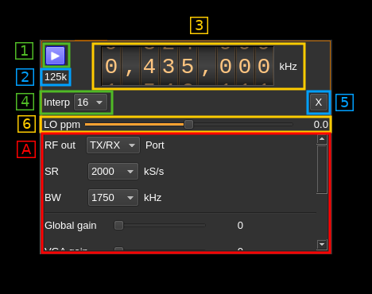
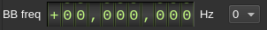
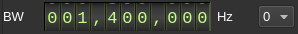

<h1>SoapySDR output plugin</h1>

<h2>Introduction</h2>

This output sample sink plugin sends its samples to a device interfaced with [SoapySDR](https://github.com/pothosware/SoapySDR/wiki).

SoapySDR is a [C/C++ API](https://github.com/pothosware/SoapySDR/blob/master/include/SoapySDR/Device.hpp) that interfaces SDR hardware on one side and application software on the other. Due to its very generic nature it was fairly difficult to implement and specific UI widgets were developed to handle specific types of parameters. The level of control depends on how the device API was implemented by the vendors. On application side some parts of the API have not been implemented and can be left as possible enhancements (see next). In any case it is recommended to use the native plugins if they are available.

SoapySDR devices appear in the list of available devices in the order they are listed in the API call to SoapySDR. If more than one device controlled by SoapySDR is listed then its sequence number is incremented like:

  - SoapySDR[0:0] hackrf: HackRF One...
  - SoapySDR[1:0] hackrf: HackRF One...

The SoapySDR driver name appears right before the column

If the same device exposes several channels they appear as distinct devices with the channel number incremented like:

  - SoapySDR[1:0] lime: LimeSDR...
  - SoapySDR[1:1] lime: LimeSDR...

This works similarly to LimeSDR USB or BladeRF 2.0 micro

<h2>Binary distributions</h2>

The binary distributions provide only the SoapySDR base library. It is your responsibility to install SoapySDR in your system with the SoapySDR plugins suitable for your hardware.

<h2>User arguments</h2>

Occasionally some devices may require to have the user specifying keyword parameters in order to open the device correctly. Most noticeably the Red Pitaya (driver `redpitaya`) needs the IP address of the board specified as a `addr=x.x.x.x` key value pair as it does not get scanned automatically.

In such a case you will use the device user arguments (Preferences -> Devices -> User arguments) with the dialog as described [here](../../../sdrgui/deviceuserargs.md)

If you use Soapy Remote make sure you read [this Wiki page](https://github.com/f4exb/sdrangel/wiki/Soapy-Remote) first as user arguments are mandatory.

<h2>SoapySDR API implementation</h2>

Not all parts are implemented. Currently the following have been left out:

  - Frequency API tuning arguments. The tuning elements are of course supported.
  - Clocking API
  - Time API
  - Sensor API
  - Register API
  - GPIO API
  - I2C API
  - SPI API
  - UART API

<h2>Particular considerations concerning hardware</h2>

In general as previously stated you should choose the native plugins if they are available. These are:

  - BladeRF
  - HackRF
  - LimeSDR
  - PlutoSDR

The following paragraphs list the known issues or oddities.

<h3>BladeRF</h3>

It is very important NOT to use SoapySDR. The default parameters are set to flash the FPGA but as this does not succeeds it results in a FPGA image wipe out and the device returns in "Cypress" mode. It is not too difficult to recover but there is no point risking the hassle.

<h3>Red Pitaya</h3>

When installed the Red Pitaya SoapySDR plugin lists a Red Pitaya device even if there is no Red Pitaya attached. Trying to select and start it when there is no Red Pitaya will result in program crash.

<h2>Interface</h2>

The top and bottom bars of the device window are described [here](../../../sdrgui/device/readme.md)

The top part described by number tags is common for all devices. The bottom part under the "A" tag depends on the SoapySDR device implementation. The corresponding widgets are stacked vertically inside a scrollable area as there may be many controls depending on how the device interface is implemented in SoapySDR. Move the slider on the right to see all parameters available.

<h3>1: Start/Stop</h3>

Device start / stop button.

  - Blue triangle icon: device is ready and can be started
  - Red square icon: device is running and can be stopped
  - Magenta (or pink) square icon: an error occurred. In the case the device was accidentally disconnected you may click on the icon, plug back in and start again.

<h3>2: Stream sample rate</h3>

Baseband I/Q sample rate in kS/s. This is the device sample rate (the "SR" SoapySDR control) divided by the interpolation factor (4).

<h3>3: Frequency</h3>

This is the center frequency of transmission in kHz. The center frequency is usually the same for all Tx channels. The GUI of the sibling channel if present is adjusted automatically if necessary. This control corresponds to the first SoapySDR tuning element usually labeled as "RF" and would generally control the main local oscillator (LO).

Use the wheels to adjust the value. Left click on a digit sets the cursor position at this digit. Right click on a digit sets all digits on the right to zero. This effectively floors value at the digit position. Wheels are moved with the mousewheel while pointing at the wheel or by selecting the wheel with the left mouse click and using the keyboard arrows. Pressing shift simultaneously moves digit by 5 and pressing control moves it by 2.

<h3>4: Interpolation factor</h3>

The I/Q stream from the application is upsampled by a power of two before being sent to the SoapySDR controlled device. Possible values are increasing powers of two: 1 (no interpolation), 2, 4, 8, 16, 32, 64.

<h3>5: Transverter mode open dialog</h3>

This button opens a dialog to set the transverter mode frequency translation options:

Note that if you mouse over the button a tooltip appears that displays the translating frequency and if translation is enabled or disabled. When the frequency translation is enabled the button is lit.

<h4>5.1: Translating frequency</h4>

You can set the translating frequency in Hz with this dial. The manipulation of the dial is described in (3: Frequency).

The frequency set in the device is the frequency on the main dial (1) minus this frequency. Thus it is positive for down converters and negative for up converters.

For example a mixer at 120 MHz for HF operation you would set the value to -120,000,000 Hz so that if the main dial frequency is set at 7,130 kHz the PlutoSDR will be set to 127.130 MHz.

If you use a down converter to receive the 6 cm band narrowband center frequency of 5670 MHz at 432 MHz you would set the translating frequency to 5760 - 432 = 5328 MHz thus dial +5,328,000,000 Hz.

For bands even higher in the frequency spectrum the GHz digits are not really significant so you can have them set at 1 GHz. Thus to receive the 10368 MHz frequency at 432 MHz you would set the translating frequency to 1368 - 432 = 936 MHz. Note that in this case the frequency of the LO used in the mixer of the transverter is set at 9936 MHz.

The Hz precision allows a fine tuning of the transverter LO offset

<h4>5.2: Translating frequency enable/disable</h4>

Use this toggle button to activate or deactivate the frequency translation

<h4>5.3: Confirmation buttons</h4>

Use these buttons to confirm ("OK") or dismiss ("Cancel") your changes.

<h3>6: Software LO ppm correction</h3>

Use this slider to adjust SDRangel internal LO correction in ppm. It can be varied from -100.0 to 100.0 in 0.1 steps and is applied in software when calculating the frequency at which the LO should be set.

<h2>A: SoapySDR variable interface</h2>

The form of widgets is closely related to the type of setting defined in the [SoapySDR interface](https://github.com/pothosware/SoapySDR/blob/master/include/SoapySDR/Types.hpp). These are:

  - Ranges
    - Continuous range when maximum and minimum are different
    - Discrete value when maximum and minimum are equal. Usually this appears in a range list to define a set of values
  - List of ranges: more than one range applies to the same setting
  - Arguments defined by
    - type: boolean, integer, floating point, string
    - nature: continuous or discrete
  - String list

<h3>A.1: Continuous range</h3>

If the range is all in the positive domain the unsigned variation is used:

Note that the same widget is used for single ranges and ranges list. In this case the range selection combo on the right is disabled. The manipulation of the dial is described in (3: Frequency)

If the range is in both the positive and negative domains the signed variation is used:

If the range applies to a gain a slider is used:

<h3>A.2: Discrete range</h3>

Appears with a combo box to select a discrete value:

<h3>A.3: List of ranges</h3>

In this case the range selection combo on the right is enabled:

<h3>A.4: Boolean argument</h3>

A checkbox is used to control boolean values:

For AGC, Auto DC and Auto IQ corrections the checkbox has its text label on the right:

When set (true) a checkbox is lit in orange:

<h3>A.5: Int, Float and String arguments</h3>

For all these types of values a line editor is used. Numerical values are parsed from string:

<h3>A.6 String lists</h3>

Some parameters like the antenna ports are expressed as a list of possible string values. These are presented in a combo box:

