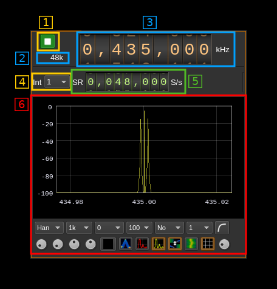

<h1>Test sink plugin</h1>

<h2>Introduction</h2>

This output sample sink plugin sends its samples to a spectrum display.

<h2>Build</h2>

The plugin is always built.

<h2>Interface</h2>

The top and bottom bars of the device window are described [here](../../../sdrgui/device/readme.md)

<h3>1: Start/Stop</h3>

Device start / stop button.

  - Blue triangle icon: device is ready and can be started
  - Red square icon: device is running and can be stopped
  - Magenta (or pink) square icon: an error occurred

<h3>2: Output stream sample rate</h3>

This is the output stream sample rate in kS/s after interpolation (4) from the baseband stream. Thus this is the sample rate (5) multiplied by the interpolation factor (4).

<h3>3: Frequency</h3>

This is the center frequency in kHz that will be put in the file header.

<h3>4: Interpolation factor</h3>

The baseband stream is interpolated by this value before being sent to spectrum display. It can vary in powers of two from 1 (no interpolation) to 64.

<h3>5: Baseband sample rate</h3>

This is the baseband sample rate before interpolation in S/s.

Use the wheels to adjust the sample rate. Left click on a digit sets the cursor position at this digit. Right click on a digit sets all digits on the right to zero. This effectively floors value at the digit position. Wheels are moved with the mousewheel while pointing at the wheel or by selecting the wheel with the left mouse click and using the keyboard arrows. Pressing shift simultaneously moves digit by 5 and pressing control moves it by 2.

<h3>6: Spectrum display</h3>

This is the final output stream spectrum display after interpolation (4). This would be sent to the hardware device. Details on the spectrum view and controls can be found [here](../../../sdrgui/gui/spectrum.md)
