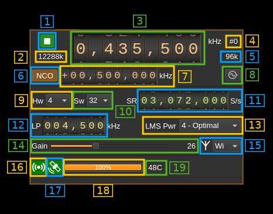

<h1>XTRX output plugin</h1>

<h2>Introduction</h2>

&#9888; Support is experimental and for Linux only. You have to compile it from source.

This output sample sink plugin sends its samples to a [XTRX device](https://xtrx.io).

XTRX is a 2x2 MIMO device so it has two transmitting channels that can run concurrently. To activate the second channel when the first is already active just open a new sink tab in the main window (Devices -> Add sink device) and select the same LimeSDR device.

&#9888; There are USB errors when first starting with XTRX after plugging it in. The only way to work around this is to restart SDRangel application.

&#9888; Right after (re)start you may need to move the main frequency dial back and forth if you notice that you are not on the right frequency.

&#9888; Simultaneous Tx and Rx is not supported. Dual Tx is not working either.

&#9888; You need a hardware interpolation of at least 4 (default)

<h2>Build</h2>

The plugin will be built only if XTRX libraries are installed in your system.

If libraries are installed in a custom place like `/opt/install/xtrx-images` add the following defines on `cmake` command line:

`-DXTRX_DIR=/opt/install/xtrx-images`

<h2>Real time scheduling</h2>

You may find in the log some info (green) messages from `libxtrx` mentioning that some task cannot be set with real time priority. While this is not an absolute necessity to make XTRX work you may want to allow your user or a specific group your user belongs to to set tasks with real time scheduling.

In most Linux systems this is done by editing the `/etc/security/limits.conf` file (with sudo rights). In this file you may add these lines for your user (ex: `user`):

```
user             -       rtprio          99
user             -       memlock         unlimited
```

For a group the syntax is the same but the group name is prefixed with `@` like:

```
@realtime        -       rtprio          99
@realtime        -       memlock         unlimited
```

<h2>Interface</h2>

The top and bottom bars of the device window are described [here](../../../sdrgui/device/readme.md)



<h3>1: Start/Stop</h3>

Device start / stop button.

  - Blue triangle icon: device is ready and can be started
  - Green square icon: device is running and can be stopped
  - Magenta (or pink) square icon: an error occurred. In the case the device was accidentally disconnected you may click on the icon to stop, plug back in, check the source on the sampling devices control panel and start again.

<h3>2: DAC sample rate</h3>

This is the sample rate at which the DAC runs in kS/s (k) or MS/s (M) after hardware interpolation (9). Thus this is the host to device sample rate (11) multiplied by the hardware interpolation factor (9). Please note that a hardware decimation of at least 4 (the default) is required for the device to work properly.

<h3>3: Center frequency</h3>

This is the center frequency of transmission in kHz.

<h3>4: Channel number</h3>

LimeSDR is a 2x2 MIMO device so it has two transmitting channels. This shows the corresponding Tx channel index (0 or 1).

<h3>5: Stream sample rate</h3>

In host to device sample rate input mode (11A) this is the baseband I/Q sample rate in kS/s. This is the host to device sample rate (11) divided by the software interpolation factor (10).

In baseband sample rate input mode (11A) this is the host to device sample rate in kS/s. This is the baseband sample rate (11) multiplied by the software interpolation factor (10)

<h3>6: NCO toggle</h3>

The button is lit when NCO is active and dark when inactive.

Use this button to activate/deactivate the TSP NCO. The LMS7002M chip has an independent NCO in each Tx channel that can span the bandwidth sent to the DAC. This effectively allows non zero digital IF.

<h3>7: NCO frequency shift</h3>

This is the frequency shift applied when the NCO is engaged thus the actual LO frequency is the center frequency of transmission minus this value. Use the thumbwheels to adjust frequency as done with the LO (1.1). Pressing shift simultaneously moves digit by 5 and pressing control moves it by 2. The boundaries are dynamically calculated from the LO center frequency, sample rate and hardware interpolation factor.

&#9758; In the LMS7002M TSP block the NCO sits after the interpolator (see Fig.14 of the [datasheet](http://www.limemicro.com/wp-content/uploads/2015/09/LMS7002M-Data-Sheet-v2.8.0.pdf) p.7) so it runs at the actual DAC rate. Hence the NCO limits are calculated as +/- half the device to host sample rate multiplied by the hardware interpolation factor. For example with a 4 MS/s device to host sample rate (10) and a hardware interpolation of 16 (9) you have +/- 32 MHz span around the LO for the NCO. In this example you can tune all HF frequencies with the center frequency set at its lowest (30 MHz).

<h3>8: External clock control</h3>

Use this button to open a dialog that lets you choose the external clock frequency and enable or disable it. When disabled the internal 30.72 MHz VCTCXO is used.


<h4>8.1: External clock frequency</h4>

Can be varied from 5 to 300 MHz

Use the thumbwheels to adjust frequency as done with the LO (1.1). Pressing shift simultaneously moves digit by 5 and pressing control moves it by 2. The boundaries are dynamically calculated from the LO center frequency, sample rate and hardware decimation factor.

<h4>8.2: Enable/disable external clock input</h7A>

Use this checkbox to enable or disable the external clock input

<h4>8.3: Confirm changes</h4>

Use the "OK" button to confirm your changes

<h4>8.4: Dismiss changes</h4>

Use the "Cancel" button to dismiss your changes

<h3>9: LMS7002M hardware interpolation factor</h3>

The TSP block in the LMS7002M hardware has an interpolation chain that acts on both Tx channels. It is composed of 5 halfband interpolation stages and therefore can achieve interpolation between 1 (no interpolation) and 32 in increasing powers of 2: 1, 2, 4, 8, 16, 32. Please note that a factor of at least 4 is required (this is the default). Lower values are experimental.

Thus the actual sample rate of the DAC is the stream sample rate (11) multiplied by this factor. In the screenshot example this yields a 12.288 MS/s rate at the DAC (3.072 * 4).

The first position in the combo is marked as "A". This is because interpolation by 1 is not implemented and instead an automatic interpolation factor is applied. The DAC rate display is updated automatically and siblings are updated with the actual DAC and hardware interpolation factor.

<h3>10: Software interpolation factor</h3>

The I/Q stream from the baseband is upsampled by a power of two by software inside the plugin before being sent to the LimeSDR device. Possible values are increasing powers of two: 1 (no interpolation), 2, 4, 8, 16, 32.

<h3>11A: Host to device sample rate / Baseband sample rate input toggle</h3>

Use this toggle button to switch the sample rate input next (10) between host to device sample rate and baseband sample rate input. The button shows the current mode:

  - **SR**: host to device sample rate input mode. The baseband sample rate (5) is the host to device sample rate (11) divided by the software interpolation factor (10).
  - **BB**: baseband sample rate input mode. The host to device sample rate (5) is the baseband sample rate (11) multiplied by the software interpolation factor (10).

<h3>11: Sample rate</h3>

This is the LMS7002M device to/from host stream sample rate or baseband sample rate in samples per second (S/s). The control (11A) is used to switch between the two input modes. The device to/from host stream sample rate is the same for the Rx and Tx systems.

The limits are adjusted automatically. In baseband input mode the limits are driven by the interpolation factor (10). You may need to increase this interpolation factor to be able to reach lower values.

Use the wheels to adjust the sample rate. Pressing shift simultaneously moves digit by 5 and pressing control moves it by 2. Left click on a digit sets the cursor position at this digit. Right click on a digit sets all digits on the right to zero. This effectively floors value at the digit position. Wheels are moved with the mousewheel while pointing at the wheel or by selecting the wheel with the left mouse click and using the keyboard arrows.

The LMS7002M uses the same clock for both the ADCs and DACs therefore this sample rate affects all of the 2x2 MIMO channels.

<h3>12: Tx hardware filter bandwidth</h3>

This is the Tx hardware filter bandwidth in kHz in the LMS7002M device for the given channel. Boundaries are updated automatically but generally are from 5 to 130 MHz in 1 kHz steps. Use the wheels to adjust the value. Pressing shift simultaneously moves digit by 5 and pressing control moves it by 2.

<h3>13: LMS002M power saving mode</h3>

<h3>14: Gain</h2>

Use this slider to adjust the PAD gain of the Tx chain. With the current version of libxtrx this does not seem to be effective.

<h3>15: Antenna selection</h3>

  - ** Hi **: Tx high range
  - ** Wi **: Tx wide range: you should use this one (default)

<h3>16: Stream status indicator</h3>

This label turns green when status can be obtained from the current stream. Usually this means that the stream is up and running but not necessarily streaming data. The various status elements appear next on the same line (16, 17, 18)

<h3>17: GPSDO lock indicator</h3>

This label turns green when the GPS used for the GPSDO is locked.

<h3>18: Stream global (all Tx) throughput in MB/s</h3>

This is the stream throughput in MB/s and is usually about 3 times the sample rate for a single stream and 6 times for a dual Tx stream. This is due to the fact that 12 bits samples are used and although they are represented as 16 bit values only 12 bits travel on the USB link.

<h3>19: Board temperature</h3>

This is the board temperature in degrees Celsius updated every ~5s. Before the first probe the display marks "00C" this is normal.
