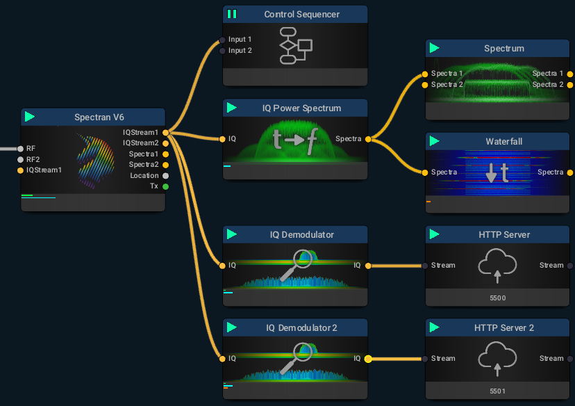
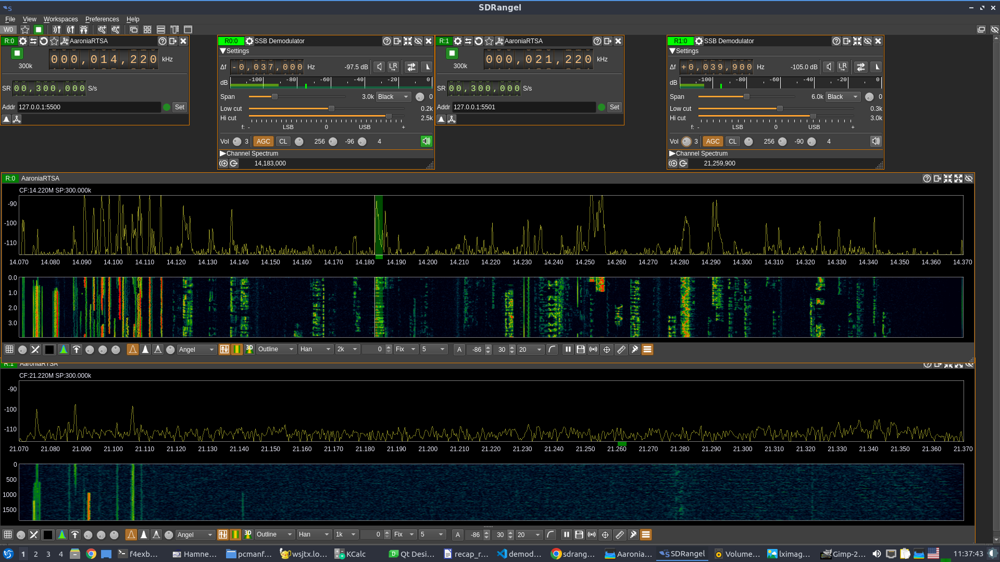
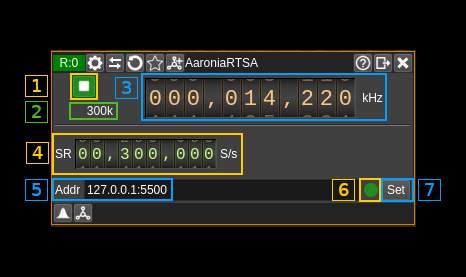

<h1>AaroniaRTSA input plugin</h1>

<h2>Introduction</h2>

You can use this plugin to interface with a http server block in the Aaronia RTSA suite connected to a Spectran V6 device. It is assumed that you have prior knowledge of the Aaronia RTSA suite software and operation of the Spectran V6 RTSA (Real Time Spectrum Analyzer). However in this context there are some specificities i.e. it assumes that the "mission" (in RTSA suite terms) that is the equivalent of a "configuration" in SDRangel has a `HTTP Server` block preceded by a `IQ Demodulator` block (the equivalent of the "Frequency translating FIR filter" in GNU radio). The center frequency and span (equal to decimated sample rate) can be controlled from either RTSA sutie or SDRangel.

An example flow graph could be the following (with two http servers) hence two possible Aaronia receivers in SDRangel:

On SDRangel side two instances of the plugin can listen to each one of the servers:

Of course the `IQ Demodulator` span should fit in the bandwidth set in the Spectran V6 block else it will yield no output.

You can obviously run the RTSA suite and SDRangel on the same machine and connect via localhost but there are advantages on a split setup:

  - The workload can be split between RTSA suite and SDRangel on two different machines. RTSA suite has to ingurgitate data from the Spectran and process it at a very high sample rate so this is demanding on CPU and latency. Often it is better to run it on its own dedicated machine.

  - You can have the RTSA suite run on a machine close to the Spectran. This is in fact mandatory due to the length of the USB cables. And you can run SDRangel on another machine (possibly quite more lightweight) anywhere on the network. You can also multiply the client machines running SDRangel.

<h2>Interface</h2>

The top and bottom bars of the device window are described [here](../../../sdrgui/device/readme.md)

<h3>1: Start/Stop</h3>

This button is used to start the "device" i.e connect to the remote and start stream or stop the "device" i.e. stop stream and disconnect from the remote. The button shows the following faces:

  - Blue triangle icon: device is ready and can be started
  - Green square icon: device is running and can be stopped

<h2>2: Stream sample rate</h2>

This is the stream sample rate in S/s with multiplier. It should be equal to what is displayed in (4).

<h3>3: Frequency</h3>

This is the center frequency received in he stream meta data. When setting it it will try to set the center frequency of the `IQ Demodulator` in RTSA suite the closest to the `HTTP server`.

<h3>4: Stream sample rate</h3>

This is sample rate (actually the frequency span) received in the stream meta data. When setting it it will try to set the sample rate and frequency span of the IQ Demodulator` in RTSA suite the closest to the `HTTP server`.

<h3>5: Remote address and port</h3>

This is the remote address and port of the `HTTP server` block in RTSA suite. The address has to be in the form of an IPv4 address.

Press button (7) to validate your change.

<h3>6: Status indicator</h3>

This ball can take the following colors depending on the status:

  - **Gray**: Idle
  - **Yellow**: Unstable
  - **Green**: Connected
  - **Red**: Error
  - **Magenta**: Disconnected

<h3>7: Set address</h3>

When you change the address in (5) you have to push this button to validate the change.
