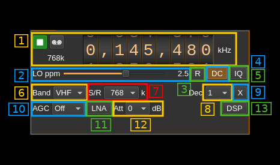

<h1>AirspyHF input plugin</h1>

<h2>Introduction</h2>

This input sample source plugin gets its samples from a [Airspy HF+ device](https://airspy.com/airspy-hf-plus/).

<h2>Build</h2>

The plugin will be built only if the [Airspy HF library](https://github.com/airspy/airspyhf) is installed in your system.

If you build it from source and install it in a custom location say: `/opt/install/libairspyhf` you will have to add `-DAIRSPYHF_DIR=/opt/install/libairspyhf` to the cmake command line.

Note: if you use binary distributions this is included in the bundle.

<h2>Interface</h2>

The top and bottom bars of the device window are described [here](../../../sdrgui/device/readme.md)

For controls 10 to 13 to be effective you will need a recent version (up to date in January 2019) of both libairspy and the firmware.

<h3>1: Common stream parameters</h3>

<h4>1.1: Frequency</h4>

This is the center frequency of reception in kHz.

<h4>1.2: Start/Stop</h4>

Device start / stop button.

  - Blue triangle icon: device is ready and can be started
  - Green square icon: device is running and can be stopped
  - Magenta (or pink) square icon: an error occurred. In the case the device was accidentally disconnected you may click on the icon, plug back in and start again.

<h4>1.4: Stream sample rate</h4>

Baseband I/Q sample rate in kS/s. This is the device to host sample rate (3) divided by the decimation factor (4).

<h3>2: Lo ppm correction</h3>

This is the correction factor in ppm applied to the local oscillator. The Airspy HF LO has 1 kHz increments so anything in between is obtained by mixing the signal with a software NCO. This is actually done in the AirspyHF library when DSP is on (13).

You can reset the ppm value anytime by pressing on button (3)

<h3>3: Reset LO ppm correction</h3>

This resets the LO ppm correction (zero the value).

<h3>4: Internal DC correction</h3>

Internal SDRangel DC correction. This is useless if libairspy DSP is engaged (13)

<h3>5: Internal IQ imbalance correction</h3>

Internal SDRangel IQ imbalance correction. This is useless if libairspy DSP is engaged (13)

<h3>6: Band select</h3>

Use this combo box to select the HF or VHF range. This will set the limits of the frequency dial (1.1) appropriately and possibly move the current frequency inside the limits. Limits are given by the AirspyHF+ specifications:

  - HF: 9 kHz to 31 MHz
  - VHF: 60 to 260 MHz

<h3>7: Device to host sample rate</h3>

This is the device to host sample rate in kilo samples per second (kS/s).

Although the combo box is there to present a choice of sample rates at present the AirspyHF+ deals only with 768 kS/s. However the support library has provision to get a list of sample rates from the device in case of future developments.

<h3>8: Decimation factor</h3>

The I/Q stream from the AirspyHF to host is downsampled by a power of two before being sent to the passband. Possible values are increasing powers of two: 1 (no decimation), 2, 4, 8, 16, 32, 64, 128, 256. When using audio channel plugins (AM, DSD, NFM, SSB...) please make sure that the sample rate is not less than the audio sample rate.

<h3>9: Transverter mode open dialog</h3>

This button opens a dialog to set the transverter mode frequency translation options. The details about this dialog can be found [here](../../../sdrgui/gui/transverterdialog.md)

<h3>10: AGC mode</h3>

This appears to work only on HF band.

  - **Off**: no AGC
  - **Low**: AGC with low threshold
  - **High**: AGC with high threshold

<h3>11: LNA</h3>

This appears to work only on HF band. Turns on or off the LNA (+6dB). Gain is compensated in software.

<h3>12: Attenuator</h3>

This appears to work only on HF band and is active only if AGC is off (10). Attenuator value can be set from 0 to 48 dB in 6 dB steps.

<h3>13: LibairspyHF DSP</h3>

Turns on or off the libairspyhf DSP routines. When on the internal DC and IQ imbalance corrections (4) and (5) are useless and should be turned off.
