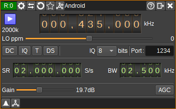

<h1>Android SDR Driver Input Olugin</h1>

<h2>Introduction</h2>

This input sample source plugin gets its I/Q samples from the Android [SDR Driver](https://play.google.com/store/apps/details?id=marto.rtl_tcp_andro&hl=en&gl=US) or [SDRplay Driver](https://play.google.com/store/apps/details?id=com.sdrplay.driver&hl=en&gl=US) apps.
These apps enable support for RTL SDR, HackRF and SDRPlay SDRs.

<h2>Interface</h2>

<h3>1: Start/Stop</h3>

Device start / stop button.

  - Blue triangle icon: device is ready and can be started
  - Green square icon: device is running and can be stopped
  - Red square icon: an error has occured with the connection to the device. The plugin will continually try to reconnect.

<h3>2: Center frequency</h3>

This is the center frequency in kHz of the device.

<h3>3: Stream sample rate</h3>

Network I/Q sample rate in kS/s.

<h3>4: Local oscillator correction</h3>

This is the correction to be applied to the device's local oscillator in ppm.

<h3>5: DC offset correction</h3>

Check this button to enable DC offset correction on the device.

<h3>6: IQ imbalance correction</h3>

Check this button to enable IQ imbalance correction on the device.

<h3>7: Bias tee</h3>

Check this button to enable a bias tee, if the device supports it.

<h3>8: Direct sampling mode</h3>

Use this button to activate RTL-SDR's direct sampling mode. This can be used to tune to HF frequencies.

<h3>9: Sample bit depth</h3>

Specifies number of bits per I/Q sample transmitted via TCP/IP. This should be 8 for RTL SDR, but can be 16 for SDRPlay.

<h3>10: Server TCP Port</h3>

TCP port of SDR Driver to connect to. Typically 1234.

<h3>11: Sample rate</h3>

Specify the device's sample rate in samples per second (S/s).

<h3>12: RF Bandwidth</h3>

Specifies the bandwidth in kHz of the analog filter in the device. Available bandwidths are dependent upon the device.

<h3>13: Gain</h3>

Specify gain in dB applied in various stages of the device. Available gains will depend upon the type of device.

<h3>12: AGC</h3>

Check to enable automatic gain control in the device. How AGC works is device dependent.
