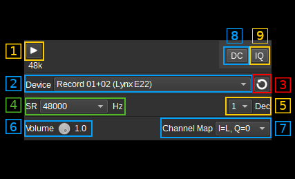

<h1>Audio input plugin</h1>

<h2>Introduction</h2>

This input sample source plugin gets its samples from an audio device.

<h2>Interface</h2>

The top and bottom bars of the device window are described [here](../../../sdrgui/device/readme.md)

<h3>1: Start/Stop</h3>

Device start / stop button.

  - Blue triangle icon: device is ready and can be started
  - Green square icon: device is running and can be stopped
  - Magenta (or pink) square icon: an error occurred. In the case the device was accidentally disconnected you may click on the icon, plug back in and start again.

<h3>2: Device</h3>

The audio device to use.

<h3>3: Refresh devices</h3>

Refresh the list of audio devices.

<h3>4: Audio sample rate</h3>

Audio sample rate in Hz (Sa/s).

<h3>5: Decimation</h3>

A decimation factor to apply to the audio data. The baseband sample rate will be the audio sample, divided by this decimation factor.

<h3>6: Volume</h3>

A control to set the input volume. This is not supported by all input audio devices.

<h3>7: Channel Map</h3>

This controls how the left and right audio channels map on to the IQ channels.

* Mono L - Real samples are taken from the left audio channel and are heterodyned by the fourth of the sample rate (fs/4) to obtain complex samples. Therefore the spectrum of the complex baseband is centered at the fourth of the sample rate (fs/4). As per Nyquist rule only a bandwidth of half of the sample rate (fs/2) is available for real signals. Frequencies outside the [0, fs/2] interval are artefacts and can be eliminated by decimating by a factor of 2.
* Mono R - Same as above but takes the right audio channel for the real signal.
* I=L, Q=R - The left audio channel is driven to the I channel. The right audio channel is driven to the Q channel for a complex (analytic signal)input.
* I=R, Q=L - The right audio channel is driven to the I channel. The left audio channel is driven to the Q channel for a complex (analytic signal)input.
