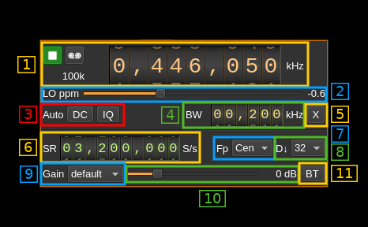

<h1>BladeRF 2.0 micro (v2) input plugin</h1>

<h2>Introduction</h2>

This input sample source plugin gets its samples from a [BladeRF 2.0 micro device](https://www.nuand.com/bladerf-2) using LibbladeRF v.2.

<h2>Build</h2>

The plugin will be built only if the [BladeRF host library](https://github.com/Nuand/bladeRF) is installed in your system. If you build it from source and install it in a custom location say: `/opt/install/libbladeRF` you will have to add `-DBLADERF_INCLUDE_DIR=/opt/install/libbladeRF` to the cmake command line.

The FPGA .rbf file should be copied to the folder where the `sdrangel` binary resides. You can download FPGA images from [here](https://www.nuand.com/fpga_images/)

The BladeRF Host library is also provided by many Linux distributions (check its version) and is built in the SDRangel binary releases.

<h2>Interface</h2>

The top and bottom bars of the device window are described [here](../../../sdrgui/device/readme.md)

<h3>1: Common stream parameters</h3>

<h4>1.1: Frequency</h4>

This is the center frequency of reception in kHz. The center frequency is the same for all Rx channels. The GUI of the sibling channel if present is adjusted automatically.

<h4>1.2: Start/Stop</h4>

Device start / stop button.

  - Blue triangle icon: device is ready and can be started
  - Green square icon: device is running and can be stopped
  - Magenta (or pink) square icon: an error occurred. In the case the device was accidentally disconnected you may click on the icon, plug back in and start again.

<h4>1.4: Stream sample rate</h4>

In device to host sample rate input mode (6A) this is the baseband I/Q sample rate in kS/s. This is the device to host sample rate (6) divided by the decimation factor (8).

In baseband sample rate input mode (6A) this is the device to host sample rate in kS/s. This is the baseband sample rate (6) multiplied by the decimation factor (8)

<h3>2: LO ppm correction</h3>

Use this slider to adjust LO correction in ppm. It can be varied from -20.0 to 20.0 in 0.1 steps and is applied in software. This applies to the oscillator that controls both the Rx and Tx frequency therefore it is also changed on the related Rx and Tx plugin(s) if they are active.

<h3>3: Auto correction options</h3>

These buttons control the local DSP auto correction options:

  - **DC**: auto remove DC component
  - **IQ**: auto make I/Q balance. The DC correction must be enabled for this to be effective.

<h3>4: Rx filter bandwidth</h3>

This is the Rx filter bandwidth in kHz. Minimum and maximum values are adjusted automatically. Normal range is from 200 kHz to 56 MHz. The Rx filter bandwidth is the same for all Rx channels. The GUI of the sibling channel if present is adjusted automatically.

<h3>5: Transverter mode open dialog</h3>

This button opens a dialog to set the transverter mode frequency translation options. The details about this dialog can be found [here](../../../sdrgui/gui/transverterdialog.md)

<h3>6A: Device sample rate / Baseband sample rate input toggle</h3>

Use this toggle button to switch the sample rate input next (6) between device sample rate and baseband sample rate input. The button shows the current mode:

  - **SR**: device sample rate input mode. The baseband sample rate (1.4) is the device sample rate (6) divided by the decimation factor (8).
  - **BB**: baseband sample rate input mode. The device sample rate (1.4) is the baseband sample rate (6) multiplied by the decimation factor (8).

<h3>6: Sample rate</h3>

This is the BladeRF device ADC sample rate or baseband sample rate in samples per second (S/s). The control (6A) is used to switch between the two input modes.

The limits are adjusted automatically. In baseband input mode the limits are driven by the decimation factor (8). You may need to increase this decimation factor to be able to reach lower values.

Use the wheels to adjust the sample rate. Left click on a digit sets the cursor position at this digit. Right click on a digit sets all digits on the right to zero. This effectively floors value at the digit position. Wheels are moved with the mousewheel while pointing at the wheel or by selecting the wheel with the left mouse click and using the keyboard arrows. Pressing shift simultaneously moves digit by 5 and pressing control moves it by 2.

The ADC sample rate is the same for all Rx channels. The GUI of the sibling channel if present is adjusted automatically.

<h3>7: Baseband center frequency position relative to the BladeRF Rx center frequency</h3>

Possible values are:

  - **Cen**: the decimation operation takes place around the BladeRF Rx center frequency Fs
  - **Inf**: the decimation operation takes place around Fs - Fc.
  - **Sup**: the decimation operation takes place around Fs + Fc.

With SR as the sample rate before decimation Fc is calculated as:

  - if decimation n is 4 or lower:  Fc = SR/2^(log2(n)-1). The device center frequency is on the side of the baseband. You need a RF filter bandwidth at least twice the baseband.
  - if decimation n is 8 or higher: Fc = SR/n. The device center frequency is half the baseband away from the side of the baseband. You need a RF filter bandwidth at least 3 times the baseband.

<h3>8: Decimation factor</h3>

The I/Q stream from the BladeRF ADC is downsampled by a power of two before being sent to the passband. Possible values are increasing powers of two: 1 (no decimation), 2, 4, 8, 16, 32, 64.

<h3>9: Gain mode</h2>

This selects the gain processing in use. Values are fetched automatically from the device. Normal values are

  - **default**: AGC with default behavior
  - **Manual**: Manual. Use control (9) to adjust gain
  - **fast**: fast AGC
  - **slow**: slow AGC
  - **hybrid**: hybrid AGC

<h3>10: Manual gain control</h3>

Use this slider to adjust gain in manual mode. This control is disabled in non manual modes (all modes but manual). The minimum, maximum and step values are fetched automatically from the device and may vary depending on the center frequency. For frequencies around 400 MHz the gain varies from -16 to 60 dB in 1 dB steps.

<h3>11: Bias tee control</h3>

Use this toggle button to activate or de-activate the bias tee. Note that according to BladeRF v2 specs the bias tee is simultaneously present on all Rx RF ports. The GUI of the sibling channel if present is adjusted automatically.

