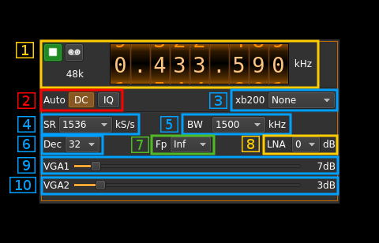

<h1>BladeRF input plugin</h1>

<h2>Introduction</h2>

This input sample source plugin gets its samples from a [BladeRF device](https://www.nuand.com/). 

<h2>Build</h2>

The plugin will be built only if the [BladeRF host library](https://github.com/Nuand/bladeRF) is installed in your system. If you build it from source and install it in a custom location say: `/opt/install/libbladeRF` you will have to add `-DLIBBLADERF_INCLUDE_DIR=/opt/install/libbladeRF/include -DLIBBLADERF_LIBRARIES=/opt/install/libbladeRF/lib/libbladeRF.so` to the cmake command line.

The BladeRF Host library is also provided by many Linux distributions and is built in the SDRangel binary releases.

<h2>Interface</h2>

<h3>1: Common stream parameters</h3>

<h4>1.1: Frequency</h4>

This is the center frequency of reception in kHz.

<h4>1.2: Start/Stop</h4>

Device start / stop button. 

  - Blue triangle icon: device is ready and can be started
  - Green square icon: device is running and can be stopped
  - Magenta (or pink) square icon: an error occurred. In the case the device was accidentally disconnected you may click on the icon, plug back in and start again.
  
<h4>1.3: Record</h4>

Record baseband I/Q stream toggle button

<h4>1.4: Stream sample rate</h4>

Baseband I/Q sample rate in kS/s. This is the device sample rate (4) divided by the decimation factor (6). 

<h3>2: Auto correction options</h3>

These buttons control the local DSP auto correction options:

  - **DC**: auto remove DC component
  - **IQ**: auto make I/Q balance. The DC correction must be enabled for this to be effective.
  
<h3>3: XB-200 add-on control</h3>

This controls the optional XB-200 add-on when it is fitted to the BladeRF main board. These controls have no effect if the XB-200 board is absent. Options are:

  - **None**: XB-200 is ignored
  - **Bypass**: XB-200 is passed through
  - **Auto 1dB**: The 50, 144 and 220 MHz filters are switched on automatically according to the frequency of reception when it is within the -1 dB passband of the filters 
  - **Auto 3dB**: The 50, 144 and 220 MHz filters are switched on automatically according to the frequency of reception when it is within the -3 dB passband of the filters
  - **Custom**: The signal is routed through a custom filter
  - **50M**: The signal is routed through the 50 MHz filter 
  - **144M**: The signal is routed through the 144 MHz filter 
  - **222M**: The signal is routed through the 222 MHz filter 

<h3>4: Device sample rate</h3>

This is the BladeRF device ADC sample rate in S/s.

Use the wheels to adjust the sample rate. Left click on a digit sets the cursor position at this digit. Right click on a digit sets all digits on the right to zero. This effectively floors value at the digit position. Wheels are moved with the mousewheel while pointing at the wheel or by selecting the wheel with the left mouse click and using the keyboard arrows. Pressing shift simultaneously moves digit by 5 and pressing control moves it by 2.

<h3>5: Decimation factor</h3>

The I/Q stream from the BladeRF ADC is downsampled by a power of two before being sent to the passband. Possible values are increasing powers of two: 1 (no decimation), 2, 4, 8, 16, 32, 64.

<h3>6: Baseband center frequency position relative the the BladeRF Rx center frequency</h3>

Possible values are:

  - **Cen**: the decimation operation takes place around the BladeRF Rx center frequency Fs
  - **Inf**: the decimation operation takes place around Fs - Fc. 
  - **Sup**: the decimation operation takes place around Fs + Fc.
  
With SR as the sample rate before decimation Fc is calculated as: 

  - if decimation n is 4 or lower:  Fc = SR/2^(log2(n)-1). The device center frequency is on the side of the baseband. You need a RF filter bandwidth at least twice the baseband.
  - if decimation n is 8 or higher: Fc = SR/n. The device center frequency is half the baseband away from the side of the baseband. You need a RF filter bandwidth at least 3 times the baseband.

<h3>7: Rx filter bandwidth</h3>

This is the Rx filter bandwidth in kHz in the LMS6002D device. Possible values are: 1500, 1750, 2500, 2750, 3000, 3840, 5000, 5500, 6000, 7000, 8750, 10000, 12000, 14000, 20000, 28000 kHz.

<h3>8: LNA gain</h2>

This is the LNA gain in dB. LNA is inside the LMS6002D chip and is placed before the RF mixer. Possible values are:

  - **0dB**: no gain
  - **3dB**
  - **6dB**
  
<h3>9: Variable gain amplifier #1 gain</h3>

The VGA1 gain can be adjusted from 5 dB to 30 dB in 1 dB steps. The VGA1 is inside the LMS6002D chip and is placed between the RF mixer and the baseband filter.

<h3>10: Variable gain amplifier #2 gain</h3>

The VGA2 gain can be adjusted from 0 dB to 30 dB in 3 dB steps. The VGA2 is inside the LMS6002D chip and is placed between the baseband filter and the ADC.
