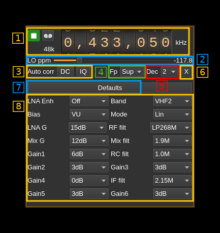
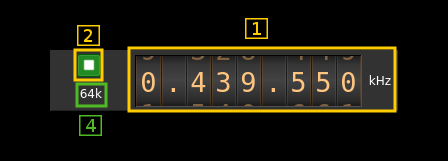
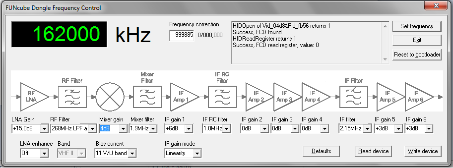

<h1>FunCube Dongle Pro input plugin</h1>

<h2>Introduction</h2>

This input sample source plugin gets its samples from a [FunCube Dongle (FCD) Pro device](http://www.funcubedongle.com/?page_id=1057).

<h2>Interface</h2>

The top and bottom bars of the device window are described [here](../../../sdrgui/device/readme.md)

<h3>1: Common stream parameters</h3>

<h4>1.1: Frequency</h4>

This is the center frequency of reception in kHz.

<h4>1.2: Start/Stop</h4>

Device start / stop button.

  - Blue triangle icon: device is ready and can be started
  - Green square icon: device is running and can be stopped
  - Magenta (or pink) square icon: an error occurred. In the case the device was accidentally disconnected you may click on the icon, plug back in and start again.

<h4>1.4: Stream sample rate</h4>

Baseband I/Q sample rate in kS/s. This is the device sample rate (4) divided by the decimation factor (6).

<h3>2: Local Oscillator correction</h3>

This is the correction to be applied to the local oscillator in ppm.

<h3>3: Auto correction options</h3>

These buttons control the local DSP auto correction options:

  - **DC**: auto remove DC component
  - **IQ**: auto make I/Q balance. The DC correction must be enabled for this to be effective.

<h3>4: Decimated bandpass center frequency position relative to the FCD Pro center frequency</h3>

  - **Cen**: the decimation operation takes place around the FCD Pro center frequency Fs
  - **Inf**: the decimation operation takes place around Fs - Fc.
  - **Sup**: the decimation operation takes place around Fs + Fc.

With SR as the sample rate before decimation Fc is calculated as:

  - if decimation n is 4 or lower:  Fc = SR/2^(log2(n)-1). The device center frequency is on the side of the baseband. You need a RF filter bandwidth at least twice the baseband.
  - if decimation n is 8 or higher: Fc = SR/n. The device center frequency is half the baseband away from the side of the baseband. You need a RF filter bandwidth at least 3 times the baseband.

<h3>5: Decimation factor</h3>

The I/Q stream from the FCD Pro ADC is downsampled by a power of two before being sent to the passband. Possible values are increasing powers of two: 1 (no decimation), 2, 4, 8, 16.

<h3>6: Transverter mode open dialog</h3>

This button opens a dialog to set the transverter mode frequency translation options. The details about this dialog can be found [here](../../../sdrgui/gui/transverterdialog.md)

<h3>7: Set default values</h3>

Use this push button to force default reasonable values for all parameters below (8)

<h3>8: Parameters</h3>

This panel lists all parameters that are the same as in the Windows utility interface showing the block diagram of the FCD:

  - **LNA Enh**: equivalent of the "LNA enhance" parameter
  - **Band**: equivalent of the "Band" parameter
  - **Bias**: equivalent of the "Bias current" parameter
  - **Mode**: equivalent of the "IF gain mode" parameter
  - **LNA G**: equivalent of the "LNA gain" parameter
  - **RF filt**: equivalent of the "RF filter" parameter
  - **Mix G**: equivalent of the "Mixer gain" parameter
  - **Mix filter**: equivalent of the "Mixer filter" parameter
  - **Gain1**: equivalent of the "IF gain 1" parameter
  - **RC filt**: equivalent of the "IF RC filter" parameter
  - **Gain2**: equivalent of the "IF gain 2" parameter
  - **Gain3**: equivalent of the "IF gain 3" parameter
  - **Gain4**: equivalent of the "IF gain 4" parameter
  - **IF filt**: equivalent of the "IF filter" parameter
  - **Gain5**: equivalent of the "IF gain 5" parameter
  - **Gain6**: equivalent of the "IF gain 6" parameter
