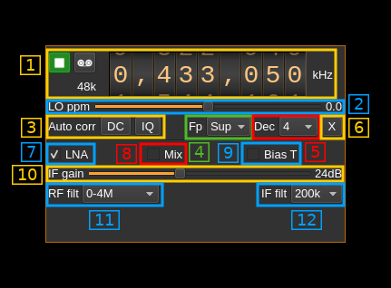

<h1>FunCube Dongle Pro+ input plugin</h1>

<h2>Introduction</h2>

This input sample source plugin gets its samples from a [FunCube Dongle (FCD) Pro+ device](http://www.funcubedongle.com/?page_id=1073).

<h2>Interface</h2>

The top and bottom bars of the device window are described [here](../../../sdrgui/device/readme.md)

<h3>1: Common stream parameters</h3>

<h4>1.1: Frequency</h4>

This is the center frequency of reception in kHz.

<h4>1.2: Start/Stop</h4>

Device start / stop button.

  - Blue triangle icon: device is ready and can be started
  - Green square icon: device is running and can be stopped
  - Magenta (or pink) square icon: an error occurred. In the case the device was accidentally disconnected you may click on the icon, plug back in and start again.

<h4>1.4: Stream sample rate</h4>

Baseband I/Q sample rate in kS/s. This is the device sample rate (4) divided by the decimation factor (6).

<h3>2: Local Oscillator correction</h3>

This is the correction to be applied to the local oscillator in ppm.

<h3>3: Auto correction options</h3>

These buttons control the local DSP auto correction options:

  - **DC**: auto remove DC component
  - **IQ**: auto make I/Q balance. The DC correction must be enabled for this to be effective.

<h3>4: Decimated bandpass center frequency position relative to the FCD Pro+ center frequency</h3>

  - **Cen**: the decimation operation takes place around the FCD Pro+ center frequency Fs
  - **Inf**: the decimation operation takes place around Fs - Fc.
  - **Sup**: the decimation operation takes place around Fs + Fc.

With SR as the sample rate before decimation Fc is calculated as:

  - if decimation n is 4 or lower:  Fc = SR/2^(log2(n)-1). The device center frequency is on the side of the baseband. You need a RF filter bandwidth at least twice the baseband.
  - if decimation n is 8 or higher: Fc = SR/n. The device center frequency is half the baseband away from the side of the baseband. You need a RF filter bandwidth at least 3 times the baseband.

<h3>5: Decimation factor</h3>

The I/Q stream from the FCD Pro+ ADC is downsampled by a power of two before being sent to the passband. Possible values are increasing powers of two: 1 (no decimation), 2, 4, 8, 16.

<h3>6: Transverter mode open dialog</h3>

This button opens a dialog to set the transverter mode frequency translation options. The details about this dialog can be found [here](../../../sdrgui/gui/transverterdialog.md)

<h3>7: LNA toggle</h3>

This checkbox is used to toggle the LNA on/off

<h3>8: Mix toggle</h3>

This checkbox is used to toggle mixer amplifier on/off

<h3>9: Bias tee</h3>

Use this checkbox to activate the bias tee.

<h3>10: If gain</h3>

Use this slider to adjust the gain of the IF amplifier.

<h3>10: RF filter</h3>

This controls the tuner filter (band) used:

<h3>11: IF filter</h2>

Selects the IF filter bandwidth
