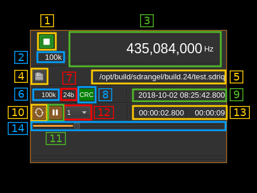

<h1>File input plugin</h1>

<h2>Introduction</h2>

This plugin reads a file of I/Q samples that have been previously saved with the file record button of other sampling source devices. The plugin supports SDRangel's own .sdriq file format as well as signed 16-bit PCM, 2 channel .wav files (including support for optional auxi headers, containing centre frequency).

An .sdriq file starts with a 32 byte header of all unsigned integer of various sizes containing meta data:

<table>
  <tr>
    <th>Displ.</th>
    <th>Bytes</th>
    <th>Description</th>
  </tr>
  <tr>
    <td>0</td>
    <td>4</td>
    <td>Sample rate in S/s</td>
  </tr>
  <tr>
    <td>4</td>
    <td>8</td>
    <td>Center frequency in Hz</td>
  </tr>
  <tr>
    <td>12</td>
    <td>8</td>
    <td>Unix epoch (timestamp) of start</td>
  </tr>
  <tr>
    <td>20</td>
    <td>4</td>
    <td>Sample size (16 or 24 bits)</td>
  </tr>
  <tr>
    <td>24</td>
    <td>4</td>
    <td>Filler with zeroes</td>
  </tr>
  <tr>
    <td>28</td>
    <td>4</td>
    <td>CRC32 of the previous 28 bytes</td>
  </tr>
</table>

The header takes an integer number of 16 (4 bytes) or 24 (8 bytes) bits samples. To calculate CRC it is assumed that bytes are in little endian order.

<h2>Interface</h2>

The top and bottom bars of the device window are described [here](../../../sdrgui/device/readme.md)

<h3>1: Start/Stop</h3>

Device start / stop button.

  - Blue triangle icon: ready to be started
  - Green square icon: currently running and can be stopped
  - Magenta (or pink) square icon: an error occurred. The file may not be found or this can be a header CRC error or the file is too small (less than the header length). You may stop and choose another file.

<h3>2: Stream sample rate</h3>

Baseband I/Q sample rate in kS/s. This is the sample rate present in the header.

<h3>3: Frequency</h3>

This is the center frequency of reception in kHz when the record was taken and written in the header.

<h3>4: Open file</h3>

Opens a file dialog to select the input file. It expects an extension of `.sdriq` or `.wav`. This button is disabled when the stream is running. You need to pause (button 11) to make it active and thus be able to select another file.

<h3>5: File path</h3>

Absolute path of the file being read

<h3>6: File recorded sample rate</h3>

Sample rate of the record in kS/s as written in the header. The reading process is based on this sample rate.

<h3>7: Sample size</h3>

This is the sample size in bits as written in the header. The reading process is based on this sample size.

<h3>8: CRC indicator</h3>

Indicates if the header block CRC check has succeeded (green) or failed (red) or undetermined yet (grey). If the header is corrupted you may try to reconstruct a valid header using the `rescuesdriq` utility in the folder with the same name. See the [readme](../../../rescuesdriq/readme.md) for details.

<h3>9: Current timestamp</h3>

This is the timestamp of the current pointer in the file based on the start time, number of samples read and sample rate.

<h3>10: Loop</h3>

Use this button to read in a loop or read only once

<h3>11: Play/pause</h3>

This is the play/pause button

<h3>12: Playback acceleration</h3>

Use this combo to select play back acceleration to values of 1 (no acceleration), 2, 5, 10, 20, 50, 100, 200, 500, 1k (1000) times. This is useful on long recordings used in conjunction with the spectrum "Max" averaging mode in order to see the waterfall over a long period. Thus the waterfall will be filled much faster.

&#9758; Note that this control is enabled only in paused mode.

&#9888; The result when using channel plugins with acceleration is unpredictable. Use this tool to locate your signal of interest then play at normal speed to get proper demodulation or decoding.

<h3>13: Relative timestamp and record length</h3>

Left is the relative timestamp of the current pointer from the start of the record. Right is the total record time.

<h3>14: Current pointer gauge</h3>

This represents the position of the current pointer position in the complete recording. It can be used it paused mode to position the current pointer by moving the slider.
