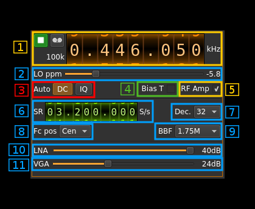

<h1>HackRF input plugin</h1>

<h2>Introduction</h2>

This input sample source plugin gets its samples from a [HackRF device](https://greatscottgadgets.com/hackrf/).

<h2>Build</h2>

The plugin will be built only if the [HackRF host library](https://github.com/mossmann/hackrf) is installed in your system. If you build it from source and install it in a custom location say: `/opt/install/libhackrf` you will have to add `-DLIBHACKRF_INCLUDE_DIR=/opt/install/libhackrf/include -DLIBHACKRF_LIBRARIES=/opt/install/libhackrf/lib/libhackrf.so` to the cmake command line.

The HackRF Host library is also provided by many Linux distributions and is built in the SDRangel binary releases.

<h2>Interface</h2>

<h3>1: Common stream parameters</h3>

<h4>1.1: Frequency</h4>

This is the center frequency of reception in kHz.

<h4>1.2: Start/Stop</h4>

Device start / stop button. 

  - Blue triangle icon: device is ready and can be started
  - Green square icon: device is running and can be stopped
  - Red square icon: an error occurred. In the case the device was accidentally disconnected you may click on the icon, plug back in and start again.
  
If you have the Tx open in another tab and it is running then it will be stopped automatically before the Rx starts. In a similar manner the Rx will be stopped before the Tx is started from the Tx tab.

The settings on Rx or Tx tab are reapplied on start so these settings can be considered independent.

<h4>1.3: Record</h4>

Record baseband I/Q stream toggle button

<h4>1.4: Baseband sample rate</h4>

Baseband I/Q sample rate in kS/s. This is the device sample rate (4) divided by the decimation factor (6). 

<h3>2: Local Oscillator correction</h3>

Use this slider to adjust LO correction in ppm. It can be varied from -10.0 to 10.0 in 0.1 steps and is applied in software.

<h3>3: Auto correction options</h3>

These buttons control the local DSP auto correction options:

  - **DC**: auto remove DC component
  - **IQ**: auto make I/Q balance. The DC correction must be enabled for this to be effective.

<h3>3A: Link Tx frequency</h3>

Use this button to toggle the device Tx frequency link.

When active (button lit) and a tab is opened for the Tx part of the same device this option will activate the link of the Tx frequency to the Rx frequency. Thus when changing the Rx frequency the Tx frequency will vary by the same amount. This facilitates the split operation or repeater operation. You can also set the Tx frequency so that it follows exactly the Rx frequency (simplex).

The amount of shift is simply set by changing the frequency in the Tx tab.
  
<h3>4: Bias tee</h3>

Use this checkbox to toggle the +5V power supply on the antenna connector.

<h3>5:RF amp</h3>

Use this checkbox to toggle the extra low noise amplifier (LNA). This gives an additional gain of 14 dB. 

<h3>6: Device sample rate</h3>

This is the HackRF device ADC sample rate in S/s.

Use the wheels to adjust the sample rate. Left click on a digit sets the cursor position at this digit. Right click on a digit sets all digits on the right to zero. This effectively floors value at the digit position. Wheels are moved with the mousewheel while pointing at the wheel or by selecting the wheel with the left mouse click and using the keyboard arrows. Pressing shift simultaneously moves digit by 5 and pressing control moves it by 2.

<h3>7: Decimation factor</h3>

The device stream from the HackRF is decimated to obtain the baseband stream. Possible values are:

  - **1**: no decimation
  - **2**: divide device stream sample rate by 2
  - **4**: divide device stream sample rate by 4
  - **8**: divide device stream sample rate by 8
  - **16**: divide device stream sample rate by 16
  - **32**: divide device stream sample rate by 32

<h3>8: Baseband center frequency position relative the the HackRF Rx center frequency</h3>

  - **Cen**: the decimation operation takes place around the HackRF Rx center frequency Fs
  - **Inf**: the decimation operation takes place around Fs - Fc. 
  - **Sup**: the decimation operation takes place around Fs + Fc.
  
With SR as the sample rate before decimation Fc is calculated as: 

  - if decimation n is 4 or lower:  Fc = SR/2^(log2(n)-1). The device center frequency is on the side of the baseband. You need a RF filter bandwidth at least twice the baseband.
  - if decimation n is 8 or higher: Fc = SR/n. The device center frequency is half the baseband away from the side of the baseband. You need a RF filter bandwidth at least 3 times the baseband.

<h3>9: Rx filter bandwidth</h3>

This is the Rx filter bandwidth in kHz. Possible values are: 1750, 2500, 3500, 5000, 5500, 6000, 7000, 8000, 9000, 10000, 12000, 14000, 15000, 20000, 24000, 28000 kHz.

<h3>10: Internal LNA gain</h3>

The LNA gain can be adjusted from 0 dB to 40 dB in 8 dB steps.

<h3>11: Rx variable gain amplifier gain</h3>

The Rx VGA gain can be adjusted from 0 dB to 62 dB in 2 dB steps.
