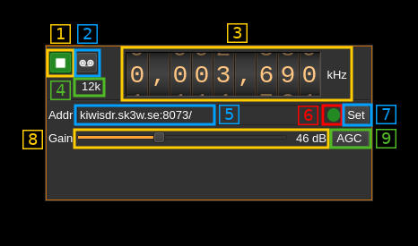

<h1>KiwiSDR input plugin</h1>

<h2>Introduction</h2>

This plugin is designed to enable connection to publicly available [KiwiSDR](http://kiwisdr.com/) receivers. A list of on-line receivers is available [here](https://sdr.hu/?q=kiwisdr)

<h2>Interface</h2>

The top and bottom bars of the device window are described [here](../../../sdrgui/device/readme.md)

<h3>1: Start/Stop</h3>

This button is used to start the "device" i.e connect to the remote and start stream or stop the "device" i.e. stop stream and disconnect from the remote. The button shows the following faces:

  - Blue triangle icon: device is ready and can be started
  - Green square icon: device is running and can be stopped

<h3>3: Frequency</h3>

This is the center frequency of reception in kHz.

<h3>4: Stream sample rate</h3>

This is the 12 kS/s fixed sample rate of the I/Q stream provided by the Kiwi.

<h3>5: Remote address and port</h3>

This is the remote address and port of the remote KiwiSDR instance to which to connect. The address can be in the form of an URL or IPv4 address. This is the same address and port found in the servers list of [SDR.hu](https://sdr.hu/?q=kiwisdr) for example. Note that the `http://` prefix should be removed this should be only the address and port.

Press button (7) to validate your change.

<h3>6: Status indicator</h3>

This ball can take the following colors depending on the status:

  - **Gray**: Idle
  - **Yellow**: Connecting
  - **Green**: Connected
  - **Red**: Error
  - **Magenta**: Disconnected

The connection can take several seconds (yellow status) please be patient.

In case of untimely disconnection (magenta status) you can stop and start again with button (1) to attempt re-connection.

<h3>7: Set address</h3>

When you change the address in (5) you have to push this button to validate the change.

<h3>8: Gain</h3>

This is the RF gain control sent to the remote

<h3>9: AGC</h3>

Use this button to switch on or off the AGC in the remote

<h3>10: DC block</h3>

Some remote receivers exhibit a peak at DC. Use this button to filter DC out.
