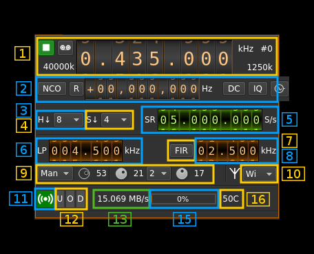
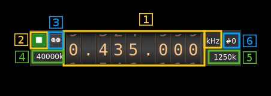
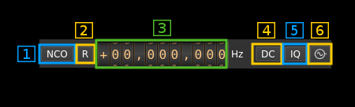
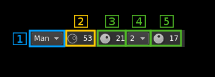

<h1>LimeSDR input plugin</h1>

<h2>Introduction</h2>

This input sample source plugin gets its samples from a [LimeSDR device](https://myriadrf.org/projects/limesdr/).

&#9888; LimeSuite library is difficult to implement due to the lack of documentation. The plugins should work normally when running as single instances. Support of both Rx and/or both Rx running concurrently is experimental.

LimeSDR is a 2x2 MIMO device so it has two receiving channels that can run concurrently. To activate the second channel when the first is already active just open a new source tab in the main window (Devices -> Add source device) and select the same LimeSDR device.

<h2>Build</h2>

The plugin will be built only if LimeSuite is installed in your system. To build and install LimeSuite from source do:

  - `sudo apt-get install libsqlite3-dev`
  - `git clone https://github.com/myriadrf/LimeSuite.git`
  - `cd LimeSuite`
  - `mkdir builddir`
  - `cd builddir`
  - `cmake -DCMAKE_INSTALL_PREFIX=/opt/install/LimeSuite`
  - `make -j8`
  - `make install`

Then add the following defines on `cmake` command line:

`-DLIMESUITE_INCLUDE_DIR=/opt/install/LimeSuite/include -DLIMESUITE_LIBRARY=/opt/install/LimeSuite/lib/libLimeSuite.so`

<h2>Installation from binary packages</h2>

&#9758; LimeSuite is built in the binary packages so there is no external dependency

<h2>Interface</h2>

<h3>1: Common stream parameters</h3>

<h4>1.1: Frequency</h4>

This is the center frequency of reception in kHz.

<h4>1.2: Start/Stop</h4>

Device start / stop button. 

  - Blue triangle icon: device is ready and can be started
  - Green square icon: device is running and can be stopped
  - Magenta (or pink) square icon: an error occured. In the case the device was accidentally disconnected you may click on the icon to stop, plug back in, check the source on the sampling devices control panel and start again.
  
<h4>1.3: Record</h4>

Record baseband I/Q stream toggle button

<h4>1.4: ADC sample rate</h4>

This is the sample rate at which the ADC runs in kS/s (k) or MS/s (M) before hardware decimation (8). Thus this is the device to host sample rate (5) multiplied by the hardware decimation factor (3).

&#9758; Note that changing the hardware decimation factor (3) or the device to host sample rate (5) may change the DAC clock sample rate and therefore the Tx side hardware interpolation factor and/or host to device sample rate.

<h4>1.5: Stream sample rate</h4>

Baseband I/Q sample rate in kS/s. This is the device to host sample rate (5) divided by the software decimation factor (4). 

<h4>1.6: Channel number</h4>

LimeSDR is a 2x2 MIMO device so it has two receiving channels. This shows the corresponding Rx channel index (0 or 1).

<h3>2: NCO, DC/IQ correction and external clock controls</h3>

<h4>2.1: NCO toggle</h4>

The button is lit when NCO is active and dark when inactive.

Use this button to activate/deactivate the TSP NCO. The LMS7002M chip has an independent NCO in each Rx channel that can span the bandwidth received by the ADC. This effectively allows non zero digital IF.

<h4>2.2: Zero (reset) NCO frequency</h4>

USe this push button to reset the NCO frequency to 0 and thus center on the main passband of the ADC.

<h4>2.3: Center frequency with NCO engaged</h4>

This is the center frequency of the mix of LO and NCO combined and is the source passband center frequency when the NCO is engaged. Use the thumbwheels to adjust frequency as done with the LO (1.1). Pressing shift simultanoeusly moves digit by 5 and pressing control moves it by 2. The boundaries are dynamically calculated from the LO center frequency, sample rate and hardware decimation factor.

&#9758; In the LMS7002M TSP block the NCO sits before the decimator (see Fig.14 of the [datasheet](http://www.limemicro.com/wp-content/uploads/2015/09/LMS7002M-Data-Sheet-v2.8.0.pdf) p.7) so it runs at the actual ADC rate. Hence the NCO limits are calculated as +/- half the device to host sample rate multiplied by the hardware decimation factor. For example with a 4 MS/s device to host sample rate (5) and a hadrware decimation of 16 (3) you have +/- 32 MHz span around the LO for the NCO. In this example you can tune all HF frequencies with the center frequency set at its lowest (30 MHz). 

<h4>2.4: DC component auto correction</h4>

Enables or disables the auto remove DC component

<h4>2.5: I/Q balance auto correction</h4>

Enables or disables the auto I/Q balance correction

<h4>2.6: External clock control</h4>

Use this button to open a dialog that lets you choose the external clock frequency and enable or disable it. When disabled the internal 30.72 MHz VCTCXO is used.

<h5>2.6.1: Exrernal clock frequency</h5>

Can be varied from 5 to 300 MHz

Use the thumbwheels to adjust frequency as done with the LO (1.1). Pressing shift simultanoeusly moves digit by 5 and pressing control moves it by 2. The boundaries are dynamically calculated from the LO center frequency, sample rate and hardware decimation factor.

<h5>2.6.2: Enable/disable external clock input</h5>

Use this checkbox to enable or disable the external clock input

<h5>2.6.3: Confirm changes</h5>

Use the "OK" button to confirm your changes
  
<h5>2.6.4: Dismiss changes</h5>

Use the "Cancel" button to dismiss your changes
  
<h3>3: LMS7002M hardware decimation factor</h3>

The TSP block in the LMS7002M hardware has a decimation chain that acts on both Rx channels. It is composed of 5 halfband decimation stages and therefore can achieve decimation between 1 (no decimation) and 32 in increasing powers of 2: 1, 2, 4, 8, 16, 32.

Thus the actual sample rate of the ADC is the stream sample rate (5) multiplied by this factor. 

<h3>4: Software decimation factor</h3>

The I/Q stream from the LimeSDR is doensampled by a power of two by software inside the plugin before being sent to the passband. Possible values are increasing powers of two: 1 (no decimation), 2, 4, 8, 16, 32.

<h3>5: Device to host stream sample rate</h3>

This is the LMS7002M device to/from host stream sample rate in S/s. It is the same for the Rx and Tx systems.

Use the wheels to adjust the sample rate. Pressing shift simultanoeusly moves digit by 5 and pressing control moves it by 2. Left click on a digit sets the cursor position at this digit. Right click on a digit sets all digits on the right to zero. This effectively floors value at the digit position. Wheels are moved with the mousewheel while pointing at the wheel or by selecting the wheel with the left mouse click and using the keyboard arroews.

The LMS7002M uses the same clock for both the ADCs and DACs therefore this sample rate affects all of the 2x2 MIMO channels.

<h3>6: Rx hardware filter bandwidth</h3>

This is the Rx hardware filter bandwidth in kHz in the LMS7002M device for the given channel. Boundaries are updated automatically but generally are from 1.4 to 130 MHz in 1 kHz steps. Use the wheels to adjust the value. Pressing shift simultanoeusly moves digit by 5 and pressing control moves it by 2.

<h3>7: TSP FIR filter toggle</h3>

The TSP in the LMS7002M chip has a FIR filter chain per channel. Use this button to activate or deactivate the TSP FIR filter.

<h3>8: TSP FIR filter bandwidth</h3>

USe the wheels to adjust the bandwidth of the hardware TSP FIR filter. Pressing shift simultanoeusly moves digit by 5 and pressing control moves it by 2.

<h3>9: Gain settings</h2>

<h4>9.1: Gain mode</h2>

Use this combo to select either the automatic gain (Aut) or the manual (Man) gain setting. Autonatic gain sets the global gain using a predefined table for LNA, TIA and PGA gain blocks. This global gain is set with button 9.2. When manual gain is engaged the LNA, TIA and PGA gains can be set independently with the 9.3, 9.4 and 9.5 buttons respectively.

Please refer to [LMS7002M documentation](http://www.limemicro.com/wp-content/uploads/2015/09/LMS7002M-Data-Sheet-v2.8.0.pdf) for a precise description of LNA, TIA and PGA and their location in the Rx chain. To summarize these blocks are placed in this order from antenna to ADC.

<h4>9.2: Global automatic gain</h4>

Use this button to adjust the global gain of the LNA, TIA and PGA. LimeSuite software automatically set optimal values of the amplifiers to achive this global gain. This gain can be set between 0 and 70 dB in 1 dB steps. The value in dB appears at the right of the button.

<h4>9.3: LNA manual gain</h4>

Use this button to adjust the gain of tha LNA when manual gain mode is set (9.1). Gain can be set between 1 and 30 dB in 1 dB steps. However the hardware has 3 dB steps for the lower gain values so increasing or decerasing by one step does not always produce a change. The value in dB appears at the right of the button.

<h4>9.4: TIA manual gain</h4>

Use this combo to select the TIA gain in dB when manual gain mode is set (9.1). Possible values are 1,2 and 3 dB.

<h4>9.5: PGA manual gain</h4>

Use this button to adjust the gain of tha PGA when manual gain mode is set (9.1). Gain can be set between 0 and 32 dB in 1 dB steps. The value in dB appears at the right of the button.

<h3>10: Antenna select</h3>

Use this combo box to select the antenna input:

  - **No**: None
  - **Lo**: Selects the low frequency input (700 to 900 MHz nominally)
  - **Hi**: Selects the high frequncy input (2 to 2.6 GHz)
  - **Wo**: Selects the wideband input
  - **T1**: Selects loopback from TX #1 (experimental)
  - **T1**: Selects loopback from TX #2 (experimental)
  
<h3>11: Stream status indicator</h3>

This label turns green when status can be obtained from the current stream. Usually this means that the stream is up and running but not necessarily streaming data. The various status elements appear next on the same line (12)

<h3>12: Stream warning indicators</h3>

  - **U**: turns red if stream experiences underruns
  - **O**: turns red if stream experiences overruns  
  - **P**: turns red if stream experiences packet drop outs
  
<h3>13: Stream global (all Rx) throughput in MB/s</h3>

This is the stream throughput in MB/s and is usually about 3 times the sample rate for a single stream and 6 times for a dual Rx stream. This is due to the fact that 12 bits samples are used and although they are represented as 16 bit values only 12 bits travel on the USB link.

<h3>15: FIFO status</h3>

This is the fill percentage of the Rx FIFO in the LimeSuite interface. It should be zero most of the time.

<h3>16: Board temperature</h3>

This is the board temperature in degrees Celsius updated every ~5s. Before the first probe the display marks "00C" this is normal.