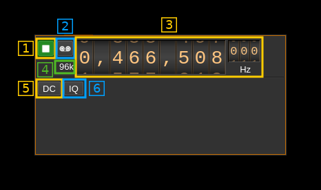

<h1>Local input plugin</h1>

<h2>Introduction</h2>

This input sample source plugin gets its samples from a Local Sink channel in another device set.

<h2>Interface</h2>

The top and bottom bars of the device window are described [here](../../../sdrgui/device/readme.md)

<h3>1: Start/Stop</h3>

Device start / stop button.

  - Blue triangle icon: device is ready and can be started
  - Green square icon: device is running and can be stopped

<h3>3: Frequency</h3>

This is the center frequency in Hz sent from the Local Sink channel instance and corresponds to the center frequency of reception.

<h3>4: Stream sample rate</h3>

Stream I/Q sample rate in kS/s

<h3>5: Auto remove DC component</h3>

Filters out the possible DC component. You use this if you notice a spike in the center of the pass band.

<h3>6: Auto make I/Q balance</h3>

Re-balances the I and Q channels. You use this if you notice ghost artifacts symmetric around the center frequency.
